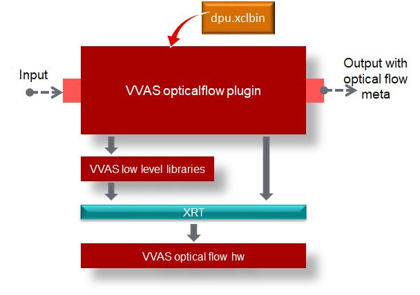
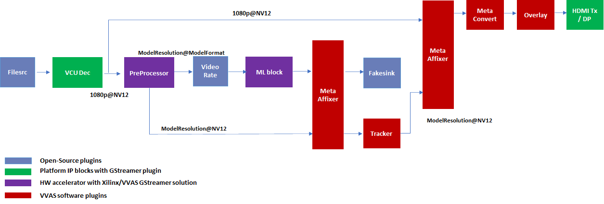
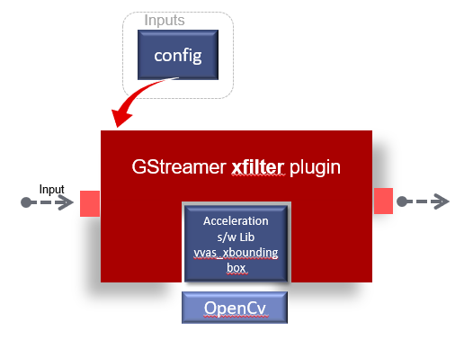

###################
Plug-ins
###################

VVAS is based on the GStreamer framework. This section describes the VVAS GStreamer plug-ins, their input, outputs, and control parameters. The plug-ins source code is available in the ``vvas-gst-plugins`` folder of the VVAS source tree. The two types of VVAS GStreamer plug-ins are custom plug-ins and infrastructure plug-ins. Infrastructure plug-ins are developed to enable developers to integrate their kernel into GStreamer based applications without having understanding about GStreamer framework. Infrastructure plug-ins encapsulates most of the basic GStreamer plug-in requirements/features, like memory management, kernel configuration, caps negotiation etc. Same Infrastructure plug-ins can be used for integrating different kernels to realize different functionalities. Custom plug-ins implement a specific functionality, like encode, decode, overlay etc. that can't be implemented using Infrastructure plug-ins in an optimized way. 

This section covers the plug-in that are common for Edge (Embedded) as well as cloud (PCI basede) solutions. There are few plug-ins that are specific to Edge/Embedded platforms and are covered in :doc:`Plugins for Embedded platforms <../Embedded/embedded-plugins>`. Similarly there are few plug-ins that are specific to Cloud/Data Center platforms and these are covered in :doc:`Plugins for Data Center Platform <../DC/DC_plugins>`. The following table lists the VVAS GStreamer plug-ins.

Table 1: GStreamer Plug-ins

.. list-table:: 
   :widths: 20 80
   :header-rows: 1
   
   * - Plug-in Name
     - Functionality
	 
   * - :ref:`vvas_xmetaaffixer`
     - Plug-in to scale and attach metadata to the frame of different resolutions.

   * - :ref:`vvas_xabrscaler`
     - Hardware accelerated scaling and color space conversion.

   * - :ref:`vvas_xmultisrc`
     - A generic infrastructure plug-in: 1 input, N output, supporting transform processing.

   * - :ref:`vvas_xfilter`
     - A generic infrastructure plug-in: 1 input, 1 output, supporting pass-through, in-place, and transform processing.

   * - :ref:`vvas_xinfer`
     - An inference plug-in using vvas_xdpuinfer acceleration software library and attaches inference output as GstInferenceMeta to input buffer. Also, this plug-in does optional pre-processing required for inference using vvas_xpreprocess acceleration software library.

   * - :ref:`vvas_xoptflow`
     - Plug-in to estimate optical flow using previous and current frame.

   * - :ref:`vvas_xoverlay`
     - Plug-in to draw text, boxes, lines, arrows, circles, polygons, and time stamp on frames.

   * - :ref:`vvas_xtracker`
     - Plug-in to track objects of interest detected during infer.  This plug-in tracks the previously detected objects during the time interval when infer information is not available.

   * - :ref:`vvas_xmetaconvert`
     - Plugin to convert VVAS ML inference metadata (GstInferenceMeta) into overlay metadata

   * - :ref:`vvas_xfunnel`
     - Plug-in to serialize data on its sink pads in round robin order

   * - :ref:`vvas_xdefunnel`
     - Plug-in to de-serialize data serialized using `vvas_xfunnel` plug-in

   * - :ref:`vvas_xmulticrop`
     - Hardware accelerated plug-in for doing static and dynamic cropping, pre-processing, scaling, and color space conversion.

   * - :ref:`vvas_xcompositor`
     - Hardware accelerated N input, 1 output plug-in that combines two or more video frames into a single frame.

.. _custom_plugins_label:

*****************
Custom Plug-ins
*****************

There are specific functions, like video decoder, encoder, and meta-affixer where the requirements are difficult to implement in an optimized way using highly simplified and generic infrastructure plug-ins framework. Hence, these functions are implemented using custom GStreamer plug-ins. This section covers details about the custom plug-ins.

.. _vvas_xmetaaffixer:

vvas_xmetaaffixer
==================

The metaaffixer plug-in, ``vvas_xmetaaffixer``, is used to scale the incoming metadata information for the different resolutions. A machine learning (ML) operation can be performed on a different frame resolution and color format than the original frame, but the metadata might be associated with the full resolution, original frame. The vvas_metaaffixer has two types of pads, master pads and slave pads. Input pads are pads on request; the number of input pads can be created based on the number of input sources. There is one mandatory master input pad (sink pad) that receives the original/reference metadata. Other input pads are referred to as slave pads. Metadata received on the master sink pad is scaled in relation to the resolution of each of the slave sink pads. The scaled metadata is attached to the buffer going out of the output (source) slave pads. There can be up to 16 slave pads created as required. For implementation details, refer to `vvas_xmetaaffixer source code <https://github.com/Xilinx/VVAS/tree/master/vvas-gst-plugins/gst/metaaffixer>`_

.. figure:: ../images/image5.png

Input and Output
--------------------

This plug-in is format agnostic and can accept any input format. It operates only on the metadata. The vvas_xmetaaffixer plug-in supports the GstInferenceMeta data structure. For details about this structure, refer to the :doc:`VVAS Inference Metadata <vvas_meta_data_structures>` section.

Control Parameters and Plug-in Properties
--------------------------------------------------------

Table 2: vvas_xmetaaffixer Plug-in Properties

+--------------------+-------------+------------------+-------------+--------------------------------------------------------+
|                    |             |                  |             |                                                        |
| **Property Name**  |   **Type**  |  **Range**       | **Default** |                   **Description**                      |
|                    |             |                  |             |                                                        |
+====================+=============+==================+=============+========================================================+
|    sync            |    Boolean  |  True/False      |    True     | This property is to enable the synchronization         |
|                    |             |                  |             | between master and slave pads buffers.                 |
|                    |             |                  |             | If sync=true is set, then the metadata is scaled       |
|                    |             |                  |             | and attached to buffers on slave pads that have        |
|                    |             |                  |             | matching PTS or PTS falls within frame duration of the |
|                    |             |                  |             | buffer on the master sink pad.                         |
|                    |             |                  |             | If sync=false is set on the element, then the          |
|                    |             |                  |             | metadata is scaled and attached to all the             |
|                    |             |                  |             | buffers on the slave pads. If this option is used,     |
|                    |             |                  |             | there is possibility that the metadata is not          |  
|                    |             |                  |             | suitable for the frames/buffers that are not           |
|                    |             |                  |             | corresponding to the frames/buffers on the master      |
|                    |             |                  |             | pad.                                                   |
+--------------------+-------------+------------------+-------------+--------------------------------------------------------+
|    timeout         |    Int64    |  -1 to           |    2000     | Timeout in millisec. Plug-in will wait for "timeout"   |
|                    |             |  9223372036854   |             | duration for a buffer on other pads before pushing     |
|                    |             |                  |             | buffer on output pad. This is to avoid hang in case    |
|                    |             |                  |             | buffers are arriving at different frame rates and      |
|                    |             |                  |             | slave pad buffer is waiting for another buffer at      |
|                    |             |                  |             | master pad (which may not arrive as there is no more   |
|                    |             |                  |             | buffers available).                                    |
+--------------------+-------------+------------------+-------------+--------------------------------------------------------+

Pad naming syntax
---------------------------

The pad naming syntax is listed, and the following image shows the syntax:

* MetaAffixer master input pad should be named sink_master.

* MetaAffixer master output pad should be named src_master.

* MetaAffixer slave input pad should be named sink_slave_0, sink_slave_1.

* MetaAffixer slave output pad should be named src_slave_0, src_slave_1, src_slave_2.

.. figure:: ../images/image6.png 

Example Pipelines
-----------------------------

This section covers the example pipelines using the metaaffixer plug-in. 

.. code-block::

        gst-launch-1.0 videotestsrc num-buffers=1 \
        ! video/x-raw, width=1920, height=1080, format=NV12 \
        ! queue \
        ! videoconvert \
        ! queue \
        ! ima.sink_master vvas_xmetaaffixer name=ima ima.src_master \
        ! queue \
        ! fakesink videotestsrc num-buffers=1 \
        ! video/x-raw, width=1920, height=1080, format=NV12 \
        ! queue \
        ! videoconvert \
        ! video/x-raw, width=1920, height=1080, format=YUY2 \
        ! ima.sink_slave_0 ima.src_slave_0 \
        ! queue \
        ! fakesink -v

.. _vvas_xabrscaler:

vvas_xabrscaler
======================

There are severa use cases where the available frame resolution and color formats may not be suitable for the consumption by the next component. For example, in case of Machine Learning applications, input can be from different sources, resolutions, but ML models work on a fixed resolution. In such cases, the input image needs to be re-sized to a different resolution. Also, the input image color format may be YUV/NV12, but the ML models require image to be in BGR format. In this case we need to do the color space conversion as well. ML model may also require some pre-processing, like Mean Subtraction, Normalization etc. on the input image. 

In adaptive bit rate (ABR) use cases, one video is encoded at different bit rates so that it can be streamed in different network bandwidth conditions without any artifacts. To achieve this, input frame is decoded, resized to different resolutions and then re-encoded. vvas_xabrscaler is a plug-in that takes one input frame and can produce several outputs frames having different resolutions and color formats. The ``vvas_xabrscaler`` is a GStreamer plug-in developed to accelerate the resize and color space conversion, Mean Subtraction, Normalization, and cropping. For more implementation details, refer to `vvas_xabrscaler source code <https://github.com/Xilinx/VVAS/tree/master/vvas-gst-plugins/sys/abrscaler>`_.

This plug-in supports:

* Single input, multiple output pads

* Color space conversion

* Resize

* Each output pad has independent resolution and color space conversion capability.

* Crop of input buffer

.. important:: The `vvas_xabrscaler` plug-in controls the multiscaler kernel. If your application uses this plug-in, then make sure that multi-scaler kernel is included in your hardware design.

.. important:: Make sure that the multi-scaler hardware kernel supports maximum resolution required by your application. 

As a reference, maximum resolution supported by multi-scaler kernel in ``Smart Model Select`` example design can be found in `multi-scaler kernel config <https://github.com/Xilinx/VVAS/blob/master/vvas-examples/Embedded/smart_model_select/v_multi_scaler_config.h#L33>`_

Prerequisite
----------------

This plug-in requires the multiscaler kernel to be available in the hardware design and the required color formats are enabled. See :ref:`Multiscaler Kernel <multiscaler-kernel>`

Input and Output
------------------------

This plug-in accepts buffers with the following color format standards:

* RGBx
* YUY2
* r210
* Y410
* NV16
* NV12
* RGB
* v308
* I422_10LE
* GRAY8
* NV12_10LE32
* BGRx
* GRAY10_LE32
* BGRx
* UYVY
* BGR
* RGBA
* BGRA
* I420
* GBR

.. important:: Make sure that the color formats needed for your application are supported by the multi-scaler hardware kernel. 

As a reference, multi-scaler configuration for ``smart model select`` example design can be found in `multi-scaler configuration <https://github.com/Xilinx/VVAS/blob/master/vvas-examples/Embedded/smart_model_select/v_multi_scaler_config.h>`_

Control Parameters and Plug-in Properties
------------------------------------------------

The following table lists the GStreamer plug-in properties supported by the vvas_xabrscaler plug-in.

Table 3: vvas_xabrscaler Plug-in Properties

+--------------------+-------------+---------------+------------------------+------------------+
|                    |             |               |                        |                  |
|  **Property Name** |   **Type**  | **Range**     | **Default**            | **Description**  |
|                    |             |               |                        |                  |
+====================+=============+===============+========================+==================+
| avoid-output-copy  |   Boolean   | true/false    | False                  | Avoid output     |
|                    |             |               |                        | frames copy on   |
|                    |             |               |                        | all source pads  |
|                    |             |               |                        | even when        |
|                    |             |               |                        | downstream does  |
|                    |             |               |                        | not support      |
|                    |             |               |                        | GstVideoMeta     |
|                    |             |               |                        | metadata         |
+--------------------+-------------+---------------+------------------------+------------------+
| enable-pipeline    |    Boolean  |  true/false   | false                  | Enable buffer    |
|                    |             |               |                        | pipelining to    |
|                    |             |               |                        | improve          |
|                    |             |               |                        | performance in   |
|                    |             |               |                        | non zero-copy    |
|                    |             |               |                        | use cases        |
+--------------------+-------------+---------------+------------------------+------------------+
| in-mem-bank        | Unsigned int|  0 - 65535    | 0                      | VVAS input memory|
|                    |             |               |                        | bank to allocate |
|                    |             |               |                        | memory           |
+--------------------+-------------+---------------+------------------------+------------------+
| out-mem-bank       | Unsigned int|  0 - 65535    | 0                      | VVAS o/p memory  |
|                    |             |               |                        | bank to allocate |
|                    |             |               |                        | memory           |
+--------------------+-------------+---------------+------------------------+------------------+
|                    |    string   |    N/A        | ./binary_container_1   | The              |
|  xclbin-location   |             |               | xclbin                 | location of      |
|                    |             |               |                        | xclbin.          |
+--------------------+-------------+---------------+------------------------+------------------+
|                    |    string   |    N/A        |                        | Kernel name      |
| kernel-name        |             |               | v_multi_scaler:        | and              |
|                    |             |               | multi_scaler_1         | instance         |
|                    |             |               |                        | separated        |
|                    |             |               |                        | by a colon.      |
+--------------------+-------------+---------------+------------------------+------------------+
|    dev-idx         |    integer  | 0 to 31       |    0                   | Device index     |
|                    |             |               |                        | This is valid    |
|                    |             |               |                        | only in PCIe/    |
|                    |             |               |                        | Data Center      |
|                    |             |               |                        | platforms.       |
+--------------------+-------------+---------------+------------------------+------------------+
|    ppc             |    integer  | 1, 2, 4       |    2                   | Pixel per        |
|                    |             |               |                        | clock            |
|                    |             |               |                        | supported        |
|                    |             |               |                        | by a multi-      |
|                    |             |               |                        | scaler           |
|                    |             |               |                        | kernel           |
+--------------------+-------------+---------------+------------------------+------------------+
|   scale-mode       |    integer  | 0, 1, 2       |    0                   | Scale algorithm  |
|                    |             |               |                        | to use:          |
|                    |             |               |                        | 0:BILINEAR       |
|                    |             |               |                        | 1:BICUBIC        |
|                    |             |               |                        | 2:POLYPHASE      |
+--------------------+-------------+---------------+------------------------+------------------+
|    coef-load-type  |  integer    | 0 => Fixed    |    1                   | Type of filter   |
|                    |             | 1 => Auto     |                        | Coefficients to  |
|                    |             |               |                        | be used: Fixed   |
|                    |             |               |                        | or Auto          |
|                    |             |               |                        | generated        |
+--------------------+-------------+---------------+------------------------+------------------+
|    num-taps        |  integer    | 6=>6 taps     |    1                   | Number of filter |
|                    |             | 8=>8 taps     |                        | taps to be used  |
|                    |             | 10=>10 taps   |                        | for scaling      |
|                    |             | 12=>12 taps   |                        |                  |
+--------------------+-------------+---------------+------------------------+------------------+
|    alpha-b         |  float      | 0 to 128      |    0                   | Mean subtraction |
|                    |             |               |                        | for blue channel |
|                    |             |               |                        | , needed for PPE |
+--------------------+-------------+---------------+------------------------+------------------+
|    alpha-g         |  float      | 0 to 128      |    0                   | Mean subtraction |
|                    |             |               |                        | for green channel|
|                    |             |               |                        | , needed for PPE |
+--------------------+-------------+---------------+------------------------+------------------+
|    alpha-r         |  float      | 0 to 128      |    0                   | Mean subtraction |
|                    |             |               |                        | for red  channel |
|                    |             |               |                        | , needed for PPE |
+--------------------+-------------+---------------+------------------------+------------------+
|    beta-b          |  float      | 0 to 1        |    1                   | Scaling for blue |
|                    |             |               |                        | channel, needed  |
|                    |             |               |                        | for PPE          |
+--------------------+-------------+---------------+------------------------+------------------+
|    beta-g          |  float      | 0 to 1        |    1                   | scaling for green|
|                    |             |               |                        | channel, needed  |
|                    |             |               |                        | for PPE          |
+--------------------+-------------+---------------+------------------------+------------------+
|    beta-r          |  float      | 0 to 1        |    1                   | scaling for red  |
|                    |             |               |                        | channel, needed  |
|                    |             |               |                        | for PPE          |
+--------------------+-------------+---------------+------------------------+------------------+
|    crop-x          |  unsigned   | 0 to          |    0                   | Crop X           |
|                    |  integer    | 4294967295    |                        | coordinate       |
+--------------------+-------------+---------------+------------------------+------------------+
|    crop-y          |  unsigned   | 0 to          |    0                   | Crop Y           |
|                    |  integer    | 4294967295    |                        | coordinate       |
+--------------------+-------------+---------------+------------------------+------------------+
|    crop-width      |  unsigned   | 0 to          |    0                   | Crop width (     |
|                    |  integer    | 4294967295    |                        | minimum: 64), if |
|                    |             |               |                        | this is 0 or not |
|                    |             |               |                        | set, it will be  |
|                    |             |               |                        | calculated as    |
|                    |             |               |                        | input width -    |
|                    |             |               |                        | `crop-x`         |
|                    |             |               |                        |                  |
+--------------------+-------------+---------------+------------------------+------------------+
|    crop-height     |  unsigned   | 0 to          |    0                   | Crop height (    |
|                    |  integer    | 4294967295    |                        | minimum: 64), if |
|                    |             |               |                        | this is 0 or not |
|                    |             |               |                        | set, it will be  |
|                    |             |               |                        | calculated as    |
|                    |             |               |                        | input height -   |
|                    |             |               |                        | `crop-y`         |
+--------------------+-------------+---------------+------------------------+------------------+

.. note::

       MultiScaler IP has some alignment requirement, hence user given parameters for crop are aligned as per the IP requirement, alignment ensures that it covers the region of crop specified by user, hence final cropped image may have extra pixels cropped.

Example Pipelines
-------------------------

One input one output
^^^^^^^^^^^^^^^^^^^^^^^^^^

The following example configures vvas_xabrscaler in one input and one output mode. The input to the scaler is 1280 x 720, NV12 frames that are resized to 640 x 360 resolution, and the color format is changed from NV12 to BGR.

.. code-block::

      gst-launch-1.0 videotestsrc num-buffers=100 \
      ! "video/x-raw, width=1280, height=720, format=NV12" \
      ! vvas_xabrscaler xclbin-location="/usr/lib/dpu.xclbin" kernel-name=v_multi_scaler:{v_multi_scaler_1} \
      ! "video/x-raw, width=640, height=360, format=BGR" ! fakesink -v

One input multiple output
^^^^^^^^^^^^^^^^^^^^^^^^^^

The following example configures vvas_xabrscaler for one input and three outputs. The input is 1920 x 1080 resolution in NV12 format. There are three output formats:

* 1280 x 720 in BGR format

* 300 x 300 in RGB format

* 640 x 480 in NV12 format

.. code-block::

        gst-launch-1.0 videotestsrc num-buffers=100 \
        ! "video/x-raw, width=1920, height=1080, format=NV12, framerate=60/1" \
        ! vvas_xabrscaler xclbin-location="/usr/lib/dpu.xclbin" kernel-name=v_multi_scaler:{v_multi_scaler_1} name=sc sc.src_0 \
        ! queue \
        ! "video/x-raw, width=1280, height=720, format=BGR" \
        ! fakesink sc.src_1 \
        ! queue \
        ! "video/x-raw, width=300, height=300, format=RGB" \
        ! fakesink sc.src_2 \
        ! queue \
        ! "video/x-raw, width=640, height=480, format=NV12" \
        ! fakesink -v

Crop with multiple output:
^^^^^^^^^^^^^^^^^^^^^^^^^^^^^^^^

The following example configures ``vvas_xabrscaler`` for one input and three outputs. The input is 1920 x 1080 resolution in NV12 format.
This input is cropped at X:140, Y:300, Width:640, Height:480.

Cropped input is scaled and converted to below format:

* 640 * 480 in RGB format

* 320 * 240 in RGB format

* 256 * 256 in NV12 format

.. code-block::

       gst-launch-1.0 -v \
       videotestsrc num-buffers=10 ! video/x-raw,format=NV12,width=1920,height=1080 \
       ! vvas_xabrscaler name=sc dev-idx=0 crop-x=140 crop-y=300 crop-width=640 crop-height=480 \
       sc.src_0 ! queue ! video/x-raw,format=RGB,width=640,height=480 ! filesink location=480p.yuv \
       sc.src_1 ! queue ! video/x-raw,format=RGB,width=320,height=240 ! filesink location=240p.yuv \
       sc.src_2 ! queue ! video/x-raw,format=NV12,width=256,height=256 ! filesink location=256p.yuv -v

.. _vvas_xinfer:

vvas_xinfer
============

GStreamer inference plug-in, ``vvas_xinfer``, performs inferencing on video frames/images with the help of ``Vitis AI`` library and prepares tree like metadata in ``GstInferenceMeta`` object and attaches the same to input GstBuffer. This plug-in triggers optional preprocessing (scale/crop & etc.) operations with the help of ``vvas_xpreprocessor``  kernel library (which is on top of Xilinx's multiscaler IP) on incoming video frames before calling ``vvas_xdpuinfer`` kernel library. vvas_xinfer plug-in's input capabilities are influenced by vvas_xpreprocessor library input capabilities and Vitis AI library capabilities (Vitis-AI does software scaling). If preprocessing is enabled and vvas_xinfer plug-in is receiving non-CMA memory frames, then data copy will be made to ensure CMA frames goes to preprocessing engine. The main advantage of this plug-in is users/customers can realize inference cascading use cases with ease.
For implementation details, refer to `vvas_xinfer source code <https://github.com/Xilinx/VVAS/tree/master/vvas-gst-plugins/sys/infer>`_

.. figure:: ../images/vvas_xinfer_blockdiagram.png
   :align: center
   :scale: 80

Input and Output
--------------------

* Accepts buffers with GRAY8/ NV12/ BGR/ RGB/ YUY2/ r210/ v308/ GRAY10_LE32/ ABGR/ ARGB color formats on input GstPad & output GstPad. Make sure HW supports the required format.
* Attaches ``GstInferenceMeta`` metadata to output GstBuffer. For details about meta data, refer to :ref:`vvas_inference_metadata`

Control Parameters
--------------------

.. list-table:: Control Parameters
   :widths: 20 10 10 10 50
   :header-rows: 1

   * - Property Name
     - Type
     - Range
     - Default
     - Description
   * - dynamic-config
     - String
     - N/A
     - Null
     - String contains dynamic json configuration of inference accelration library
   * - infer-config
     - String
     - N/A
     - Null
     - location of the inference kernel library configuration file in json format
   * - preprocess-config
     - String
     - N/A
     - Null
     - location of the scaler kernels config file in json format

infer-config json members
-------------------------

+---------------------+--------------------+------------------------------------------------------------------------------------------------------------------------------------------------------+
| Json key            | Item               | Item description                                                                                                                                     |
+=====================+====================+======================================================================================================================================================+
|                     | Description        | VVAS libraries repository path to look for kernel libraries by VVAS GStreamer plug-in                                                                |
|                     +--------------------+------------------------------------------------------------------------------------------------------------------------------------------------------+
|                     | Value type         | String                                                                                                                                               |
| vvas-library-repo   +--------------------+------------------------------------------------------------------------------------------------------------------------------------------------------+
|                     | Mandatory/Optional | Optional                                                                                                                                             |
|                     +--------------------+------------------------------------------------------------------------------------------------------------------------------------------------------+
|                     | Default value      | /usr/lib in Embedded platforms                                                                                                                       |
|                     |                    | /opt/xilinx/vvas/lib in PCIe platforms                                                                                                               |
+---------------------+--------------------+------------------------------------------------------------------------------------------------------------------------------------------------------+
|                     | Description        | Inference level in cascaded inference use case. e.g. Object detection ML (level-1) followed by object classification (level-2) on detected objects   |
|                     +--------------------+------------------------------------------------------------------------------------------------------------------------------------------------------+
|                     | Value type         | Integer                                                                                                                                              |
| inference-level     +--------------------+------------------------------------------------------------------------------------------------------------------------------------------------------+
|                     | Mandatory/Optional | Optional                                                                                                                                             |
|                     +--------------------+------------------------------------------------------------------------------------------------------------------------------------------------------+
|                     | Default value      | 1                                                                                                                                                    |
+---------------------+--------------------+------------------------------------------------------------------------------------------------------------------------------------------------------+
|                     | Description        | Parameter to enable/disable low-latency mode in vvas_xinfer and it is useful only when inference-level > 1.                                          |
|                     |                    | If enabled, then vvas_xinfer plug-in will not wait for batch-size frames to be accumulated to reduce latency.                                        |
|                     |                    | If disabled, inference engine can work at maximum throughput.                                                                                        |
|                     +--------------------+------------------------------------------------------------------------------------------------------------------------------------------------------+
| low-latency         | Value type         | Boolean                                                                                                                                              |
|                     +--------------------+------------------------------------------------------------------------------------------------------------------------------------------------------+
|                     | Mandatory/Optional | Optional                                                                                                                                             |
|                     +--------------------+------------------------------------------------------------------------------------------------------------------------------------------------------+
|                     | Default value      | false                                                                                                                                                |
+---------------------+--------------------+------------------------------------------------------------------------------------------------------------------------------------------------------+
|                     | Description        | Maximum number of input frames those can be queued inside the plug-in.                                                                               |
|                     |                    | When low-latency is disabled, vvas_xinfer plug-in will wait for inference-max-queue buffers until batch-size is accumulated                          |
|                     +--------------------+------------------------------------------------------------------------------------------------------------------------------------------------------+
| inference-max-queue | Value type         | Integer                                                                                                                                              |
|                     +--------------------+------------------------------------------------------------------------------------------------------------------------------------------------------+
|                     | Mandatory/Optional | Optional                                                                                                                                             |
|                     +--------------------+------------------------------------------------------------------------------------------------------------------------------------------------------+
|                     | Default value      | batch-size                                                                                                                                           |
+---------------------+--------------------+------------------------------------------------------------------------------------------------------------------------------------------------------+
|                     | Description        | Attaches output of preprocessing library to GstInferenceMeta to avoid redoing of the preprocessing if required.                                      |
|                     +--------------------+------------------------------------------------------------------------------------------------------------------------------------------------------+
|                     | Value type         | Boolean                                                                                                                                              |
| attach-ppe-outbuf   +--------------------+------------------------------------------------------------------------------------------------------------------------------------------------------+
|                     | Mandatory/Optional | Optional                                                                                                                                             |
|                     +--------------------+------------------------------------------------------------------------------------------------------------------------------------------------------+
|                     | Default value      | False                                                                                                                                                |
+---------------------+--------------------+------------------------------------------------------------------------------------------------------------------------------------------------------+
|                     | Description        | Kernel object provides information about an VVAS kernel library configuration and kernel library name                                                |
|                     +--------------------+------------------------------------------------------------------------------------------------------------------------------------------------------+
|                     | Value type         | JSON Object                                                                                                                                          |
|                     +--------------------+------------------------------------------------------------------------------------------------------------------------------------------------------+
| kernel              | Mandatory/Optional | Mandatory                                                                                                                                            |
|                     +--------------------+------------------------------------------------------------------------------------------------------------------------------------------------------+
|                     | Default value      | None                                                                                                                                                 |
|                     +--------------------+------------------------------------------------------------------------------------------------------------------------------------------------------+
|                     | Object Members     | members of kernel JSON object are mentioned below                                                                                                    |
+---------------------+--------------------+------------------------------------------------------------------------------------------------------------------------------------------------------+

infer-config::kernel json members
---------------------------------

+--------------+--------------------+---------------------------------------------------------------------------------------------------------------------+
| JSON key     | Item               |  Description                                                                                                        |
+==============+====================+=====================================================================================================================+
|              | Description        | Name of inference kernel library to be loaded for inferencing                                                       |
|              +--------------------+---------------------------------------------------------------------------------------------------------------------+
|              | Value type         | String                                                                                                              |
| library-name +--------------------+---------------------------------------------------------------------------------------------------------------------+
|              | Mandatory/Optional | Mandatory                                                                                                           |
|              +--------------------+---------------------------------------------------------------------------------------------------------------------+
|              | Default value      | NULL                                                                                                                |
+--------------+--------------------+---------------------------------------------------------------------------------------------------------------------+
|              | Description        | Inference kernel specific configuration                                                                             |
|              +--------------------+---------------------------------------------------------------------------------------------------------------------+
|              | Value type         | JSON object                                                                                                         |
|              +--------------------+---------------------------------------------------------------------------------------------------------------------+
| config       | Mandatory/Optional | Mandatory                                                                                                           |
|              +--------------------+---------------------------------------------------------------------------------------------------------------------+
|              | Default value      | None                                                                                                                |
|              +--------------------+---------------------------------------------------------------------------------------------------------------------+
|              | Object members     | Contains members specific to inference kernel library. See vvas_xdpuinfer acceleration library for more information |
+--------------+--------------------+---------------------------------------------------------------------------------------------------------------------+

preprocess-config json members
------------------------------

Table 4 preprocess-config json members

+-------------------+--------------------+-------------------------------------------------------------------------------------------------------+
| Json key          | Item               | Item description                                                                                      |
+===================+====================+=======================================================================================================+
|                   | Description        | Location of xclbin which contains scaler IP to program FPGA device based on device-index property     |
|                   +--------------------+-------------------------------------------------------------------------------------------------------+
|                   | Value type         | String                                                                                                |
| xclbin-location   +--------------------+-------------------------------------------------------------------------------------------------------+
|                   | Mandatory/Optional | Mandatory                                                                                             |
|                   +--------------------+-------------------------------------------------------------------------------------------------------+
|                   | Default value      | NULL                                                                                                  |
+-------------------+--------------------+-------------------------------------------------------------------------------------------------------+
|                   | Description        | VVAS libraries repository path to look for kernel libraries by VVAS GStreamer plug-in                 |
|                   +--------------------+-------------------------------------------------------------------------------------------------------+
|                   | Value type         | String                                                                                                |
| vvas-library-repo +--------------------+-------------------------------------------------------------------------------------------------------+
|                   | Mandatory/Optional | Optional                                                                                              |
|                   +--------------------+-------------------------------------------------------------------------------------------------------+
|                   | Default value      | /usr/lib in Embedded platforms                                                                        |
|                   |                    | /opt/xilinx/vvas/lib in PCIe platforms                                                                |
+-------------------+--------------------+-------------------------------------------------------------------------------------------------------+
|                   | Description        | Device index on which scaler IP is present                                                            |
|                   +--------------------+-------------------------------------------------------------------------------------------------------+
|                   | Value type         | Integer                                                                                               |
|                   +--------------------+-------------------------------------------------------------------------------------------------------+
| device-index      | Mandatory/Optional | Mandatory in PCIe platforms                                                                           |
|                   |                    | In embedded platforms, device-index is not an applicable option as it is always zero                  |
|                   +--------------------+-------------------------------------------------------------------------------------------------------+
|                   | Default value      | -1 in PCIe platforms                                                                                  |
|                   |                    | 0 in Embedded platforms                                                                               |
+-------------------+--------------------+-------------------------------------------------------------------------------------------------------+
|                   | Description        | Kernel object provides information about an VVAS kernel library configuration and kernel library name |
|                   +--------------------+-------------------------------------------------------------------------------------------------------+
|                   | Value type         | JSON Object                                                                                           |
|                   +--------------------+-------------------------------------------------------------------------------------------------------+
| kernel            | Mandatory/Optional | Mandatory                                                                                             |
|                   +--------------------+-------------------------------------------------------------------------------------------------------+
|                   | Default value      | None                                                                                                  |
|                   +--------------------+-------------------------------------------------------------------------------------------------------+
|                   | Object Members     | members of kernel JSON object are mentioned below                                                     |
+-------------------+--------------------+-------------------------------------------------------------------------------------------------------+

preprocess-config::kernel json members
---------------------------------------

Table 5: preprocess-config::kernel json members

+--------------+--------------------+----------------------------------------------------------------------------+
| JSON key     | Item               | Description                                                                |
+==============+====================+============================================================================+
|              | Description        | Name of kernel library to be loaded for inferencing                        |
|              +--------------------+----------------------------------------------------------------------------+
|              | Value type         | String                                                                     |
| library-name +--------------------+----------------------------------------------------------------------------+
|              | Mandatory/Optional | Mandatory                                                                  |
|              +--------------------+----------------------------------------------------------------------------+
|              | Default value      | NULL                                                                       |
+--------------+--------------------+----------------------------------------------------------------------------+
|              | Description        | Name of the preprocessing kernel. Syntax : "<kernel_name>:<instance_name>" |
|              +--------------------+----------------------------------------------------------------------------+
|              | Value type         | String                                                                     |
| kernel-name  +--------------------+----------------------------------------------------------------------------+
|              | Mandatory/Optional | Mandatory                                                                  |
|              +--------------------+----------------------------------------------------------------------------+
|              | Default value      | NULL                                                                       |
+--------------+--------------------+----------------------------------------------------------------------------+
|              | Description        | preprocess kernel specific configuration                                   |
|              +--------------------+----------------------------------------------------------------------------+
|              | Value type         | JSON object                                                                |
|              +--------------------+----------------------------------------------------------------------------+
| config       | Mandatory/Optional | Mandatory                                                                  |
|              +--------------------+----------------------------------------------------------------------------+
|              | Default value      | None                                                                       |
|              +--------------------+----------------------------------------------------------------------------+
|              | Object members     | Contains members specific to preprocess kernel library                     |
+--------------+--------------------+----------------------------------------------------------------------------+

* Example infer-json file:

This file is used to configure vvas_xdpuinfer library for Machine Learning.

.. code-block::

   {
      "vvas-library-repo": "/usr/lib/",
      "inference-level":1,
      "inference-max-queue":30,
      "attach-ppe-outbuf": false,
      "low-latency":false,
      "kernel" : {
          "library-name":"libvvas_xdpuinfer.so",
          "config": {
              "model-name" : "yolov3_voc_tf",
              "model-class" : "YOLOV3",
              "model-format" : "RGB",
              "batch-size":1,
              "model-path" : "/usr/share/vitis_ai_library/models/",
              "run_time_model" : false,
              "need_preprocess" : false,
              "performance_test" : false,
              "debug_level" : 0
          }
      }
   }

* Example preprocess-config json file:

This json file captures the parameters for the pre-processing kernel.

.. code-block::

   {
      "xclbin-location":"/usr/lib/dpu.xclbin",
      "vvas-library-repo": "/usr/lib",
      "device-index": 0,
      "kernels" :[
          {
              "kernel-name": "v_multi_scaler:{v_multi_scaler_1}",
              "library-name": "libvvas_xpreprocessor.so",
              "config": {
	         "alpha_r" : 0.0,
	         "alpha_g" : 0.0,
	         "alpha_b" : 0.0,
	         "beta_r" : 0.25,
	         "beta_g" : 0.25,
	         "beta_b" : 0.25,
	         "cascade" : 1,
	         "debug_level" : 0
              }
          }
      ]

.. note::

   When user wants to perform hardware accelerated pre-processing on input frame using ``vvas_xinfer`` plug-in, then the pre-processing parameters provided in **preprocess-config** json file must be checked for correctness. The pre-processing parameters for the models are provided in the prototxt file for the models. For few models these parameters need to be modified from what it is in the prototxt file. User must provide these modified values in the preprocess-config json file.
   There are few steps mentioned below to know which models need changes.

To determine the pre-processing parameters for a model, follow the steps mentioned below:

* Get the algorithmic scale vector, i.e. "scale" fields for each channel R,G,B mentioned in the model prototxt file. If the model expects input image in RGB format, then the first field will corresponds to Channel R, next will correspond to Channel G, and the last one will be for Channel B. Example prototxt file contents are mentioned below:

.. code-block::

   model {
           name: "yolov3_voc_416"
           kernel {
               name: "yolov3_voc_416"
               mean: 0.0
               mean: 0.0
               mean: 0.0
               scale: 0.00390625
               scale: 0.00390625
               scale: 0.00390625
   }

* Calculate the ``inner scale`` value from the "fixpos" field of the "input_tensor" by executing the command at command prompt on the target board in case of Embedded platform.

.. code-block::

   xdputil xmodel -l path-to-xmodel.xmodel

   you can get something like:

   {
    "subgraphs":[
        {
            "name":"subgraph_data",
            "device":"USER"
        },
        {
           "name":"subgraph_conv1_1",
            "device":"DPU",
            "fingerprint":"0x1000020f6014407",
            "DPU Arch":"DPUCZDX8G_ISA0_B4096_MAX_BG2",
            "input_tensor":[
                {
                    "name":"data_fixed",
                    "shape":"[1, 360, 480, 3]",
                    "fixpos":-1
                }
            ],

    inner scale = 2^fixpos
                = 2^-1
                = 0.5

* Multiply the "scale" vector values from prototxt file with the inner scale calculated above. Provide these values in the preprocess-config json file. User need to be careful while assigning the value to the correct channel field.

.. code-block::

  If the model expects input image in RGB format, then the first scale value in prototxt file will corresponds to channel R. So after multiplying with the "inner scale" value, assign this first value to "beta_r" in preprocess-config json file. Repeat the same for other channels.

* Example Simple inference (YOLOv3) pipeline which takes NV12 YUV file (test.nv12) as input is described below:

.. code-block::
  
  gst-launch-1.0 filesrc location=<test.nv12> ! videoparse width=1920 height=1080 format=nv12 ! \
  vvas_xinfer preprocess-config=yolo_preproc.json infer-config=yolov3_voc.json ! fakesink -v

* Example cascade inference (YOLOv3+Resnet18) pipeline which takes NV12 YUV file (test.nv12) as input is described below:

.. code-block::

  gst-launch-1.0 filesrc location=<test.nv12> ! videoparse width=1920 height=1080 format=nv12 ! \
  vvas_xinfer preprocess-config=yolo_preproc.json infer-config=yolov3_voc.json ! queue ! \
  vvas_xinfer preprocess-config=resnet_preproc.json infer-config=resnet18.json ! fakesink -v

.. _vvas_xoptflow:

vvas_xoptflow
==============

Optical flow is one of the key functions used in many image processing and computer vision applications like object tracking, motion based segmentation, depth estimation, stitching and video frame rate conversion etc. Optical flow is estimated using previous and current frame pixel information.

For optical flow estimation this plug-in uses hardware accelerator of xfopencv non-pyramid optical flow. This non-pyramid optical flow function takes current and previous frame as input and generates two floating point buffers of x and y direction displacements. Optical flow plug-in attaches these displacement buffers as **gstvvasofmeta**.
For implementation details, refer to `vvas_xoptflow source code <https://github.com/Xilinx/VVAS/tree/master/vvas-gst-plugins/sys/optflow>`_

Prerequisite
--------------

This plug-in uses **dense_non_pyr_of_accel** kernel. Make sure your xclbin has this kernel.

Input and Output
--------------------

Accepts buffer of NV12 format and generates two metadata buffers of type float and each size equal to the size of frame.
For details about the meta data structure, refer to :ref:`optical_flow_metadata`

Plug-in Properties
-------------------

Table 6: vvas_xoptflow Plug-in Properties

+--------------------+-------------+---------------+----------------------+------------------+
|                    |             |               |                      |                  |
|  **Property Name** |   **Type**  | **Range**     |     **Default**      | **Description**  |
|                    |             |               |                      |                  |
+====================+=============+===============+======================+==================+
| xclbin-loc         |   String    |      NA       | ./binary_container_1 | location of      |
|                    |             |               | .xclbin              | xclbin           |
+--------------------+-------------+---------------+----------------------+------------------+
| dev-idx            |   Integer   |    0 to 31    |           0          | device index     |
+--------------------+-------------+---------------+----------------------+------------------+

example Pipelines
---------------------

The following example demonstrates use of vvas_xoptflow plug-in.

 
.. code-block::

      gst-launch-1.0 filesrc location=$1 ! \
      h264parse ! \
      queue ! \
      omxh264dec internal-entropy-buffers=2 ! \
      videorate ! video/x-raw, framerate=10/1 ! \
      queue ! \
      vvas_xinfer preprocess-config=kernel_preprocessor_dev0_yolov3_voc_tf.json infer-config=kernel_yolov3_voc_tf.json name=infer ! \
      vvas_xoptflow xclbin-location="/mnt/sd-mmcblk0p1/dpu.xclbin" ! \
      fakesink -v

.. _vvas_xoverlay:

vvas_xoverlay
=============

Overlay plug-in is used for drawing bounding boxes, text, lines, arrows, circles, and polygons on frames. Bounding boxes can be drawn by using hardware accelerator. By setting use-bbox-accel property of the plug-in user can use hardware accelerator for drawing bounding boxes. Using display-clock property user can display clock on any part of the frame.

Forr drawing objects like bounding box, lines, arrows etc., the information about these objects must be provided through overlay metadata structure attached to the buffer. For more information about this overlay meta data structure, refer to :ref:`vvas_overlay_metadata`. 

For converting metadata generated from upstream plug-in like infer, opticalflow, segmentation etc., to gstvvasoverlaymeta an intermediate plug-in, :ref:`vvas_xmetaconvert` is to be used before ``vvas_xoverlay`` plug-in.

For implementation details, refer to `vvas_xoverlay source code <https://github.com/Xilinx/VVAS/tree/master/vvas-gst-plugins/sys/overlay>`_

.. figure:: ../images/vvas_overlay_blockdiagram.png
   :align: center
   :scale: 80

Supported features
-------------------

+--------------+-----------------------------------------------------------------------------------------------+
|              |                                                                                               |
|  **Feature** |                                   **Description**                                             |
|              |                                                                                               |
+==============+===============================================================================================+
|   boxes      | Drawing bounding boxes with and without background color                                      |
|              |                                                                                               |
+--------------+-----------------------------------------------------------------------------------------------+
|   text       | Overlaying of text with and without background color. Supports text fonts available in opencv |
|              |                                                                                               |
+--------------+-----------------------------------------------------------------------------------------------+
|   lines      | For drawing lines with different thickness and color                                          |
|              |                                                                                               |
+--------------+-----------------------------------------------------------------------------------------------+
|   arrows     | Drawing arrows on either side of line or both the sides                                       |
|              |                                                                                               |
+--------------+-----------------------------------------------------------------------------------------------+
|   circle     | For drawing circles of different radius and thickness without fill                            |
|              |                                                                                               |
+--------------+-----------------------------------------------------------------------------------------------+
|   polygons   | For drawing closed polygons without fill                                                      |
|              |                                                                                               |
+--------------+-----------------------------------------------------------------------------------------------+

Input and Output
--------------------

Supported input buffer formats are RGB, NV12 and Grayscale. Required metadata in gstvvasoverlaymeta type for drawing.

Control Parameters and Plug-in Properties
---------------------------------------------

The following table lists the GStreamer plug-in properties supported by the vvas_xoverlay plug-in.

Table 7: vvas_xoverlay Plug-in Properties

+--------------------+-------------+---------------+-----------------------+----------------------+
|                    |             |               |                       |                      |
|  **Property Name** |   **Type**  | **Range**     |    **Default**        |    **Description**   |
|                    |             |               |                       |                      |
+====================+=============+===============+=======================+======================+
| xclbin-loc         |   String    |      NA       | ./binary_container_1  | location of xcllbin  |
|                    |             |               | .xclbin               |                      |
+--------------------+-------------+---------------+-----------------------+----------------------+
| dev-idx            |   Integer   |    0 to 31    |           0           | device index         |
+--------------------+-------------+---------------+-----------------------+----------------------+
| display-clock      |   Boolean   |    0 or 1     |           0           | flag for indicating  |
|                    |             |               |                       | displaying clock     |
+--------------------+-------------+---------------+-----------------------+----------------------+
| use-bbox-accel     |   Boolean   |    0 or 1     |           0           | flag to use          |
|                    |             |               |                       | accelerator for      |
|                    |             |               |                       | bounding boxes       |
+--------------------+-------------+---------------+-----------------------+----------------------+
| clock-fontname     |   Integer   |    0 or 7     |           0           | font number for clock|
|                    |             |               |                       | based on opencv      |
+--------------------+-------------+---------------+-----------------------+----------------------+
| clock-fontscale    |   float     |  0.1 to 1.0   |           0.5         | font scale of        |
|                    |             |               |                       | display clock        |
+--------------------+-------------+---------------+-----------------------+----------------------+
| clock-fontcolor    |   Integer   | 0 to          |        0xff00         | RGB color of display |
|                    |             | 4,294,967,295 |                       | clock as 0xRGB       |
+--------------------+-------------+---------------+-----------------------+----------------------+
| clock-xoffset      |   Integer   | 0 to          |        100            | x starting position  |
|                    |             | frame width   |                       |                      |
+--------------------+-------------+---------------+-----------------------+----------------------+
| clock-yoffset      |   Integer   | 0 to          |        50             | y starting position  |
|                    |             | frame height  |                       |                      |
+--------------------+-------------+---------------+-----------------------+----------------------+

Example Pipelines
---------------------

The following example demonstrates use of ``vvas_xoverlay`` plug-in with ``vvas_xxinfer`` and ``vvas_xmetaconvert`` plug-ins for drawing bounding boxes. ``vvas_xinfer`` plug-in produces inference result and stores in VVAS_GstInference data structure. This metadata is parsed and translated into a different metadata structure that understood by ``vvas_xmetaconvert`` plug-in to draw the bounding box. This translation of meta data is done by ``vvas_xmetaconvert`` plug-in. 

.. code-block::

     gst-launch-1.0 filesrc location="<PATH>/001.bgr" blocksize=150528 numbuffers=1
     ! videoparse width=224 height=224 framerate=30/1 format=16
     ! vvas_xfilter name="kernel1" kernels-config="<PATH>/kernel_resnet50.json"
     ! vvas_xmetaconvert config-location="<PATH>/metaconvert.json"
     ! vvas_xoverlay ! filesink location=output.bgr

.. _vvas_xtracker:

vvas_xtracker
===============

The tracker plug-in tracks detected objects in a sequence of video frames. Because tracking is easier than detection, tracking algorithms can use fewer computational resources than running an object detector on every frame and hence finds many applications.

Each tracker element in the frame is given a unique ID and is initialized with the coordinates of the object detected by ML block. The object is snipped from the frame and taken as a template. Afterward, the tracker element updates the filter every time that there is an object hit, adapting itself to the possible changes which an object might have during the video. 

The tracker plug-in supports three types of object tracking algorithms, namely **Intersection-Over-Union (IOU), Kernelized Correlation Filters (KCF) and Minimum Output Sum of Squared Error (MOSSE)**.  IOU algorithm is used when detection output is available for every frame.  Kernelized Correlation Filters (KCF) algorithm or Minimum Output Sum of Squared Error (MOSSE) filter algorithm implemented completely in software using optimizations for the host processor.
For implementation details, refer to `vvas_xtracker source code <https://github.com/Xilinx/VVAS/tree/master/vvas-gst-plugins/gst/tracker>`_

Tracker plug-in supports detecting 16 objects supporting tracker Id from 0 to 15. Beyond these, the tracker Ids restarts from 0.

In the above pipeline, preprocessor generates two outputs, one in the resolution and color format required by the object detection model and the other one in the resolution required by the model in NV12 format. One output is provided to ML block to detect the object in the frame. Since the tracker is used in the pipeline, ML block can be run at lower framerate using ``videorate`` plug-in. The detection co-ordinates of the frames detected by the ML block are used by tracker plug-in to initialize the objects to track by tracker plug-in. For the frames that are skipped by ML block, tracker plug-in tracks and updates the tracked co-ordinates in the metadata for the next plug-in to draw the bounding boxes.

Input and Output
--------------------

Accepts buffers with NV12 color formats on input GstPad & output GstPad.

Control Parameters and Plug-in Properties
---------------------------------------------

The following table lists the GStreamer plug-in properties supported by the vvas_xtracker plug-in.

Table 8: vvas_xtracker Plug-in Properties

+-----------------------+-------------+---------------+-----------------------+-----------------------+
|                       |             |               |                       |                       |
|  **Property Name**    |   **Type**  | **Range**     |    **Default**        |    **Description**    |
|                       |             |               |                       |                       |
+=======================+=============+===============+=======================+=======================+
|    tracker-algo       |   Enum      |   0, 1, 2     |          0            | Tracker algorithm to  |
|                       |             |               |                       | use                   |
|                       |             |               |                       |                       |
|                       |             |               |                       | 0 - Tracker IOU       |
|                       |             |               |                       | algorithm             |
|                       |             |               |                       |                       |
|                       |             |               |                       | 1 - Tracker MOSSE     |
|                       |             |               |                       | algorithm             |
|                       |             |               |                       |                       |
|                       |             |               |                       | 2 - Tracker KCF       |
|                       |             |               |                       | algorithm             |
+-----------------------+-------------+---------------+-----------------------+-----------------------+
|   IOU-with-color      |   Boolean   |    0 or 1     |           0           | To use color          |
|                       |             |               |                       | information during    |
|                       |             |               |                       | matching              |
|                       |             |               |                       |                       |
|                       |             |               |                       | 0 - No color          |
|                       |             |               |                       | information for       |
|                       |             |               |                       | matching              |
|                       |             |               |                       |                       |
|                       |             |               |                       | 1 - Use color         |
|                       |             |               |                       | information for       |
|                       |             |               |                       | matching              |
+-----------------------+-------------+---------------+-----------------------+-----------------------+
| obj-match-color-space |   Enum      |   0 or 1      |          1            | Color space to use    |
|                       |             |               |                       | for objects matching  |
|                       |             |               |                       |                       |
|                       |             |               |                       | 0 - RGB color space   |
|                       |             |               |                       | for object match      |
|                       |             |               |                       |                       |
|                       |             |               |                       | 1 - HSV color space   |
|                       |             |               |                       | for object match      |
+-----------------------+-------------+---------------+-----------------------+-----------------------+
|    feature-length     |   Enum      |  22, 31       |         31            | Object feature length |
|                       |             |               |                       | (required only for    |
|                       |             |               |                       |  KCF algorithm)       |
+-----------------------+-------------+---------------+-----------------------+-----------------------+
|    search-scale       |   Enum      | 0, 1, 2       |         0             | Scales to verify for  |
|                       |             |               |                       | object localization   |
|                       |             |               |                       |                       |
|                       |             |               |                       | 0 - Search all scales |
|                       |             |               |                       | (up, down and same    |
|                       |             |               |                       | scale)                |
|                       |             |               |                       |                       |
|                       |             |               |                       | 1 - Search up and     |
|                       |             |               |                       | same scale            |
|                       |             |               |                       |                       |
|                       |             |               |                       | 2 - Search down and   |
|                       |             |               |                       | same scale            |
+-----------------------+-------------+---------------+-----------------------+-----------------------+
|   detection-interval  | Integer     |  0 to         |         5             | Object detection      |
|                       |             |  4294967295   |                       | interval in number of |
|                       |             |               |                       | frames i.e frame      |
|                       |             |               |                       | interval at which     |
|                       |             |               |                       | objects are passed    |
|                       |             |               |                       | via ML block for      |
|                       |             |               |                       | detection.            |
|                       |             |               |                       |                       |
|                       |             |               |                       | If video framerate is |
|                       |             |               |                       | 60fps and ML block    |
|                       |             |               |                       | framerate is 12 fps   |
|                       |             |               |                       | then set the          |
|                       |             |               |                       | detection-interval    |
|                       |             |               |                       | to 60/12 = 5          |
|                       |             |               |                       |                       |
|                       |             |               |                       | Please make sure this |
|                       |             |               |                       | field is set correctly|
|                       |             |               |                       | to get accurate       |
|                       |             |               |                       | tracker resutls       |
+-----------------------+-------------+---------------+-----------------------+-----------------------+
| inactive-wait-        | Integer     |  0 to         |        24             | Number of frames      |
| interval              |             |  4294967295   |                       | to wait before        |
|                       |             |               |                       | stopping tracking of  |
|                       |             |               |                       | inactive objects      |
+-----------------------+-------------+---------------+-----------------------+-----------------------+
| min-object-width      | Integer     |  0 to         |        20             | Minimum object width  |
|                       |             |  4294967295   |                       | in pixels to consider |
|                       |             |               |                       | for tracking          |
+-----------------------+-------------+---------------+-----------------------+-----------------------+
| min-object-height     | Integer     |  0 to         |        60             | Minimum object height |
|                       |             |  4294967295   |                       | in pixels to consider |
|                       |             |               |                       | for tracking          |
+-----------------------+-------------+---------------+-----------------------+-----------------------+
| max-object-width      | Integer     |  0 to         |        200            | Objects width above   |
|                       |             |  4294967295   |                       | maximum width are not |
|                       |             |               |                       | considered for        |
|                       |             |               |                       | tracking              |
+-----------------------+-------------+---------------+-----------------------+-----------------------+
| max-object-height     | Integer     |  0 to         |        360            | Objects height above  |
|                       |             |  4294967295   |                       | maximum height are    |
|                       |             |               |                       | not considered for    |
|                       |             |               |                       | tracking              |
+-----------------------+-------------+---------------+-----------------------+-----------------------+
| num-frames-confidence | Integer     |  0 to         |        3              | Number of times       |
|                       |             |  4294967295   |                       | object need to be     |
|                       |             |               |                       | detected continuously |
|                       |             |               |                       | to consider for       |
|                       |             |               |                       |        tracking       |
+-----------------------+-------------+---------------+-----------------------+-----------------------+
| match-search-region   | Float       |  1.0 to 2.0   |        1.0            | Object search region  |
|                       |             |               |                       | during detection for  |
|                       |             |               |                       | IOU based matching    |
+-----------------------+-------------+---------------+-----------------------+-----------------------+
| relative-search-      | Float       |  1.0 to 2.5   |        1.5            | Object search region  |
| region                |             |               |                       | with respect to       |
|                       |             |               |                       | detection coordinates |
+-----------------------+-------------+---------------+-----------------------+-----------------------+
| correlation-threshold | Float       |  0.1 to 1.0   |        0.7            | Object correlation    |
|                       |             |               |                       | threshold value for   |
|                       |             |               |                       | matching              |
+-----------------------+-------------+---------------+-----------------------+-----------------------+
| overlap-threshold     | Float       | 0.0011 to 1.0 |        0.001          | Object overlap        |
|                       |             |               |                       | threshold to consider |
|                       |             |               |                       | for matching          |
+-----------------------+-------------+---------------+-----------------------+-----------------------+
| scale-change-         | Float       |  0.1 to 1.0   |        0.7            | Maximum object scale  |
| threshold             |             |               |                       | change threshold to   |
|                       |             |               |                       | consider for matching.|
|                       |             |               |                       | Value of 1 means      |
|                       |             |               |                       | double the scale      |
+-----------------------+-------------+---------------+-----------------------+-----------------------+
| correlation-weight    | Float       |  0.0 to 1.0   |       0.6             | Weightage for         |
|                       |             |               |                       | correlation value     |
+-----------------------+-------------+---------------+-----------------------+-----------------------+
| overlap-weight        | Float       |  0.0 to 1.0   |       0.3             | Weightage for         |
|                       |             |               |                       | overlap value         |
+-----------------------+-------------+---------------+-----------------------+-----------------------+
| scale-change-weight   | Float       |  0.0 to 1.0   |       0.1             | Weightage for         |
|                       |             |               |                       | change in scale       |
+-----------------------+-------------+---------------+-----------------------+-----------------------+
| occlusion-threshold   | Float       |  0.0 to 1.0   |       0.4             | Threshold for         |
|                       |             |               |                       | considering object as |
|                       |             |               |                       | occluded              |
+-----------------------+-------------+---------------+-----------------------+-----------------------+
| confidence-score-     | Float       |  0.0 to 1.0   |       0.25            | Confidence score of   |
| threshold             |             |               |                       | tracker to be         |
|                       |             |               |                       | consider for tracking |
|                       |             |               |                       | objects               |
+-----------------------+-------------+---------------+-----------------------+-----------------------+

Example Pipelines
---------------------

The following example demonstrates use of vvas_xtracker plug-in along with detection from ML at interval of 5.

.. code-block::

   gst-launch-1.0 filesrc location=$1 ! \
   h264parse ! queue ! \
   omxh264dec internal-entropy-buffers=3 ! \
   queue ! \
   tee name=t t. ! \
   queue ! \
   vvas_xabrscaler xclbin-location="/media/sd-mmcblk0p1/dpu.xclbin" kernel-name=v_multi_scaler:{v_multi_scaler_1} name=sc sc.src_0 ! \
   queue ! \
   videorate ! \
   video/x-raw, framerate=6/1 ! \
   queue ! \
   vvas_xinfer preprocess-config=kernel_preprocessor_refinedet_pruned_0_96.json infer-config=kernel_refinedet_pruned_0_96.json name=infer ! \
   queue ! \
   mftrack1.sink_master vvas_xmetaaffixer name=mftrack1 mftrack1.src_master ! \
   queue  ! \
   fakesink sc.src_1 ! \
   queue ! \
   mftrack1.sink_slave_0 mftrack1.src_slave_0 ! \
   queue ! \
   vvas_xtracker tracker-algo=2 ! \
   queue max-size-bytes=0 min-threshold-buffers=1 max-size-buffers=2 max-size-time=0 ! \
   mftrack2.sink_master vvas_xmetaaffixer name=mftrack2 mftrack2.src_master ! \
   queue  ! \
   fakesink t. ! \
   queue ! \
   mftrack2.sink_slave_0 mftrack2.src_slave_0 ! \
   queue ! \
   vvas_xmetaconvert config-location=metaconvert.json ! \
   queue ! \
   vvas_xoverlay ! \
   queue ! \
   kmssink driver-name="xlnx" fullscreen-overlay=1 sync=false -v

.. _vvas_xmetaconvert:

vvas_xmetaconvert
=================

GStreamer vvas_xmetaconvert plug-in converts VVAS ML inference metadata (GstInferenceMeta) into overlay metadata structure needed by vvas_overlay plug-in. Configuration parameters which are frequently used are added as plug-in properties as well (Ex: "font", "font-size", "thickness" etc).
For implementation details, refer to `vvas_xmetaconvert source code <https://github.com/Xilinx/VVAS/tree/master/vvas-gst-plugins/gst/metaconvert>`_

JSON File for vvas_xmetaconvert
-------------------------------

This section describes the JSON file format and configuration parameters for the vvas_xmetaconvert plug-in. 

The following example is of a JSON file to pass to the vvas_xmetaconvert.

.. code-block::

      {
        "config": {
          "font_size" : 0.5,
          "font" : 3,
          "thickness" : 2,
          "mask_level" : 0,
          "label_color" : { "blue" : 0, "green" : 0, "red" : 0 },
          "y_offset" : 0,
          "label_filter" : [ "class", "probability" ],
          "classes" : [
            {
              "name" : "car",
              "blue" : 255,
              "green" : 0,
              "red"  : 0,
              "masking"  : 0
            },
            {
              "name" : "person",
              "blue" : 0,
              "green" : 255,
              "red"  : 0,
              "masking"  : 0
            },
            {
              "name" : "bus",
              "blue" : 0,
              "green" : 0,
              "red"  : 255,
              "masking"  : 0
            },
            {
              "name" : "bicycle",
              "blue" : 0,
              "green" : 0,
              "red"  : 255,
              "masking"  : 0
            }
          ]
        }
      }

Various configuration parameters used by vvas_xmetaconvert are described in the following table.

Table 9: vvas_xmetaconvert Parameters

+----------------------+----------------------+----------------------+
|    **Parameter**     | **Expected Values**  |    **Description**   |
|                      |                      |                      |
+======================+======================+======================+
|    font              |    0 to 7            |    Font for the      |
|                      |                      |    label text.       | 
|                      |                      |   0: Hershey Simplex |
|                      |                      |                      |
|                      |                      |    1: Hershey Plain  |
|                      |                      |                      |
|                      |                      |    2: Hershey Duplex |
|                      |                      |                      |
|                      |                      |    3: Hershey        |
|                      |                      |    Complex           |
|                      |                      |                      |
|                      |                      |    4: Hershey        |
|                      |                      |    Triplex           |
|                      |                      |                      |
|                      |                      |    5: Hershey        |
|                      |                      |    Complex Small 6:  |
|                      |                      |    Hershey Script    |
|                      |                      |    Simplex 7:        |
|                      |                      |    Hershey Script    |
|                      |                      |    Complex           |
+----------------------+----------------------+----------------------+
|    font_size         |    0.5 to 1          |    Font fraction     |
|                      |                      |    scale factor that |
|                      |                      |    is multiplied by  |
|                      |                      |    the font-specific |
|                      |                      |    base size.        |
+----------------------+----------------------+----------------------+
|    thickness         |    Integer 1 to 3    | The thickness of the |
|                      |                      | line that makes up   |
|                      |                      | the rectangle.       |
|                      |                      | Negative values,     |
|                      |                      | like -1, signify     |
|                      |                      | that the function    |
|                      |                      | draws a filled       |
|                      |                      | rectangle.           |
|                      |                      |                      |
|                      |                      | The recommended      |
|                      |                      | value is between 1   |
|                      |                      | and 3.               |
+----------------------+----------------------+----------------------+
|  mask_level          |    Integer           | In case of cascaded  |
|                      |                      | ML pipeline, user can|
|                      |                      | use this field to    |
|                      |                      | mask out the results |
|                      |                      | of a particular      |
|                      |                      | level.               |
|                      |                      | All bounding boxes in|
|                      |                      | that level will be   |
|                      |                      | masked with black    |
|                      |                      | color.               |
|                      |                      | When set to 0, none  |
|                      |                      | of the levels are    |
|                      |                      | masked               |
+----------------------+----------------------+----------------------+
| label_color          |    { "blue" : 0,     | The color of the     |
|                      |    "green" : 0,      | label is specified.  |
|                      |    "red" : 0 }       |                      |
+----------------------+----------------------+----------------------+
| label_filter         |    [ "class",        | This field indicates |
|                      |    "probability" ]   | that all information |
|                      |                      | printed is the label |
|                      |                      | string. Using        |
|                      |                      | "class" alone adds   |
|                      |                      | the ML               |
|                      |                      | classification name. |
|                      |                      | For example, car,    |
|                      |                      | person, etc.         |
|                      |                      |                      |
|                      |                      | The addition of      |
|                      |                      | "probability" in the |
|                      |                      | array adds the       |
|                      |                      | probability of a     |
|                      |                      | positive object      |
|                      |                      | identification.      |
+----------------------+----------------------+----------------------+
| y_offset             |  Integer 0 to height | 'y' offset to be     |
|                      |                      | added along height   |
|                      |                      | for label in case of |
|                      |                      | classification model |
+----------------------+----------------------+----------------------+
| classes              |    { "name" : "car", | This is a filtering  |
|                      |                      | option when using    |
|                      |    "blue" : 255,     | the                  |
|                      |    "green" :         | vvas_xboundingbox.   |
|                      |                      | The bounding box is  |
|                      |    0, "red" : 0,     | only drawn for the   |
|                      |    "masking" : 0 }   | classes that are     |
|                      |                      | listed in this       |
|                      |                      | configuration. Other |
|                      |                      | classes are ignored. |
|                      |                      | For instance, if     |
|                      |                      | "car", "person",     |
|                      |                      | "bicycle" is         |
|                      |                      | entered under        |
|                      |                      | "classes", then the  |
|                      |                      | bounding box is only |
|                      |                      | drawn for these      |
|                      |                      | three classes, and   |
|                      |                      | other classes like   |
|                      |                      | horse, motorbike,    |
|                      |                      | etc. are ignored.    |
|                      |                      |                      |
|                      |                      | The expected value   |
|                      |                      | columns show an      |
|                      |                      | example of how each  |
|                      |                      | class should be      |
|                      |                      | described. All       |
|                      |                      | objects in this      |
|                      |                      | example, by class,   |
|                      |                      | are drawn using the  |
|                      |                      | color combination    |
|                      |                      | listed.              |
|                      |                      |                      |
|                      |                      | The class names in   |
|                      |                      | this list matches the|
|                      |                      | class names assigned |
|                      |                      | by the               |
|                      |                      | vvas_xdpuinfer.      |
|                      |                      | Otherwise, the       |
|                      |                      | bounding box is not  |
|                      |                      | drawn.               |
|                      |                      |                      |
|                      |                      | "masking" flag can be|
|                      |                      | used to mask all     |
|                      |                      | objects of a class   |
|                      |                      | Set it to 1 for      |
|                      |                      | enabling masking.    |
|                      |                      | This flag will       |
|                      |                      | override "mask_level"|
|                      |                      | field.               |
|                      |                      | For instance, if     |
|                      |                      | "mask_level" is set 1|
|                      |                      | and "masking" for    |
|                      |                      | "car" is set 1 and if|
|                      |                      | level 1 has cars and |
|                      |                      | busses, then only    |
|                      |                      | cars are masked not  |
|                      |                      | the entire level.    |
|                      |                      |                      |
|                      |                      | For face detect,     |
|                      |                      | keep the "classes"   |
|                      |                      | array empty.         |
+----------------------+----------------------+----------------------+
| display_level        |  Integer 0 to N      | display bounding box |
|                      |  0 => all levels     | of one particular    |
|                      |  N => specific level | level or all levels  |
+----------------------+----------------------+----------------------+

Example Pipelines
---------------------

The following example demonstrates use of vvas_xmetaconvert with vvas_overlay plug-in for drawing bounding boxes.
 
.. code-block::

    gst-launch-1.0 filesrc location="<PATH>/001.bgr" blocksize=150528 numbuffers=1
    ! videoparse width=224 height=224 framerate=30/1 format=16
    ! vvas_xfilter name="kernel1" kernels-config="<PATH>/kernel_resnet50.json"
    ! vvas_xmetaconvert config-location="<PATH>/metaconvert.json"
    ! vvas_overlay ! filesink location=output.bgr

.. _vvas_xfunnel:

vvas_xfunnel
================

vvas_xfunnel gstreamer plug-in serializes data on its sink pads, it iterates all the sink pads in round robin order, if sink pad has buffer available; it sends it on the output pad, else the plug-in will wait for preset (user configurable) time, by that time also if data is not available the plug-in will skip that sink pad and it will probe next sink pad.

Whenever new sink pad is added to or removed from this plug-in, it sends custom events to notify ``vvas_xdefunnel`` to create or destroy source pads.
Metadata on each buffer is attached to enable ``vvas_xdefunnel`` plug-in to decide the source pad to which that buffer has to be sent.

``vvas_xfunnel`` supports all caps.

Refer ``vvas_xdefunnel`` plug-in which de-serializes these serialized data and pushes them to the output pads.
For ``vvas_xfunnel`` implementation details, refer to `vvas_xfunnel source code <https://github.com/Xilinx/VVAS/tree/master/vvas-gst-plugins/gst/funnel>`_

This plug-in supports:

* Multiple input, single output pad

* Sink pads are request pads and they can be added or removed dynamically.

* Serialization of parallel data using round robin algorithm

.. important:: Caps of all the sink pads must be same, this is to avoid caps renegotiation always when sending buffer from the sink pad which has different caps.
.. important:: There are several custom events sent from this plugin for ``vvas_xdefunnel`` plug-in, intermediate plug-ins must pass these events.

Control Parameters and Plug-in Properties
------------------------------------------------

The following table lists the GStreamer plug-in properties supported by the vvas_xfunnel plug-in.

Table 10: vvas_xfunnel Plug-in Properties

+--------------------+-------------+---------------+--------------+----------------------+
|                    |             |               |              |                      |
|  **Property Name** |   **Type**  |  **Range**    | **Default**  |   **Description**    |
|                    |             |               |              |                      |
+====================+=============+===============+==============+======================+
|    queue-size      |   unsigned  |    1 - 100    |     2        |    queue size for    |
|                    |   integer   |               |              |    each sink pad     |
+--------------------+-------------+---------------+--------------+----------------------+
| sink-wait-timeout  |   unsigned  |    1 - 100    |     33       | Time to wait before  |
|                    |   integer   |               |              | switching to next    |
|                    |             |               |              | sink pad in mili     |
|                    |             |               |              | seconds, default     |
|                    |             |               |              | will be calculated   |
|                    |             |               |              | as 1/FPS             |
+--------------------+-------------+---------------+--------------+----------------------+

Example Pipelines
-------------------------

The pipeline mentioned below is using vvass_xvcudec and vvas_xvcuenc plug-ins that is supported on PCIe/Data center platform. To execute the similar pipeline on Embedded platform, use the decoder and encoder plug-ins supported on Embedded platform. For details, refer to :ref:`omx_encoder_decoder`

.. code-block::

    gst-launch-1.0 \
    filesrc location= video1.h264 ! h264parse ! vvas_xvcudec  dev-idx=0 ! fun.sink_0 \
    filesrc location= video2.h264 ! h264parse ! vvas_xvcudec  dev-idx=0 ! fun.sink_1 \
    filesrc location= video3.h264 ! h264parse ! vvas_xvcudec  dev-idx=0 ! fun.sink_2 \
    vvas_xfunnel name=fun ! identity silent=false ! vvas_xdefunnel name=def \
    def.src_0 ! queue ! vvas_xvcuenc  dev-idx=0 ! h264parse ! filesink async=false sync=false location= out1.h264 \
    def.src_1 ! queue ! vvas_xvcuenc  dev-idx=0 ! h264parse ! filesink async=false sync=false location= out1.h264 \
    def.src_2 ! queue ! vvas_xvcuenc  dev-idx=0 ! h264parse ! filesink async=false sync=false location= out1.h264 -v

.. _vvas_xdefunnel:

vvas_xdefunnel
================

vvas_xdefunnel gstreamer plug-in de-serializes data coming from ``vvas_xfunnel`` plug-in.
This plug-in creates and destroys source pads based on the events from the ``vvas_xfunnel`` plug-in.
For ``vvas_xdefunnel`` implementation details, refer to `vvas_xdefunnel source code <https://github.com/Xilinx/VVAS/tree/master/vvas-gst-plugins/gst/defunnel>`_

This plug-in supports:

* Single input, multiple output pad

* Source pads are sometimes pad.

* Source pads can be added and removed dynamically.

``vvas_xdefunnel`` supports all caps.

Control Parameters and Plug-in Signals
------------------------------------------------

The following table lists the GStreamer plug-in signals supported by the vvas_xdefunnel plug-in.

Table 11: vvas_xdefunnel Plug-in signals

+--------------------+--------------------------+------------------------------------------+
|                    |                          |                                          |
|  **Signal Name**   |       **Description**    |                 **callback**             |
|                    |                          |                                          |
+====================+==========================+==========================================+
|     pad-added      | This signal will be      | void user_function (GstElement* object,  |
|                    | emitted when new source  | GstPad* arg0, gpointer user_data);       |
|                    | pad is created.          |                                          |
+--------------------+--------------------------+------------------------------------------+
|    pad-removed     | This signal will be      | void user_function (GstElement* object,  |
|                    | emitted when a source    | GstPad* arg0, gpointer user_data);       |
|                    | pad is removed.          |                                          |
+--------------------+--------------------------+------------------------------------------+
+--------------------+--------------------------+------------------------------------------+

Example Pipelines
-------------------------

The pipeline mentioned below is using vvass_xvcudec and vvas_xvcuenc plug-ins that is supported on PCIe/Data center platform. To execute the similar pipeline on Embedded platform, use the decoder and encoder plug-ins supported on Embedded platform. For details, refer to :ref:`omx_encoder_decoder`

.. code-block::

    gst-launch-1.0 \
    filesrc location= video1.h264 ! h264parse ! vvas_xvcudec  dev-idx=0 ! fun.sink_0 \
    filesrc location= video2.h264 ! h264parse ! vvas_xvcudec  dev-idx=0 ! fun.sink_1 \
    filesrc location= video3.h264 ! h264parse ! vvas_xvcudec  dev-idx=0 ! fun.sink_2 \
    vvas_xfunnel name=fun ! identity silent=false ! vvas_xdefunnel name=def \
    def.src_0 ! queue ! vvas_xvcuenc  dev-idx=0 ! h264parse ! filesink async=false sync=false location= out1.h264 \
    def.src_1 ! queue ! vvas_xvcuenc  dev-idx=0 ! h264parse ! filesink async=false sync=false location= out1.h264 \
    def.src_2 ! queue ! vvas_xvcuenc  dev-idx=0 ! h264parse ! filesink async=false sync=false location= out1.h264 -v

.. _vvas_xmulticrop:

vvas_xmulticrop
================

In ML applications we often need to crop the video frame for processing objects and number of objects per frame may differ. For ML we may also need preprocessing.

`vvas_xmulticrop` is a Gstreamer plug-in to do scaling, color space conversion, preprocessing and to crop single or multiple objects.
It takes one input frame and can crop one or more objects from it. Scaling, color space conversion and preprocessing can be applied to all the cropped objects/buffers.
If user wants to get cropped buffer directly on the output pad, he can use static cropping, but with static cropping user can crop only one object.
If user wants to crop more than one objects, s/he must go with dynamic cropping, dynamically cropped objects/buffers will not be sent onto the output pad, they will be attached as metadata into the output buffer.
Both static and dynamic cropping can be performed simultaneously.

For more implementation details, refer to `vvas_xmulticrop source code <https://github.com/Xilinx/VVAS/tree/master/vvas-gst-plugins/sys/multicrop>`_.

This plug-in supports:

* Single input, single output pad

* Color space conversion

* Resize

* Pre-processing

* Static and Dynamic cropping

vvas_xmulticrop plug-in is similar to ``vvas_xabrscaler`` excepts below features:

* It has only one output pad

* It supports dynamic cropping.

Static Cropping: For cropping only one object. The cropped object/buffer will be sent to the output pad. `s-crop-x`, `s-crop-y`, `s-crop-width`, `s-crop-height` are the properties to set the crop parameters.

Dynamic Cropping: For cropping more than one objects from the input buffer. To use dynamic crop feature user must send crop coordinates attached to the buffer in GstVideoRegionOfInterestMeta metadata and GstVideoRegionOfInterestMeta->roi_type must be set to "roi-crop-meta". One instance of GstVideoRegionOfInterestMeta in buffer represents one object for dynamic crop. `vvas_xmulticrop` will dynamically crop the object and attach the cropped objects/buffers to output buffer in GstVideoRegionOfInterestMeta->params. GstVideoRegionOfInterestMeta->params is a GList * of GstStructure. Dynamically cropped buffer is attached into this field, The name of GstStructure is "roi-buffer", and this GstStructure has only one field "sub-buffer" of type GST_TYPE_BUFFER. User should extract this cropped buffer use it and unref it.
User can choose to resize these cropped buffers to one width and height by setting `d-height` and `d-width` properties. If these properties are not set, then cropped buffers will not be resized.

If user wants cropped buffers to be of different format than the input format, he can specify this by setting `d-format` gstreamer property. If this property is not set all cropped buffers will have format same as input buffer.

User specified pre-processing will be applied to dynamically cropped buffers only, if user wants it to be applied on output buffer/static crop buffers also, he can set `ppe-on-main buffer` gstreamer property.

Static and dynamic cropping both is possible simultaneously. As explained statically cropped buffer will be sent on the output pad and dynamically cropped buffers will be attached into that output buffer.

`vvas_xmulticrop` supports at max 39 dynamic crops.
Memory for dynamically cropped buffers is allocated from a Gstreamer buffer pool, there is no upper limit on this buffer pool. So, if buffers are not freed, new buffers will be allocated which may lead to more memory consumption.

.. important:: The `vvas_xmulticrop` plug-in controls the multiscaler kernel. If your application uses this plug-in, then make sure that multi-scaler kernel is included in your hardware design.

.. important:: Make sure that the multi-scaler hardware kernel supports maximum resolution required by your application.

As a reference, maximum resolution supported by multi-scaler kernel in ``Smart Model Select`` example design can be found in  `multi-scaler kernel config <https://github.com/Xilinx/VVAS/blob/master/vvas-examples/Embedded/smart_model_select/v_multi_scaler_user_config.h#L33>`_

Prerequisite
----------------

This plug-in requires the multiscaler kernel to be available in the hardware design. See :ref:`Multiscaler Kernel <multiscaler-kernel>`

Input and Output
------------------------

This plug-in accepts buffers with the following color format standards:

* RGBx
* YUY2
* r210
* Y410
* NV16
* NV12
* RGB
* v308
* I422_10LE
* GRAY8
* NV12_10LE32
* BGRx
* GRAY10_LE32
* BGRx
* UYVY
* BGR
* RGBA
* BGRA
* I420
* GBR

.. important:: Make sure that the color formats needed for your application are supported by the multi-scaler hardware kernel.

As a reference, multi-scaler configuration for ``smart model select`` example design can be found in `multi-scaler configuration <https://github.com/Xilinx/VVAS/blob/master/vvas-examples/Embedded/smart_model_select/v_multi_scaler_user_config.h>`_

Control Parameters and Plug-in Properties
------------------------------------------------

The following table lists the GStreamer plug-in properties supported by the vvas_xmulticrop plug-in.

Table 12: vvas_xmulticrop Plug-in Properties

+--------------------+--------------+---------------+------------------------+-------------------+
|                    |              |               |                        |                   |
|  **Property Name** |   **Type**   | **Range**     | **Default**            | **Description**   |
|                    |              |               |                        |                   |
+====================+==============+===============+========================+===================+
| avoid-output-copy  |   Boolean    | true/false    | False                  | Avoid output      |
|                    |              |               |                        | frames copy even  |
|                    |              |               |                        | when downstream   |
|                    |              |               |                        | does not support  |
|                    |              |               |                        | GstVideoMeta      |
|                    |              |               |                        | metadata          |
+--------------------+--------------+---------------+------------------------+-------------------+
| enable-pipeline    |    Boolean   |  true/false   | false                  | Enable buffer     |
|                    |              |               |                        | pipelining to     |
|                    |              |               |                        | improve           |
|                    |              |               |                        | performance in    |
|                    |              |               |                        | non zero-copy     |
|                    |              |               |                        | use cases         |
+--------------------+--------------+---------------+------------------------+-------------------+
| in-mem-bank        | Unsigned int |  0 - 65535    | 0                      | VVAS input memory |
|                    |              |               |                        | bank to allocate  |
|                    |              |               |                        | memory            |
+--------------------+--------------+---------------+------------------------+-------------------+
| out-mem-bank       | Unsigned int |  0 - 65535    | 0                      | VVAS o/p memory   |
|                    |              |               |                        | bank to allocate  |
|                    |              |               |                        | memory            |
+--------------------+--------------+---------------+------------------------+-------------------+
|                    |    string    |    N/A        | ./binary_container_1   | The               |
| xclbin-location    |              |               | xclbin                 | location of       |
|                    |              |               |                        | xclbin.           |
+--------------------+--------------+---------------+------------------------+-------------------+
|                    |    string    |    N/A        |                        | Kernel name       |
| kernel-name        |              |               | v_multi_scaler:        | and               |
|                    |              |               | multi_scaler_1         | instance          |
|                    |              |               |                        | separated         |
|                    |              |               |                        | by a colon.       |
+--------------------+--------------+---------------+------------------------+-------------------+
|    dev-idx         |    integer   | 0 to 31       |    0                   | Device index      |
|                    |              |               |                        | This is valid     |
|                    |              |               |                        | only in PCIe/     |
|                    |              |               |                        | Data Center       |
|                    |              |               |                        | platforms.        |
+--------------------+--------------+---------------+------------------------+-------------------+
|    ppc             |    integer   | 1, 2, 4       |    2                   | Pixel per         |
|                    |              |               |                        | clock             |
|                    |              |               |                        | supported         |
|                    |              |               |                        | by a multi-       |
|                    |              |               |                        | scaler            |
|                    |              |               |                        | kernel            |
+--------------------+--------------+---------------+------------------------+-------------------+
|   scale-mode       |    integer   | 0, 1, 2       |    0                   | Scale algorithm   |
|                    |              |               |                        | to use:           |
|                    |              |               |                        | 0:BILINEAR        |
|                    |              |               |                        | 1:BICUBIC         |
|                    |              |               |                        | 2:POLYPHASE       |
+--------------------+--------------+---------------+------------------------+-------------------+
|    coef-load-type  |  integer     | 0 => Fixed    |    1                   | Type of filter    |
|                    |              | 1 => Auto     |                        | Coefficients to   |
|                    |              |               |                        | be used: Fixed    |
|                    |              |               |                        | or Auto           |
|                    |              |               |                        | generated         |
+--------------------+--------------+---------------+------------------------+-------------------+
|    num-taps        |  integer     | 6=>6 taps     |    1                   | Number of filter  |
|                    |              | 8=>8 taps     |                        | taps to be used   |
|                    |              | 10=>10 taps   |                        | for scaling       |
|                    |              | 12=>12 taps   |                        |                   |
+--------------------+--------------+---------------+------------------------+-------------------+
|    alpha-b         |  float       | 0 to 128      |    0                   | Mean subtraction  |
|                    |              |               |                        | for blue channel  |
|                    |              |               |                        | , needed only if  |
|                    |              |               |                        | PPE is required   |
+--------------------+--------------+---------------+------------------------+-------------------+
|    alpha-g         |  float       | 0 to 128      |    0                   | Mean subtraction  |
|                    |              |               |                        | for green channel |
|                    |              |               |                        | , needed only if  |
|                    |              |               |                        | PPE is required   |
+--------------------+--------------+---------------+------------------------+-------------------+
|    alpha-r         |  float       | 0 to 128      |    0                   | Mean subtraction  |
|                    |              |               |                        | for red  channel  |
|                    |              |               |                        | , needed only if  |
|                    |              |               |                        | PPE is required   |
+--------------------+--------------+---------------+------------------------+-------------------+
|    beta-b          |  float       | 0 to 1        |    1                   | Scaling for blue  |
|                    |              |               |                        | channel, needed   |
|                    |              |               |                        | only if PPE is    |
|                    |              |               |                        | required          |
+--------------------+--------------+---------------+------------------------+-------------------+
|    beta-g          |  float       | 0 to 1        |    1                   | scaling for green |
|                    |              |               |                        | channel, needed   |
|                    |              |               |                        | only if PPE is    |
|                    |              |               |                        | required          |
+--------------------+--------------+---------------+------------------------+-------------------+
|    beta-r          |  float       | 0 to 1        |    1                   | scaling for red   |
|                    |              |               |                        | channel, needed   |
|                    |              |               |                        | only if PPE is    |
|                    |              |               |                        | required          |
+--------------------+--------------+---------------+------------------------+-------------------+
|    s-crop-x        | unsigned int | 0 to          |    0                   | Crop X coordinate |
|                    |              | 4294967925    |                        | for static        |
|                    |              |               |                        | cropping          |
+--------------------+--------------+---------------+------------------------+-------------------+
|    s-crop-y        | unsigned int | 0 to          |    0                   | Crop Y coordinate |
|                    |              | 4294967925    |                        | for static        |
|                    |              |               |                        | cropping          |
+--------------------+--------------+---------------+------------------------+-------------------+
|   s-crop-width     | unsigned int | 0 to          |    0                   | Crop width for    |
|                    |              | 4294967925    |                        | static cropping   |
|                    |              |               |                        | (minimum: 64),    |
|                    |              |               |                        | when this is 0    |
|                    |              |               |                        | or not set, it    |
|                    |              |               |                        | will be           |
|                    |              |               |                        | calculated as     |
|                    |              |               |                        | input width -     |
|                    |              |               |                        | `s-crop-x`        |
+--------------------+--------------+---------------+------------------------+-------------------+
|  s-crop-height     | unsigned int | 0 to          |    0                   | Crop height for   |
|                    |              | 4294967925    |                        | static cropping   |
|                    |              |               |                        | (minimum: 64),    |
|                    |              |               |                        | when this is 0    |
|                    |              |               |                        | or not set, it    |
|                    |              |               |                        | will be           |
|                    |              |               |                        | calculated as     |
|                    |              |               |                        | input height -    |
|                    |              |               |                        | `s-crop-y`        |
+--------------------+--------------+---------------+------------------------+-------------------+
|     d-width        | unsigned int | 0 to          |    0                   | Width of          |
|                    |              | 4294967925    |                        | dynamically       |
|                    |              |               |                        | cropped buffers   |
+--------------------+--------------+---------------+------------------------+-------------------+
|     d-height       | unsigned int | 0 to          |    0                   | Height of         |
|                    |              | 4294967925    |                        | dynamically       |
|                    |              |               |                        | cropped buffers   |
+--------------------+--------------+---------------+------------------------+-------------------+
|     d-format       |   integer    | 0,2,4,5,7,8,  |    0                   | Format of         |
|                    |              | 11,12,15,16,  |                        | dynamically       |
|                    |              | 23,25,41,45,  |                        | cropped buffers   |
|                    |              | 48,51,78,79,  |                        |                   |
|                    |              | 83            |                        |                   |
+--------------------+--------------+---------------+------------------------+-------------------+
| ppe-on-main-buffer |   boolean    |   true/false  |    0                   | Apply pre-        |
|                    |              |               |                        | processing on     |
|                    |              |               |                        | main buffer also  |
+--------------------+--------------+---------------+------------------------+-------------------+

.. note::

       MultiScaler IP has some alignment requirement, hence user given parameters for crop are aligned as per the IP requirement, alignment ensures that it covers the region of crop specified by user, hence final cropped image may have extra pixels cropped. Crop width and height must be at least 64.

Example Pipelines
--------------------

The pipeline mentioned below is for PCIe/Data Center platform. In case you want to execute this pipeline on Embedded platform, then remove **dev-idx** property in the pipelines mentioned below.

* Below pipeline converts NV12 to RGB and performs scaling from 1920x1080 to 640x480. The pipeline mentioned below is for PCIe/Data Center platform.

.. code-block::

        gst-launch-1.0 -v \
        videotestsrc num-buffers=10 ! video/x-raw,format=NV12,width=1920,height=1080 \
        ! vvas_xmulticrop dev-idx=0 \
        ! video/x-raw,format=RGB,width=640,height=480 ! filesink location=out.yuv

* Below pipeline performs pre-processing along with color space conversion and scaling on output buffers

.. code-block::

        gst-launch-1.0 -v \
        videotestsrc num-buffers=10 ! video/x-raw,format=NV12,width=1920,height=1080 \
        ! vvas_xmulticrop dev-idx=0 ppe-on-main-buffer=true alpha-r=124 alpha-g=116 alpha-b=104 beta-r=0.547 beta-g=0.56 beta-b=0.557 \
        ! video/x-raw,format=RGB,width=640,height=480 ! filesink location=out.yuv

* Below pipeline performs static cropping at (x,y) = (100,80) and (width,height)= (1280,720), this cropped buffers gets scaled to 640x480 and converted to RGB.

.. code-block::

        gst-launch-1.0 -v \
        videotestsrc num-buffers=10 ! video/x-raw,format=NV12,width=1920,height=1080 \
        ! vvas_xmulticrop dev-idx=0 s-crop-x=100 s-crop-y=80 s-crop-width=1280 s-crop-height=720 \
        ! video/x-raw,format=RGB,width=640,height=480 ! filesink location=out.yuv

* Below code shows how to add GstVideoRegionOfInterestMeta for dynamic cropping.

.. code-block::

    GstVideoRegionOfInterestMeta *meta;
    meta = gst_buffer_add_video_region_of_interest_meta (buffer, "roi-crop-meta", 0, 0, 0, 0);
    if (meta) {
      meta->id = id;
      meta->parent_id = p_id;
      meta->x =  x;
      meta->y =  y;
      meta->w = w;
      meta->h = h;
      printf("meta: x:%u y:%u, w:%u h:%u", meta->x, meta->y, meta->w, meta->h);
    }

* Below code shows how to read GstVideoRegionOfInterestMeta and how to extract dynamically cropped buffer/object

.. code-block::

     read_crop_meta (GstBuffer *buf) {
       gpointer state = NULL;
       GstMeta *_meta;
       while ((_meta = gst_buffer_iterate_meta_filtered (buf, &state,
                   GST_VIDEO_REGION_OF_INTEREST_META_API_TYPE))) {
         GstStructure *s = NULL;
         GstVideoRegionOfInterestMeta *roi_meta =
                               (GstVideoRegionOfInterestMeta  *) _meta;
         if (g_strcmp0("roi-crop-meta", g_quark_to_string (roi_meta->roi_type))) {
           //This is not the metadata we are looking for
           continue;
         }
         //Got the ROI crop metadata, prepare output buffer
         //Extract dynamically cropped buffer from this meta
         s = gst_video_region_of_interest_meta_get_param (roi_meta, "roi-buffer");
         if (s) {
           GstBuffer *sub_buffer = NULL;
           gst_structure_get (s, "sub-buffer", GST_TYPE_BUFFER, &sub_buffer, NULL);
           if (sub_buffer) {
             //use sub_buffer and unref it
             dump_dynamically_cropped_buffer (sub_buffer);
           } else {
             printf("couldn't get sub buffer");
           }
         } else {
           printf("couldn't get expected struct");
         }
       }
       return TRUE;
     }

* Below code shows how to read/dump dynamically cropped buffers

.. code-block::

     dump_dynamically_cropped_buffer (GstBuffer *sub_buffer) {
       /* Read GstVideoMeta from the buffer, dump the buffer to file */
       GstVideoMeta *vmeta = NULL;
       FILE *fp;
       GstMapInfo map = {0};
       gchar name[256] = {0};
       GstBuffer *new_outbuf;
       GstVideoFrame new_frame = { 0 }, out_frame = { 0 };
       GstVideoInfo *vinfo;

       if (!sub_buffer) {
         return FALSE;
       }

       vmeta = gst_buffer_get_video_meta (sub_buffer);
       if (!vmeta) {
         printf"couldn't get video meta");
       }

       sprintf (name, "dynbuf_%ux%u_%s.yuv", vmeta->width, vmeta->height,
                             gst_video_format_to_string (vmeta->format));
       fp = fopen (name, "wb");
       if (!fp) {
         return FALSE;
       }

       vinfo = gst_video_info_new ();
       gst_video_info_set_format (vinfo, vmeta->format, vmeta->width, vmeta->height);

       new_outbuf = gst_buffer_new_and_alloc (GST_VIDEO_INFO_SIZE (vinfo));
       if (!new_outbuf) {
         printf("couldn't allocate buffer");
         gst_video_info_free (vinfo);
         fclose (fp);
         return FALSE;
       }

       gst_video_frame_map (&out_frame, vinfo, sub_buffer, GST_MAP_READ);
       gst_video_frame_map (&new_frame, vinfo, new_outbuf, GST_MAP_WRITE);
       gst_video_frame_copy (&new_frame, &out_frame);
       gst_video_frame_unmap (&out_frame);
       gst_video_frame_unmap (&new_frame);
       gst_video_info_free (vinfo);

       if (gst_buffer_map ( new_outbuf, &map, GST_MAP_READ)) {
         fwrite (map.data, map.size, 1, fp);
       }
       gst_buffer_unmap (new_outbuf, &map);
       gst_buffer_unref (new_outbuf);
       fclose (fp);
       gst_buffer_unref (sub_buffer);
       return TRUE;
     }

.. _vvas_xcompositor:

vvas_xcompositor
================

vvas_xcompositor is a hardware accelerated N input, 1 output Gstreamer plugin that combines two or more video frames into a single frame.
It can accept the below mentioned video formats. For each of the requested sink pads it will compare the incoming geometry and framerate to define the output parameters. Indeed, output video frames will have the geometry of the biggest incoming video stream and the framerate of the fastest incoming one.

In case input and output formats are different, then the color space conversion will be hardware accelerated by vvas_xcompositor.
For implementation details, refer to `vvas_xcompositor source code <https://github.com/Xilinx/VVAS/tree/master/vvas-gst-plugins/sys/compositor>`_

Input and Output
------------------------

This plug-in accepts buffers with the following color format standards:

* RGBx
* YUY2
* r210
* Y410
* NV16
* NV12
* RGB
* v308
* I422_10LE
* GRAY8
* NV12_10LE32
* BGRx
* GRAY10_LE32
* BGRx
* UYVY
* BGR
* RGBA
* BGRA
* I420
* GBR

.. important:: 

    Make sure that the color formats needed for your application are supported by the multi-scaler hardware kernel.

As a reference, multi-scaler configuration for ``smart model select`` example design can be found in `multi-scaler configuration <https://github.com/Xilinx/VVAS/blob/master/vvas-examples/Embedded/smart_model_select/v_multi_scaler_user_config.h>`_

Individual parameters for each input stream can be configured on the GstCompositorPad:
--------------------------------------------------------------------------------------

* "xpos": The x-co-ordinate position of the top-left corner of the current frame in output buffer. 
* "ypos": The y-co-ordinate position of the top-left corner of the current frame in output buffer.
* "width": The width of the current picture in the output buffer; If the input width and the width in output buffer are different, then hardware accelerated resize operation will be performed.
* "height": The height of the current picture in the output buffer; If the input height and the height in output buffer are different, then hardware accelerated resize operation will be performed.
* "zorder": The z-order position of the picture in the composition.

.. figure:: ../images/compositor.png

Plugin properties
-----------------

Table 13: vvas_xcompositor Plug-in Properties

+--------------------+-------------+---------------+---------------------+----------------------+
|                    |             |               |                     |                      |
|  **Property Name** |   **Type**  |  **Range**    |     **Default**     |   **Description**    |
|                    |             |               |                     |                      |
+====================+=============+===============+=====================+======================+
| avoid-output-copy  |   Boolean   | true or false |        false        | Avoid output frames  |
|                    |             |               |                     | copy on all source   |
|                    |             |               |                     | pads even when       |
|                    |             |               |                     | downstream does not  |
|                    |             |               |                     | support GstVideoMeta |
|                    |             |               |                     | metadata             |
+--------------------+-------------+---------------+---------------------+----------------------+
|    best-fit        |   Boolean   | true or false |        false        | downscale/upscale    |
|                    |             |               |                     | the input video to   |
|                    |             |               |                     | best-fit in each     |
|                    |             |               |                     | window               |
+--------------------+-------------+---------------+---------------------+----------------------+
|     dev-idx        |   Integer   |   -1 to 31    |         -1          |    Device index      |
|                    |             |               |                     | Valid only for PCIe/ |
|                    |             |               |                     | ta Center platforms  |
+--------------------+-------------+---------------+---------------------+----------------------+
| enable-pipeline    |   Boolean   | true or false |        false        | Enable buffer        |
|                    |             |               |                     | pipelining to        |
|                    |             |               |                     | improve performance  |
|                    |             |               |                     | in non zero-copy use |
|                    |             |               |                     | cases                |
+--------------------+-------------+---------------+---------------------+----------------------+
|   in-mem-bank      |   Unsigned  |  0 - 65535    |          0          | VVAS input memory    |
|                    |   Integer   |               |                     | bank to allocate     |
|                    |             |               |                     | memory               |
+--------------------+-------------+---------------+---------------------+----------------------+
|   out-mem-bank     |   Unsigned  |  0 - 65535    |          0          | VVAS output memory   |
|                    |   Integer   |               |                     | bank to allocate     |
|                    |             |               |                     | memory               |
+--------------------+-------------+---------------+---------------------+----------------------+
|        ppc         |   Integer   |   1, 2, 4     |          2          | Pixel per clock      |
|                    |             |               |                     | supported by a       |
|                    |             |               |                     | multi-scaler kernel  |
+--------------------+-------------+---------------+---------------------+----------------------+
|    scale-mode      |   Integer   |   0, 1, 2     |          0          | Scale algorithm      |
|                    |             |               |                     | to use:              |
|                    |             |               |                     | 0:BILINEAR           |
|                    |             |               |                     | 1:BICUBIC            |
|                    |             |               |                     | 2:POLYPHASE          |
+--------------------+-------------+---------------+---------------------+----------------------+
|   coef-load-type   |  Integer    |  0 => Fixed   |          1          | Type of filter       |
|                    |             |  1 => Auto    |                     | Coefficients to be   |
|                    |             |               |                     | used: Fixed or Auto  |
|                    |             |               |                     | generated            |
+--------------------+-------------+---------------+---------------------+----------------------+
|      num-taps      |  Integer    | 6=>6 taps     |          1          | Number of filter     |
|                    |             | 8=>8 taps     |                     | taps to be used for  |
|                    |             | 10=>10 taps   |                     | scaling              |
|                    |             | 12=>12 taps   |                     |                      |
+--------------------+-------------+---------------+---------------------+----------------------+
|    kernel-name     |   String    |      NA       | v_multi_scaler      | String defining the  |
|                    |             |               | :{v_multi_scaler_1} | kernel name and      |
|                    |             |               |                     | instance as          |
|                    |             |               |                     | mentioned in xclbin  |
+--------------------+-------------+---------------+---------------------+----------------------+
|  xclbin-location   |   String    |      NA       |        NULL         | Location of the      |
|                    |             |               |                     | xclbin to program    |
|                    |             |               |                     | devices              |
+--------------------+-------------+---------------+---------------------+----------------------+

vvas_xcompositor pad properties
-------------------------------

Table 14: vvas_xcompositor Pad Properties

+--------------------+-------------+---------------+---------------------+----------------------+
|                    |             |               |                     |                      |
|  **Property Name** |   **Type**  |  **Range**    |     **Default**     |   **Description**    |
|                    |             |               |                     |                      |
+====================+=============+===============+=====================+======================+
|        xpos        |  Unsigned   | 0 to          |          0          | The x-co-ordinate    | 
|                    |  Integer    | 2147483647    |                     | position of the      |
|                    |             |               |                     | top-left corner of   |
|                    |             |               |                     | the current farme in |
|                    |             |               |                     | output buffer.       |
+--------------------+-------------+---------------+---------------------+----------------------+
|        ypos        |  Unsigned   | 0 to          |          0          | The y-co-ordinate    | 
|                    |  Integer    | 2147483647    |                     | position of the      |
|                    |             |               |                     | top-left corner of   |
|                    |             |               |                     | the current farme in |
|                    |             |               |                     | output buffer.       |
+--------------------+-------------+---------------+---------------------+----------------------+
|       height       |  Integer    | -1 to         |          -1         | The height of the    |
|                    |             | 2147483647    |                     | current picture in   |
|                    |             |               |                     | the output buffer;   |
|                    |             |               |                     | If the input height  |
|                    |             |               |                     | and the height in    | 
|                    |             |               |                     | output buffer are    |
|                    |             |               |                     | different, then      | 
|                    |             |               |                     | hardware accelerated |
|                    |             |               |                     | resize operation     |
|                    |             |               |                     | will be performed.   |
|                    |             |               |                     | Setting default/-1   |
|                    |             |               |                     | treats o/p height as |
|                    |             |               |                     | input height         |
+--------------------+-------------+---------------+---------------------+----------------------+
|        width       |  Integer    | -1 to         |          -1         | The width of the     |
|                    |             | 2147483647    |                     | current picture in   |
|                    |             |               |                     | the output buffer;   |
|                    |             |               |                     | If the input width   |
|                    |             |               |                     | and the width in     | 
|                    |             |               |                     | output buffer are    |
|                    |             |               |                     | different, then      | 
|                    |             |               |                     | hardware accelerated |
|                    |             |               |                     | resize operation     |
|                    |             |               |                     | will be performed.   |
|                    |             |               |                     | Setting default/-1   |
|                    |             |               |                     | treats o/p width  as |
|                    |             |               |                     | input width          |
+--------------------+-------------+---------------+---------------------+----------------------+
|     zorder         |  Unsigned   |  -1 to 16     |        -1           | The z-order positon  |
|                    |  Integer    |               |                     | of the picture in    |
|                    |             |               |                     | the composition.     |
+--------------------+-------------+---------------+---------------------+----------------------+

The example pipeline with vvas_xcompositor plug-in is as mentioned below.

The pipeline mentioned below is using ``omxh264dec`` plug-in and this plug-in is supported on embedded platforms only. For PCIe/Data center platform, use ``vvas_xvcudec`` plug-in.

.. code-block::

        #! /bin/bash

        PAD_PROPERTIES="\
        sink_0::xpos=0 sink_0::ypos=0 \
        sink_1::xpos=1920 sink_1::ypos=0 \
        sink_2::xpos=0 sink_2::ypos=1080 \
        sink_3::xpos=1920 sink_3::ypos=1080 \
        "

        gst-launch-1.0 -v  filesrc location=$1 !\
        h264parse !\
        omxh264dec !\
        comp.sink_0 \
        vvas_xcompositor xclbin-location=/usr/lib/dpu.xclbin $PAD_PROPERTIES name=comp !\
        video/x-raw , width=3840, height=2160 , format=NV12  !\
        queue !\
        fpsdisplaysink video-sink="kmssink  bus-id=a0130000.v_mix async=true" text-overlay=false sync=false \
        filesrc location=$2 !\
        h264parse !\
        omxh264dec name=decoder_1 !\
        queue !\
        comp.sink_1 \
        filesrc location=$3 !\
        h264parse !\
        omxh264dec !\
        queue !\
        comp.sink_2 \
        filesrc location=$4 !\
        h264parse !\
        omxh264dec !\
        queue !\
        comp.sink_3

.. _infra_plugins_label:

**********************************************************************
Infrastructure Plug-ins and Acceleration Software Libraries
**********************************************************************

Infrastructure plug-ins are generic plug-ins that interact with the acceleration kernel through a set of APIs exposed by an acceleration software library corresponding to that kernel. Infrastructure plug-ins abstract the core/common functionality of the GStreamer framework (for example: caps negotiation and buffer management).

Table 15: Infrastructure Plug-ins

+----------------------------------------+----------------------------------+
|  **Infrastructure Plug-ins**           |          **Function**            |
|                                        |                                  |
+========================================+==================================+
|    vvas_xfilter                        | Plug-in has one input, one output|
|                                        | Support Transform, passthrough   |
|                                        | and inplace transform operations |
+----------------------------------------+----------------------------------+
|    vvas_xmultisrc                      | Plug-in support one input and    |
|                                        | multiple output pads.            |
|                                        | Support transform operation      |
+----------------------------------------+----------------------------------+

.. note::

        Though one input and one output kernel can be integrated using any of the two infrastructure plug-ins, we recommend using vvas_xfilter plugin for one input and one output kernels.

Acceleration software libraries control the acceleration kernel, like register programming, or any other core logic required to implement the functions. Acceleration software libraries expose a simplified interface that is called by the GStreamer infrastructure plug-ins to interact with the acceleration kernel. The following table lists the acceleration software libraries developed to implement specific functionality. These libraries are used with one of the infrastructure plug-ins to use the functionality a GStreamer-based application. Example pipelines with GStreamer infrastructure plug-ins and acceleration software libraries are covered later in this section.

Table 16: Acceleration Software Libraries

+----------------------------------------+----------------------------------+
|  **Acceleration Software Library**     |          **Function**            |
|                                        |                                  |
+========================================+==================================+
|    vvas_xdpuinfer                      |    Library based on Vitis AI to  |
|                                        |    control DPU kernels for       |
|                                        |    machine learning.             |
+----------------------------------------+----------------------------------+
|    vvas_xboundingbox                   |    Library to draw a bounding    |
|                                        |    box and labels on the frame   |
|                                        |    using OpenCV.                 |
+----------------------------------------+----------------------------------+

GStreamer infrastructure plug-ins are available in the ``vvas-gst-plugins`` folder in the vvas source code tree. The following section describes each infrastructure plug-in.

.. _vvas_xfilter:

vvas_xfilter
==============

The GStreamer vvas_xfilter is an infrastructure plug-in that is derived from GstBaseTransform. It supports one input pad and one output pad. The vvas_xfilter efficiently works with hard-kernel/soft-kernel/software (user-space) acceleration software library types as shown in the following figure.

.. figure:: ../images/image8.png 

This plug-in can operate in the following three modes.
  
* **Passthrough:** Useful when the acceleration software library does not need to alter the input buffer.

* **In-place:** Useful when the acceleration software library needs to alter the input buffer.

* **Transform:** In this mode, for each input buffer, a new output buffer is produced.

You must set the mode using the JSON file. Refer to :doc:`JSON File Schema <JSON-File-Schema>` for information related to the kernels-config property.

.. figure:: ../images/image9.png 

The vvas_xfilter plug-in takes configuration file as one of the input properties, kernels- config. This configuration file is in JSON format and contains information required by the kernel. During initialization, the vvas_xfilter parses the JSON file and performs the following tasks:

* Finds the VVAS acceleration software library in the path and loads the shared library.

* Understands the acceleration software library type and prepares the acceleration software library handle (VVASKernel) to be passed to the core APIs.

Input and Output
-------------------

The vvas_xfilter accepts the buffers with the following color formats on input GstPad and output GstPad.

* GRAY8
* NV12
* BGR
* RGB
* YUY2
* r210
* v308
* GRAY10_LE32
* ABGR
* ARGB

The formats listed are the Xilinx IP supported color formats. To add other color formats, update the vvas_kernel.h and vvas_xfilter plug-ins.

Control Parameters and Plug-in Properties
-----------------------------------------

The following table lists the GObject properties exposed by the vvas_xfilter. Most of them are only available in PCIe based platforms.

Table 17: GObject Properties

+---------------------+----------------------------+----------+-----------+-------------+-----------------------------------------------+
|                     |                            |          |           |             |                                               |
|  **Property Name**  |   **Platforms Supported**  | **Type** | **Range** | **Default** |                **Description**                |
|                     |                            |          |           |             |                                               |
|                     |                            |          |           |             |                                               |
+=====================+============================+==========+===========+=============+===============================================+
|                     |                            |          |           |             |                                               |
|  dynamic-config     |    PCIe and Embedded       |   String |    N/A    |     Null    |  JSON formatted string contains kernel        |
|                     |                            |          |           |             |  specific configuration for run time changes  |
|                     |                            |          |           |             |                                               |
+---------------------+----------------------------+----------+-----------+-------------+-----------------------------------------------+
|                     |                            |          |           |             |                                               |
|  dev-idx            |    PCIe only               |  Integer |  0 to 31  |      0      |  Device used for kernel processing,           |
|                     |                            |          |           |             |  xclbin download.                             |
|                     |                            |          |           |             |                                               |
+---------------------+----------------------------+----------+-----------+-------------+-----------------------------------------------+
|                     |                            |          |           |             |                                               |
|  kernels-config     |  PCIe and Embedded         |   String |    N/A    |    NULL     | JSON configuration file path based on VVAS    |
|                     |                            |          |           |             | acceleration software library requirements.   |
|                     |                            |          |           |             | Refer to the :doc:`JSON-File-Schema`          |
|                     |                            |          |           |             |                                               |
+---------------------+----------------------------+----------+-----------+-------------+-----------------------------------------------+
|                     |                            |          |           |             |                                               |
| sk-cur-idx          |  PCIe only                 |  Integer | 0 to 31   |    0        | Softkernel current index to be used for       |
|                     |                            |          |           |             | executing job on device.                      |
+---------------------+----------------------------+----------+-----------+-------------+-----------------------------------------------+
| reservation-id      |  PCIe only                 |  Integer | 0 to 1024 |    0        | Reservation ID provided by the Xilinx         |
|                     |                            |          |           |             | resource manager (XRM).                       | 
+---------------------+----------------------------+----------+-----------+-------------+-----------------------------------------------+

JSON Format for vvas_xfilter Plug-in
------------------------------------

The following table provides the JSON keys accepted by the GStreamer vvas_xfilter plug-in.

Table 18: Root JSON Object Members

+----------------------+----------------------+-----------------------------------+
|    **JSON Key**      |    **Item**          |    **Item Description**           |
|                      |                      |                                   |
+======================+======================+===================================+
|    xclbin-location   |    Description       |    The location of                |
|                      |                      |    the xclbin that                |
|                      |                      |    is used to                     |
|                      |                      |    program the FPGA               |
|                      |                      |    device.                        |
+----------------------+----------------------+-----------------------------------+
|                      |    Value type        |    String                         |
+----------------------+----------------------+-----------------------------------+
|                      |    Mandatory or      | Conditionally                     |
|                      |    optional          | mandatory:                        |
|                      |                      |                                   |
|                      |                      | -  If the VVAS                    |
|                      |                      |    acceleration                   |
|                      |                      |    software                       |
|                      |                      |    library is                     |
|                      |                      |    developed for                  |
|                      |                      |    hard-kernel IP                 |
|                      |                      |    and                            |
|                      |                      |    soft-kernel,                   |
|                      |                      |    then the                       |
|                      |                      |    xclbin-location                |
|                      |                      |    is mandatory.                  |
|                      |                      |                                   |
|                      |                      | -  If the VVAS                    |
|                      |                      |    acceleration                   |
|                      |                      |    software                       |
|                      |                      |    library is                     |
|                      |                      |    developed for                  |
|                      |                      |    a software                     |
|                      |                      |    library (e.g.,                 |
|                      |                      |    OpenCV), then                  |
|                      |                      |    the xclbin-location            |
|                      |                      |    is not required                |
+----------------------+----------------------+-----------------------------------+
|                      | Default value        | NULL                              |
+----------------------+----------------------+-----------------------------------+
| vvas-library-repo    | Description          | This is the VVAS                  |
|                      |                      | libraries repository              |
|                      |                      | path to look for                  |
|                      |                      | acceleration                      |
|                      |                      | software libraries                |
|                      |                      | by the VVAS                       |
|                      |                      | GStreamer plug-in.                |
+----------------------+----------------------+-----------------------------------+
|                      | Value type           | String                            |
+----------------------+----------------------+-----------------------------------+
|                      | Mandatory or         | Optional                          |
|                      | optional             |                                   |
+----------------------+----------------------+-----------------------------------+
|                      | Default value        | /usr/lib                          |
+----------------------+----------------------+-----------------------------------+
| element-mode         | Description          | GStreamer element                 |
|                      |                      | mode to operate.                  |
|                      |                      | Based on your                     |
|                      |                      | requirement, choose               |
|                      |                      | one of the following              |
|                      |                      | modes:                            |
|                      |                      |                                   |
|                      |                      | 1. Passthrough: In                |
|                      |                      |    this mode,                     |
|                      |                      |    element does                   |
|                      |                      |    not want to                    |
|                      |                      |    alter the                      |
|                      |                      |    input buffer.                  |
|                      |                      |                                   |
|                      |                      | 2. Inplace: In this               |
|                      |                      |    mode, element                  |
|                      |                      |    wants to alter                 |
|                      |                      |    the input                      |
|                      |                      |    buffer itself                  |
|                      |                      |    instead of                     |
|                      |                      |    producing new                  |
|                      |                      |    output                         |
|                      |                      |    buffers.                       |
|                      |                      |                                   |
|                      |                      | 3. Transform: In                  |
|                      |                      |    this mode,                     |
|                      |                      |    element                        |
|                      |                      |    produces a                     |
|                      |                      |    output buffer                  |
|                      |                      |    for each input                 |
|                      |                      |    buffer.                        |
+----------------------+----------------------+-----------------------------------+
|                      | Value type           | Enum                              |
+----------------------+----------------------+-----------------------------------+
|                      | Mandatory or         | Mandatory                         |
|                      | optional             |                                   |
+----------------------+----------------------+-----------------------------------+
| kernels              | Description          | This is the array of              |
|                      |                      | kernel objects. Each              |
|                      |                      | kernel object                     |
|                      |                      | provides information              |
|                      |                      | about an VVAS                     |
|                      |                      | acceleration                      |
|                      |                      | software library                  |
|                      |                      | configuration. The                |
|                      |                      | vvas_xfilter only                 |
|                      |                      | takes the first                   |
|                      |                      | kernel object in the              |
|                      |                      | kernel array.                     |
+----------------------+----------------------+-----------------------------------+
|                      | Value type           | Array of objects                  |
+----------------------+----------------------+-----------------------------------+
|                      | Mandatory or         | Mandatory                         |
|                      | optional             |                                   |
+----------------------+----------------------+-----------------------------------+
|                      | Default value        | None                              |
+----------------------+----------------------+-----------------------------------+
|                      | Minimum value        | 1                                 |
+----------------------+----------------------+-----------------------------------+
|                      | Maximum value        | 10                                |
+----------------------+----------------------+-----------------------------------+
|                      | Object members       | Refer to :ref:`Kernel JSON Object |
|                      |                      | <kernel-json-object>`             |
+----------------------+----------------------+-----------------------------------+

The information in the following table is specific to the kernel chosen.

.. _kernel-json-object:

Table 19: Kernel JSON Object Members

+----------------------+----------------------+--------------------------+
|    **JSON Key**      |    **Item**          |    **Item Description**  |
|                      |                      |                          |
+======================+======================+==========================+
| library-name         | Description          | The name of the VVAS     |
|                      |                      | acceleration             |
|                      |                      | software library to      |
|                      |                      | be loaded by the         |
|                      |                      | VVAS GStreamer           |
|                      |                      | plug-ins. The            |
|                      |                      | absolute path of the     |
|                      |                      | kernel library is        |
|                      |                      | formed by the            |
|                      |                      | pre-pending              |
|                      |                      | vvas-library-repo        |
|                      |                      | path.                    |
+----------------------+----------------------+--------------------------+
|                      | Value type           | String                   |
+----------------------+----------------------+--------------------------+
|                      | Mandatory or         | Mandatory                |
|                      | optional             |                          |
+----------------------+----------------------+--------------------------+
|                      | Default value        | None                     |
+----------------------+----------------------+--------------------------+
| kernel-name          | Description          | The name of the          |
|                      |                      | IP/kernel in the         |
|                      |                      | form of <kernel          |
|                      |                      | name>:<instance          |
|                      |                      | name>                    |
+----------------------+----------------------+--------------------------+
|                      | Value type           | String                   |
+----------------------+----------------------+--------------------------+
|                      | Mandatory or         | Optional                 |
|                      | optional             |                          |
+----------------------+----------------------+--------------------------+
|                      | Default value        | None                     |
+----------------------+----------------------+--------------------------+
| kernel-access-mode   | Description          | Mode in which IP/Kernel  |
|                      |                      | is to be accessed.       |
|                      |                      | "shared" or "exclusive"  |
+----------------------+----------------------+--------------------------+
|                      | Value type           | String                   |
+----------------------+----------------------+--------------------------+
|                      | Mandatory or         | Optional                 |
|                      | optional             |                          |
+----------------------+----------------------+--------------------------+
|                      | Default value        | "shared"                 |
+----------------------+----------------------+--------------------------+
| config               | Description          | Holds the                |
|                      |                      | configuration            |
|                      |                      | specific to the VVAS     |
|                      |                      | acceleration             |
|                      |                      | software library.        |
|                      |                      | VVAS GStreamer           |
|                      |                      | plug-ins do not          |
|                      |                      | parse this JSON          |
|                      |                      | object, instead it       |
|                      |                      | is sent to the           |
|                      |                      | acceleration             |
|                      |                      | software library.        |
+----------------------+----------------------+--------------------------+
|                      | Value type           | Object                   |
+----------------------+----------------------+--------------------------+
|                      | Mandatory or         | Optional                 |
|                      | optional             |                          |
+----------------------+----------------------+--------------------------+
|                      | Default value        | None                     |
+----------------------+----------------------+--------------------------+
| softkernel           | Description          | Contains the             |
|                      |                      | information specific     |
|                      |                      | to the soft-kernel.      |
|                      |                      | This JSON object is      |
|                      |                      | valid only for the       |
|                      |                      | PCIe based               |
|                      |                      | platforms.               |
+----------------------+----------------------+--------------------------+
|                      | Value type           | Object                   |
+----------------------+----------------------+--------------------------+
|                      | Mandatory or         | Mandatory if kernel      |
|                      | optional             | library is written       |
|                      |                      | for soft-kernel.         |
+----------------------+----------------------+--------------------------+
|                      | Default value        | None                     |
+----------------------+----------------------+--------------------------+
|                      | Members              | Not required for         |
|                      |                      | embedded platforms.      |
+----------------------+----------------------+--------------------------+

For ``vvas_xfilter`` implementation details, refer to `vvas_xfilter source code <https://github.com/Xilinx/VVAS/tree/master/vvas-gst-plugins/sys/filter>`_

Example JSON Configuration Files
----------------------------------

JSON File for vvas_xdpuinfer library
^^^^^^^^^^^^^^^^^^^^^^^^^^^^^^^^^^^^^

The following JSON file is for pure software-based acceleration, it does not involve any kernel for acceleration. However, the Vitis AI API based DPU is a special case, where the DPU hardware kernel is controlled by Vitis AI. The acceleration software library calls the Vitis AI API calls and it is implemented as a pure software acceleration software library. There is no need to provide the path of the xclbin in the JSON file.

.. code-block::

         {
            "vvas-library-repo": "/usr/lib/",
            "element-mode":"inplace",
            "kernels" :[
               {
                  "library-name":"libvvas_xdpuinfer.so",
                  "config": {
                     "model-name" : "densebox_320_320",
                     "model-class" : "FACEDETECT",
                     "model-format": ""BGR",
                     "model-path" : "/usr/share/vitis_ai_library/models/",
                     "run_time_model" : false,
                     "need_preprocess" : true,
                     "performance_test" : true,
                     "max_num" : -1,
                     "prob_cutoff" : 0.0,
                     "debug_level" : 1
                  }
               }
            ]
         }

JSON File for a Hard Kernel
^^^^^^^^^^^^^^^^^^^^^^^^^^^

The following JSON file uses vvas_xfilter to control multi-scaler IP (hard-kernel). The acceleration software library accessing the register map is libvvas_xcrop.so.

.. code-block::

      {
         "xclbin-location":"/usr/lib/dpu.xclbin",
         "vvas-library-repo": "/usr/lib/",
         "element-mode":"passthrough",
         "kernels" :[
             {
                "kernel-name":"v_multi_scaler:{v_multi_scaler_1}",
                "library-name":"libvvas_xcrop.so",
                "config": {
                }
             }
         ]
      }

Example Pipelines
-----------------

This section covers the GStreamer example pipelines using the ``vvas_xfilter`` infrastructure plug-in and several acceleration software libraries. This section covers the bounding box functionality and the machine learning functions using the vvas_xfilter plug-in.

* The bounding box functionality is implemented in the ``vvas_xboundingbox`` acceleration software library that is controlled by the ``vvas_xfilter`` plug-in.

* Machine learning using the DPU is implemented by the ``vvas_xdpuinfer`` acceleration software library that is called by the ``vvas_xfilter`` plug-in.

.. _vvas_xboundingbox:

Bounding Box Example
^^^^^^^^^^^^^^^^^^^^^

This section describes how to draw a bounding box and label information using the VVAS infrastructure plug-in ``vvas_xfilter`` and the ``vvas_xboundingbox`` acceleration software library. The vvas_xboundingbox interprets machine learning inference results from the vvas_xdpuinfer acceleration software library and uses an OpenCV library to draw the bounding box and label on the identified objects.

For ``vvas_xboundingbox`` implementation details, refer to `vvas_xboundingbox source code <https://github.com/Xilinx/VVAS/tree/master/vvas-accel-sw-libs/vvas_xboundingbox>`_

Prerequisites
""""""""""""""

There are a few requirements before start running bounding box examples. Make sure these prerequisites are met.

* Installation of OpenCV: The vvas_xboundingbox uses OpenCV for the graphics back-end library to draw the boxes and labels. Install the libopencv-core-dev package (the preferred version is 3.2.0 or later).

.. _json-vvas_xboundingbox:

JSON File for vvas_xboundingbox
""""""""""""""""""""""""""""""""

This section describes the JSON file format and configuration parameters for the bounding box acceleration software library. The GStreamer vvas_xfilter plug-in used in the in-place mode. Bounding box and labels are drawn on identified objects on the incoming frame. Bounding box functionality is implemented in the libvvas_xboundingbox.so acceleration software library.

The following example is of a JSON file to pass to the vvas_xfilter.

.. code-block::

      {
         "xclbin-location":"/usr/lib/dpu.xclbin",
         "vvas-library-repo": "/usr/local/lib/vvas",
         "element-mode":"inplace",
         "kernels" :[
            {
               "library-name":"libvvas_xboundingbox.so",
               "config": {
                  "font_size" : 0.5,
                  "font" : 3,
                  "thickness" : 2,
                  "debug_level" : 2,
                  "label_color" : { "blue" : 0, "green" : 0, "red" : 0 },
                  "label_filter" : [ "class", "probability" ],
                  "classes" : [
                     {
                        "name" : "car",
                        "blue" : 255,
                        "green" : 0,
                        "red" : 0
                     },
                     {
                        "name" : "person",
                        "blue" : 0,
                        "green" : 255,
                        "red" : 0
                     },
                     {  
                        "name" : "bicycle",
                        "blue" : 0,
                        "green" : 0,
                        "red" : 255
                     }
                  ]
               }  
            }
         ]
      }

Various configuration parameters of the bounding box acceleration software library are described in the following table.

Table 20: vvas_xboundingbox Parameters

+----------------------+----------------------+----------------------+
|    **Parameter**     | **Expected Values**  |    **Description**   |
|                      |                      |                      |
+======================+======================+======================+
|    debug_level       |    0:                |    Enables the log   |
|                      |    LOG_LEVEL_ERROR   |    levels. There are |
|                      |                      |    four log levels   |
|                      |    1:                |    listed in the     |
|                      |    LOG_LEVEL_WARNING |    expected values   |
|                      |                      |    column.           |
|                      |    2: LOG_LEVEL_INFO |                      |
|                      |                      |                      |
|                      |    3:                |                      |
|                      |    LOG_LEVEL_DEBUG   |                      |
+----------------------+----------------------+----------------------+
|    font              |    0 to 7            |    Font for the      |
|                      |                      |    label text. 0:    |
|                      |                      |    Hershey Simplex   |
|                      |                      |                      |
|                      |                      |    1: Hershey Plain  |
|                      |                      |                      |
|                      |                      |    2: Hershey Duplex |
|                      |                      |                      |
|                      |                      |    3: Hershey        |
|                      |                      |    Complex           |
|                      |                      |                      |
|                      |                      |    4: Hershey        |
|                      |                      |    Triplex           |
|                      |                      |                      |
|                      |                      |    5: Hershey        |
|                      |                      |    Complex Small 6:  |
|                      |                      |    Hershey Script    |
|                      |                      |    Simplex 7:        |
|                      |                      |    Hershey Script    |
|                      |                      |    Complex           |
+----------------------+----------------------+----------------------+
|    font_size         |    0.5 to 1          |    Font fraction     |
|                      |                      |    scale factor that |
|                      |                      |    is multiplied by  |
|                      |                      |    the font-specific |
|                      |                      |    base size.        |
+----------------------+----------------------+----------------------+
| thickness            |    Integer 1 to 3    | The thickness of the |
|                      |                      | line that makes up   |
|                      |                      | the rectangle.       |
|                      |                      | Negative values,     |
|                      |                      | like -1, signify     |
|                      |                      | that the function    |
|                      |                      | draws a filled       |
|                      |                      | rectangle.           |
|                      |                      |                      |
|                      |                      | The recommended      |
|                      |                      | value is between 1   |
|                      |                      | and 3.               |
+----------------------+----------------------+----------------------+
| label_color          |    { "blue" : 0,     | The color of the     |
|                      |    "green" : 0,      | label is specified.  |
|                      |    "red" : 0 }       |                      |
+----------------------+----------------------+----------------------+
| label_filter         |    [ "class",        | This field indicates |
|                      |    "probability" ]   | that all information |
|                      |                      | printed is the label |
|                      |                      | string. Using        |
|                      |                      | "class" alone adds   |
|                      |                      | the ML               |
|                      |                      | classification name. |
|                      |                      | For example, car,    |
|                      |                      | person, etc.         |
|                      |                      |                      |
|                      |                      | The addition of      |
|                      |                      | "probability" in the |
|                      |                      | array adds the       |
|                      |                      | probability of a     |
|                      |                      | positive object      |
|                      |                      | identification.      |
+----------------------+----------------------+----------------------+
| classes              |    { "name" : "car", | This is a filtering  |
|                      |                      | option when using    |
|                      |    "blue" : 255,     | the                  |
|                      |    "green" :         | vvas_xboundingbox.   |
|                      |                      | The bounding box is  |
|                      |    0, "red" : 0 }    | only drawn for the   |
|                      |                      | classes that are     |
|                      |                      | listed in this       |
|                      |                      | configuration. Other |
|                      |                      | classes are ignored. |
|                      |                      | For instance, if     |
|                      |                      | "car", "person",     |
|                      |                      | "bicycle" is         |
|                      |                      | entered under        |
|                      |                      | "classes", then the  |
|                      |                      | bounding box is only |
|                      |                      | drawn for these      |
|                      |                      | three classes, and   |
|                      |                      | other classes like   |
|                      |                      | horse, motorbike,    |
|                      |                      | etc. are ignored.    |
|                      |                      |                      |
|                      |                      | The expected value   |
|                      |                      | columns show an      |
|                      |                      | example of how each  |
|                      |                      | class should be      |
|                      |                      | described. All       |
|                      |                      | objects in this      |
|                      |                      | example, by class,   |
|                      |                      | are drawn using the  |
|                      |                      | color combination    |
|                      |                      | listed.              |
|                      |                      |                      |
|                      |                      | The class names in   |
|                      |                      | this list matches the|
|                      |                      | class names assigned |
|                      |                      | by the               |
|                      |                      | vvas_xdpuinfer.      |
|                      |                      | Otherwise, the       |
|                      |                      | bounding box is not  |
|                      |                      | drawn.               |
|                      |                      |                      |
|                      |                      | For face detect,     |
|                      |                      | keep the "classes"   |
|                      |                      | array empty.         |
+----------------------+----------------------+----------------------+
| display_level        |  Integer 0 to N      | display bounding box |
|                      |  0 => all levels     | of one particular    |
|                      |  N => specific level | level or all levels  |
+----------------------+----------------------+----------------------+

An example of using a bounding box along with the machine learning plug-in is shown in the :doc:`Multi Channel ML <../Embedded/Tutorials/MultiChannelML>` Tutorial.

.. _vvas_xdpuinfer:

Machine Learning Example
^^^^^^^^^^^^^^^^^^^^^^^^^^

This section discusses how machine learning solutions can be implemented using the VVAS infrastructure ``vvas_xfilter`` plug-in and the ``vvas_xdpuinfer`` acceleration software library. Please follow vvas_xinfer to run vvas_xdpuinfer with inference plug-in.

.. figure:: ../images/image11.png

The vvas_xdpuinfer is the acceleration software library that controls the DPU through the Vitis AI interface. The vvas_xdpuinfer does not modify the contents of the input buffer. The input buffer is passed to the Vitis AI model library that generates the inference data. This inference data is then mapped into the VVAS meta data structure and attached to the input buffer. The same input buffer is then pushed to the downstream plug-in.

For ``vvas_xdpuinfer`` implementation details, refer to `vvas_xdpuinfer source code <https://github.com/Xilinx/VVAS/tree/master/vvas-accel-sw-libs/vvas_xdpuinfer>`_

Prerequisites
""""""""""""""

There are a few requirements to be met before you can start running the machine learning examples.

Model Information
""""""""""""""""""

The model directory name must match with the ELF and prototxt files inside the model directory. The model directory should contain:

* model-name.elf/model-name.xmodel and model-name.prototxt file.

* label.json file containing the label information, if the models generate labels.

The following is an example of the model directory (yolov2_voc), which contains the yolov2_voc.xmodel and yolov2_voc.prototxt files along with the label.json file.

.. figure:: ../images/model-directory.png

 
xclbin Location
"""""""""""""""
   
By default, the Vitis AI interface expects ``xclbin`` to be located at **/usr/lib/** and the xclbin is called **dpu.xclbin**. Another option is to use the environment variable **XLNX_VART_FIRMWARE** to specify the path of xclbin using export XLNX_VART_FIRMWARE=/where/your/dpu.xclbin.

Input Image
""""""""""""

The vvas_xdpuinfer works with raw BGR and RGB images as required by the model. Make sure you have specified correct color format in model-format field in json file. The exact resolution of the image to vvas_xdpuinfer must be provided, it is expected by the model. There is a performance loss if a different resolution of the BGR image is provided to the vvas_xdpuinfer because resizing is done on the CPU inside the Vitis AI library.

.. _json-vvas-dpuinfer:

JSON File for vvas_xdpuinfer
""""""""""""""""""""""""""""

The following table shows the JSON file format and configuration parameters for vvas_xdpuinfer.

Table 21: JSON File for vvas_xdpuinfer

+-------------------+---------+-----------------------------------------+--------------+--------------------------------------------------------------------------------------------------------------------------------------------------------------------------------------------------------------------------------------------------------------------------------------------------------------------------------------------------------------------------------------------------------------+
| Parameter         | Type    | Expected Values                         | Default      | Description                                                                                                                                                                                                                                                                                                                                                                                                  |
+===================+=========+=========================================+==============+==============================================================================================================================================================================================================================================================================================================================================================================================================+
| xclbin-location   | string  | This field is not needed for dpuinfer   | NULL         | By default, Vitis AI expects xclbin to be located at /usr/lib/ and xclbin is called "dpu.xclbin".                                                                                                                                                                                                                                                                                                            |
|                   |         |                                         |              |                                                                                                                                                                                                                                                                                                                                                                                                              |
|                   |         |                                         |              | The environment variable XLNX_VART_FIRMWARE could also be used to change the path. For example, export XLNX_VART_FIRMWARE=/where/your/dpu.xclbin. Alternatively, you may also provide the xclbin path in ``/etc/vart.conf``. In this release, ``/etc/vart.conf`` has "/media/sd-mmcblk0p1/dpu.xclbin"                                                                                                        |
+-------------------+---------+-----------------------------------------+--------------+--------------------------------------------------------------------------------------------------------------------------------------------------------------------------------------------------------------------------------------------------------------------------------------------------------------------------------------------------------------------------------------------------------------+
| vvas-library-repo | string  | ``/usr/local/lib/vvas/``                | ``usr/lib/`` | This is the path where the vvas_xfilter will search the acceleration software library. The kernel name is specified in the library-name parameter of the JSON file.                                                                                                                                                                                                                                          |
+-------------------+---------+-----------------------------------------+--------------+--------------------------------------------------------------------------------------------------------------------------------------------------------------------------------------------------------------------------------------------------------------------------------------------------------------------------------------------------------------------------------------------------------------+
| element-mode      | string  | inplace                                 | None         | Because the input buffer is not modified by the ML operation, but the metadata generated out of an inference operation needs to be added/appended to the input buffer, the GstBuffer is writable. The vvas_xfilter is configured in inplace mode                                                                                                                                                             |
+-------------------+---------+-----------------------------------------+--------------+--------------------------------------------------------------------------------------------------------------------------------------------------------------------------------------------------------------------------------------------------------------------------------------------------------------------------------------------------------------------------------------------------------------+
| kernels           | N/A     | N/A                                     | N/A          | The JSON tag for starting the kernel specific configurations.                                                                                                                                                                                                                                                                                                                                                |
+-------------------+---------+-----------------------------------------+--------------+--------------------------------------------------------------------------------------------------------------------------------------------------------------------------------------------------------------------------------------------------------------------------------------------------------------------------------------------------------------------------------------------------------------+
| kernel-name       | string  | N/A                                     | NULL         | The name and instance of a kernel separated by “:”                                                                                                                                                                                                                                                                                                                                                           |
+-------------------+---------+-----------------------------------------+--------------+--------------------------------------------------------------------------------------------------------------------------------------------------------------------------------------------------------------------------------------------------------------------------------------------------------------------------------------------------------------------------------------------------------------+
| library-name      | string  | N/A                                     | NULL         | Acceleration software library name for the kernel. It is appended to the vvas-l ibrary-repo for an absolute path.                                                                                                                                                                                                                                                                                            |
+-------------------+---------+-----------------------------------------+--------------+--------------------------------------------------------------------------------------------------------------------------------------------------------------------------------------------------------------------------------------------------------------------------------------------------------------------------------------------------------------------------------------------------------------+
| config            | N/A     | N/A                                     | N/A          | The JSON tag for kernel-specific configurations depending on the acceleration software library.                                                                                                                                                                                                                                                                                                              |
+-------------------+---------+-----------------------------------------+--------------+--------------------------------------------------------------------------------------------------------------------------------------------------------------------------------------------------------------------------------------------------------------------------------------------------------------------------------------------------------------------------------------------------------------+
| model-name        | string  | resnet50                                | N/A          | Name string of the machine learning model to be executed. The name string should be same as the name of the directory available in model -path parameter file. If the name of the model ELF file is resnet50.elf, then the model-name is resnet50 in the JSON file. The ELF file present in the specified path model-path of the JSON file.                                                                  |
+-------------------+---------+-----------------------------------------+--------------+--------------------------------------------------------------------------------------------------------------------------------------------------------------------------------------------------------------------------------------------------------------------------------------------------------------------------------------------------------------------------------------------------------------+
| model-class       | string  | YOLOV3                                  | N/A          | Class of some model corresponding to model. Some examples are shown below:                                                                                                                                                                                                                                                                                                                                   |
|                   |         |                                         |              |                                                                                                                                                                                                                                                                                                                                                                                                              |
|                   |         | FACEDETECT                              |              | * **YOLOV3**: yolov3_adas_pruned_0_9, yolov3_voc, yolov3_voc_tf                                                                                                                                                                                                                                                                                                                                              |
|                   |         |                                         |              |                                                                                                                                                                                                                                                                                                                                                                                                              |
|                   |         | CLASSIFICATION                          |              | * **FACEDETECT**: densebox_320_320, densebox_640_360                                                                                                                                                                                                                                                                                                                                                         |
|                   |         |                                         |              |                                                                                                                                                                                                                                                                                                                                                                                                              |
|                   |         | SSD                                     |              | * **CLASSIFICATION**: resnet18, resnet50, resnet_v1_50_tf                                                                                                                                                                                                                                                                                                                                                    |
|                   |         |                                         |              |                                                                                                                                                                                                                                                                                                                                                                                                              |
|                   |         | REFINEDET                               |              |                                                                                                                                                                                                                                                                                                                                                                                                              |
|                   |         |                                         |              |                                                                                                                                                                                                                                                                                                                                                                                                              |
|                   |         | TFSSD                                   |              |                                                                                                                                                                                                                                                                                                                                                                                                              |
|                   |         |                                         |              |                                                                                                                                                                                                                                                                                                                                                                                                              |
|                   |         | YOLOV2                                  |              |                                                                                                                                                                                                                                                                                                                                                                                                              |
+-------------------+---------+-----------------------------------------+--------------+--------------------------------------------------------------------------------------------------------------------------------------------------------------------------------------------------------------------------------------------------------------------------------------------------------------------------------------------------------------------------------------------------------------+
| model-format      | string  | RGB/BGR                                 | N/A          | Image color format required by model.                                                                                                                                                                                                                                                                                                                                                                        |
+-------------------+---------+-----------------------------------------+--------------+--------------------------------------------------------------------------------------------------------------------------------------------------------------------------------------------------------------------------------------------------------------------------------------------------------------------------------------------------------------------------------------------------------------+
| model-path        | string  | ``/usr/share/vitis_ai_library/models/`` | N/A          | Path of the folder where the model to be executed is stored.                                                                                                                                                                                                                                                                                                                                                 |
+-------------------+---------+-----------------------------------------+--------------+--------------------------------------------------------------------------------------------------------------------------------------------------------------------------------------------------------------------------------------------------------------------------------------------------------------------------------------------------------------------------------------------------------------+
| need_preprocess   | Boolean | True/False                              | True         | If need_preprocess = true: Normalize with mean/scale through the Vitis AI Library If need_preprocess = false: Normalize with mean/scale is performed before feeding the frame to vvas_xdpuinfer. The Vitis AI library does not perform these operations.                                                                                                                                                     |
+-------------------+---------+-----------------------------------------+--------------+--------------------------------------------------------------------------------------------------------------------------------------------------------------------------------------------------------------------------------------------------------------------------------------------------------------------------------------------------------------------------------------------------------------+
| performance_test  | Boolean | True/False                              | False        | Enable performance test and corresponding flops per second (f/s) display logs. Calculates and displays the f/s of the standalone DPU after every second.                                                                                                                                                                                                                                                     |
+-------------------+---------+-----------------------------------------+--------------+--------------------------------------------------------------------------------------------------------------------------------------------------------------------------------------------------------------------------------------------------------------------------------------------------------------------------------------------------------------------------------------------------------------+
| debug_level       | integer | 0 to 3                                  | 1            | Used to enable log levels.                                                                                                                                                                                                                                                                                                                                                                                   |
|                   |         |                                         |              |                                                                                                                                                                                                                                                                                                                                                                                                              |
|                   |         |                                         |              | There are four log levels for a message sent by the kernel library code, starting from level 0 and decreasing in severity till level 3 the lowest log-level identifier. When a log level is set, it acts as a filter, where only messages with a log-level lower than it, (therefore messages with an higher severity) are displayed.                                                                        |
|                   |         |                                         |              |                                                                                                                                                                                                                                                                                                                                                                                                              |
|                   |         |                                         |              | 0: This is the highest level in order of severity: it is used for messages about critical errors, both hardware and software related.                                                                                                                                                                                                                                                                        |
|                   |         |                                         |              |                                                                                                                                                                                                                                                                                                                                                                                                              |
|                   |         |                                         |              | 1: This level is used in situations where you attention is immediately required.                                                                                                                                                                                                                                                                                                                             |
|                   |         |                                         |              |                                                                                                                                                                                                                                                                                                                                                                                                              |
|                   |         |                                         |              | 2: This is the log level used for information messages about the action performed by the kernel and output of model.                                                                                                                                                                                                                                                                                         |
|                   |         |                                         |              |                                                                                                                                                                                                                                                                                                                                                                                                              |
|                   |         |                                         |              | 3: This level is used for debugging.                                                                                                                                                                                                                                                                                                                                                                         |
+-------------------+---------+-----------------------------------------+--------------+--------------------------------------------------------------------------------------------------------------------------------------------------------------------------------------------------------------------------------------------------------------------------------------------------------------------------------------------------------------------------------------------------------------+

Model Parameters
""""""""""""""""

The Vitis AI library provides a way to read model parameters by reading the configuration file. It facilitates uniform configuration management of model parameters. The configuration file is located in the model-path of the JSON file with [model_name].prototxt. These parameters are model specific. For more information on model parameters, refer to the Vitis AI Library User Guide (`UG1354 <http://www.xilinx.com/cgi-bin/docs/rdoc?t=vitis_ai%3Bv%3Dlatest%3Bd%3Dug1354-xilinx-ai-sdk.pdf>`__).

Example GStreamer Pipelines
"""""""""""""""""""""""""""

This section describes a few example GStreamer pipelines.

Classification Example Using Resnet50
^^^^^^^^^^^^^^^^^^^^^^^^^^^^^^^^^^^^^^^

The following pipeline performs ML using a Resnet50 model. DPU configuration uses kernels- config = ./json_files/kernel_resnet50.json for the vvas_xdpuinfer. The output of the vvas_xfilter is passed to fakesink along with the metadata.

.. figure:: ../images/example-using-resnet50-model.png 

The GStreamer command for the example pipeline:

.. code-block::

      gst-launch-1.0 filesrc location="<PATH>/001.bgr" blocksize=150528 numbuffers=1 
      ! videoparse width=224 height=224 framerate=30/1 format=16 
      ! vvas_xfilter name="kernel1" kernels-config="<PATH>/kernel_resnet50.json" 
      ! fakesink
  
The JSON file for the vvas_xdpuinfer to execute ``resnet50`` model-based classification pipeline is described below.

.. code-block::

        {
           "vvas-library-repo": "/usr/local/lib/vvas/",
           "element-mode":"inplace",
           "kernels" :[
              {
                 "library-name":"libvvas_xdpuinfer.so",
                 "config": {
                    "model-name" : "resnet50",
                    "model-class" : "CLASSIFICATION",
                    "model-format : "BGR"
                    "model-path" : "/usr/share/vitis_ai_library/models/",
                    "run_time_model" : false,
                    "need_preprocess" : true,
                    "performance_test" : true,
                    "debug_level" : 2
                 }
              }
           ]
        }

.. note::
        If "need_preprocess" = false, then pre-processing operations like, Normalization, scaling must be
        performed on the frame before feeding to vvas_xfilter/vvas_xdpuinfer otherwise results may not be as expected.

.. _vvas_xmultisrc:

vvas_xmultisrc
===============

The GStreamer ``vvas_xmultisrc`` plug-in can have one input pad and multiple-output pads. This single plug-in supports multiple acceleration kernels, each controlled by a separate acceleration software library.

For ``vvas_xmultisrc`` implementation details, refer to `vvas_xmultisrc source code <https://github.com/Xilinx/VVAS/tree/master/vvas-gst-plugins/sys/multisrc>`_

.. figure:: ../images/vvas_xmultisrc.png

Input and Output
--------------------------------

Input and output accept buffers with the following color formats on input GstPad and output GstPad.

* GRAY8

* NV12

* BGR

* RGB

* YUY2

* r210

* v308

* GRAY10_LE32

* ABGR

* ARGB

The formats listed are the Xilinx IP supported color formats. To add other color formats, update the vvas_kernel.h and vvas_xfilter plug-ins.

Control Parameters and Plug-in Properties
------------------------------------------

Table 22: Plug-in Properties

+--------------------+-------------+-------------+-------------+-------------------------------------------+
|                    |             |             |             |                                           |
|  **Property Name** |  **Type**   |  **Range**  | **Default** |         **Description**                   |
|                    |             |             |             |                                           |
+====================+=============+=============+=============+===========================================+
| kconfig            |    String   |    N/A      |    NULL     | Path of the JSON configuration file based |
|                    |             |             |             | on the VVAS acceleration software library |
|                    |             |             |             | requirements. For further information,    |
|                    |             |             |             | refer to :doc:`JSON-File-Schema`          |
|                    |             |             |             |                                           |
+--------------------+-------------+-------------+-------------+-------------------------------------------+
| dynamic-config     |  String     |    N/A      |    NULL     |                                           |
+--------------------+-------------+-------------+-------------+-------------------------------------------+

JSON format for vvas_xmultisrc
--------------------------------

This section covers the format of JSON file/string to be passed to the vvas_xmultisrc plug-in.

Example JSON File
^^^^^^^^^^^^^^^^^^^^^^^^^^^

The following example file describes how to specify two kernels that are being controlled by the single instance of the vvas_xmultisrc plug-in. Modify this json file as per your kernels and acceleration software library. The next section describes each field in this example file.

.. code-block::

      {
         "xclbin-location":"/usr/lib/binary_1.xclbin",
         "vvas-library-repo": "/usr/lib/",
         "kernels" :[
            {
               "kernel-name":"resize:resize_1", <------------------ kernel 1
               "library-name":"libvvas_xresize.so",
               "config": {
                  x : 4,
                  y : 7
               }
            }
            {
               "kernel-name":"cvt_rgb:cvt_rgb_1", <-------------- kernel 2
               "library-name":"libcvt_bgr.so",
               "config": {
                  name = "xilinx",
                  value = 98.34
               }
            }
         ]
      }

Table 23: JSON Properties

+--------------------+-------------+-------------+-------------+------------------------------------------+
|                    |             |             |             |                                          |
|  **Property Name** |  **Type**   |  **Range**  | **Default** |         **Description**                  |
|                    |             |             |             |                                          |
+====================+=============+=============+=============+==========================================+
| xclbin-location    |    String   |    N/A      |    NULL     | The path of xclbin including the xclbin  |
|                    |             |             |             | name. The plug-in downloads this xclbin  |
|                    |             |             |             | and creates an XRT handle for memory     |
|                    |             |             |             | allocation and programming kernels.      |
|                    |             |             |             |                                          |
+--------------------+-------------+-------------+-------------+------------------------------------------+
| vvas-library-repo  |    String   |    N/A      |   /usr/lib  | The library path for the VVAS repository |
|                    |             |             |             | for all the acceleration software        |
|                    |             |             |             | libraries.                               |
+--------------------+-------------+-------------+-------------+------------------------------------------+
| kernels            |    N/A      |    N/A      |    N/A      | The JSON tag for starting the kernel     |
|                    |             |             |             | specific configurations.                 |
+--------------------+-------------+-------------+-------------+------------------------------------------+
| kernel-name        |    String   |    N/A      |    NULL     | Name and instance of a kernel separated  |
|                    |             |             |             | by ":" as mentioned in xclbin.           |
+--------------------+-------------+-------------+-------------+------------------------------------------+
| library-name       |    String   |    N/A      |    NULL     | The acceleration software library name   |
|                    |             |             |             | for the kernel. This is appended to      |
|                    |             |             |             | vvas-library-repo for an absolute path.  |
+--------------------+-------------+-------------+-------------+------------------------------------------+
| kernel-access-mode |    String   |    N/A      |  "shared"   | Mode in which IP/Kernel is to be         |
|                    |             |             |             | accessed.                                |
|                    |             |             |             | "shared or "exclusive"                   |
+--------------------+-------------+-------------+-------------+------------------------------------------+
| config             |    N/A      |    N/A      |    N/A      | The JSON tag for kernel specific         |
|                    |             |             |             | configurations that depends on the       |
|                    |             |             |             | acceleration software library.           |
+--------------------+-------------+-------------+-------------+------------------------------------------+

Source Pad Naming Syntax
^^^^^^^^^^^^^^^^^^^^^^^^^^^                  

For single output pad naming is optional. For multiple pads, the source pads names shall be as mentioned below, assuming the name of the plug-in as `sc`.

sc.src_0, sc.src_1 .....sc.src_n

Example Pipelines
---------------------

Single Output Pad
^^^^^^^^^^^^^^^^^^^^^^^^^^^

The following example demonstrates the vvas_xmultisrc plug-in configured for one input and one output. A test video pattern is generated by the videotestrc plug-in and passed to the vvas_xmultisrc plug-in. Depending on the kernel being used, vvas_xmultisrc uses kernel.json to configure the kernel for processing the input frame before passing it to the fakesink.

.. code-block::

      gst-launch-1.0 videotestsrc 
      ! "video/x-raw, width=1280, height=720, format=BGR" 
      ! vvas_xmultisrc kconfig="/root/jsons/<kernel.json>" 
      ! "video/x-raw, width=640, height=360, format=BGR" 
      ! fakesink -v

The following is an example kernel.json file having `mean_value` and `use_mean` as kernel configuration parameters. Modify this as per your kernel requirements.

.. code-block::

      {
         "xclbin-location": "/usr/lib/dpu.xclbin",
         "vvas-library-repo": "/usr/lib/vvas",
         "kernels": [
            {
               "kernel-name": "<kernel-name>",
               "library-name": "libvvas_xresize_bgr.so",
               "config": {
               "use_mean": 1,
               "mean_value": 128
               }
            }
         ]
      }

GstVvasBufferPool
=================

The GStreamer VVAS buffer pool holds the pool of video frames allocated using the GStreamer allocator object. It is derived from the GStreamer base video buffer pool object (GstVideoBufferPool).

The VVAS buffer pool:

* Allocates buffers with stride and height alignment requirements. (e.g., the video codec unit (VCU) requires the stride to be aligned with 256 bytes and the height aligned with 64 bytes)

* Provides a callback to the GStreamer plug-in when the buffer comes back to the pool after it is used.

The following API is used to create the buffer pool.

.. code-block::

      GstBufferPool *gst_vvas_buffer_pool_new (guint stride_align, guint
      elevation_align)

      Parameters:
         stride_align - stride alignment required
         elevation_align - height alignment required

      Return:
         GstBufferPool object handle

Plug-ins can use the following API to set the callback function on the VVAS buffer pool and the callback function is called when the buffer arrives back to the pool after it is used.

.. code-block::

      Buffer release callback function pointer declaration:
      typedef void (*ReleaseBufferCallback)(GstBuffer *buf, gpointer user_data);

      void gst_vvas_buffer_pool_set_release_buffer_cb (GstVvasBufferPool *xpool,
      ReleaseBufferCallback release_buf_cb, gpointer user_data)

      Parameters:
         xpool - VVAS buffer pool created using gst_vvas_buffer_pool_new
         release_buf_cb - function pointer of callback
         user_data - user provided handle to be sent as function argument while
      calling release_buf_cb()

      Return:
          None

GstVvasAllocator
==================

The GStreamer VVAS allocator object is derived from an open source GstAllocator object designed for allocating memory using XRT APIs. The VVAS allocator is the backbone to the VVAS framework achieving zero-copy (wherever possible).

Allocator APIs
---------------------------------

GStreamer plug-in developers can use the following APIs to interact with the VVAS allocator. To allocate memory using XRT, the GStreamer plug-ins and buffer pools require the GstAllocator object provided by the following API.

.. code-block::

      GstAllocator* gst_vvas_allocator_new (guint dev_idx, gboolean need_dma)

      Parameters:
         dev_idx - FPGA Device index on which memory is going to allocated
         need_dma - will decide memory allocated is dmabuf or not

      Return:
         GstAllocator handle on success or NULL on failure

..note:: In PCIe platforms, the DMA buffer allocation support is not available. This means that the need_dma argument to gst_vvas_allocator_new() API must be false.

Use the following API to check if a particular GstMemory object is allocated using GstVvasAlloctor.

.. code-block::

      gboolean gst_is_vvas_memory (GstMemory *mem)

      Parameters:
         mem - memory to be validated

      Return:
         true if memory is allocated using VVAS Allocator or false

When GStreamer plug-ins are interacting with hard-kernel/IP or soft-kernel, the plug-ins need physical memory addresses on an FPGA using the following API.

.. code-block::

      guint64 gst_vvas_allocator_get_paddr (GstMemory *mem)

      Parameters:
         mem - memory to get physical address

      Return:
         valid physical address on FPGA device or 0 on failure

      Use the following API when plug-ins need an XRT buffer object (BO) corresponding to an VVAS memory object.

.. code-block::

      guint gst_vvas_allocator_get_bo (GstMemory *mem)

      Parameters:
         mem - memory to get XRT BO

      Return:
         valid XRT BO on success or 0 on failure

JSON Schema
=============

This section covers the JSON schema for the configuration files used by the infrastructure plug-ins. For more details, refer to :doc:`JSON Schema <JSON-File-Schema>`

VVAS Inference Meta Data
=====================================

This section covers details about inference meta data structure used to store meta data. For more details, refer to :ref:`vvas_inference_metadata`

Overlay Meta Data
==================

vvas_xoverlay plug-in understand GstOverlayMetaData structure. Details about this structure can be referred at :ref:`vvas_overlay_metadata`.
