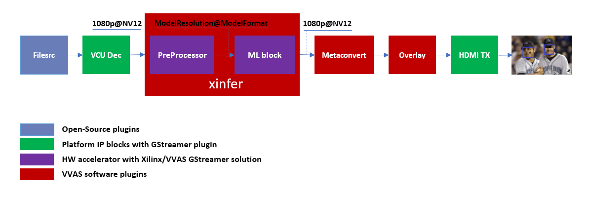
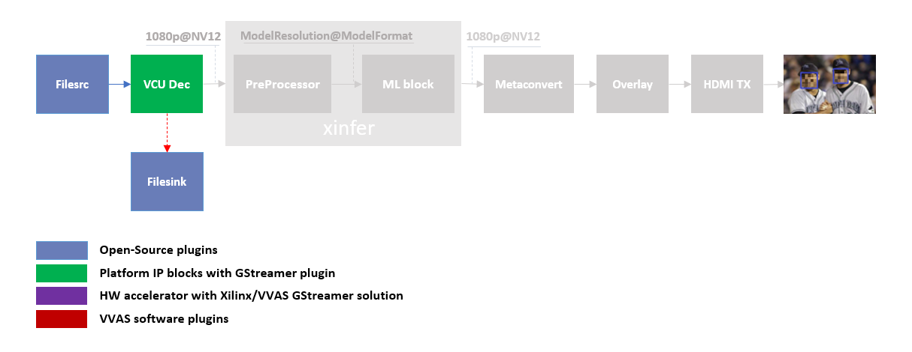
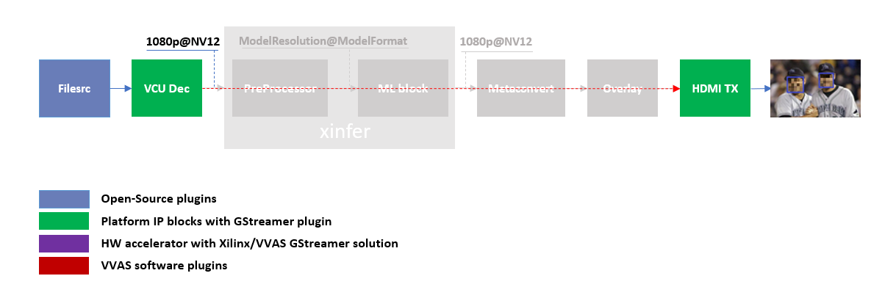

#########################################
Multichannel ML
#########################################

This tutorial covers steps to create Machine Learning (ML) based example pipelines. There are two types of Machine Learning pipelines:

* Single stage ML that involve only one ML operation on the input image
* Multi stage ML, also commonly known as Cascaded ML, that involve several ML operation using different ML models on single input image

This tutorial begins with building a one stream, single stage Machine Learning pipeline using VVAS and then scales up to build four channel Machine learning pipelines that processes 4 streams in parallel.

The pipeline will run some ML model on the four H.264 decoded streams and mix the videos and display the four streams on HDMI Monitor.

.. image:: ./media/multichannel_ml/four_channel_pipeline.png
   :align: center

Once single stage ML pipeline creation is completed, this tutorial covers the steps to build multi stage ML pipelines.

*****************
Requirements
*****************

Hardware Requirements
========================

- `ZCU104 Evaluation Board Rev 1.0 <https://www.xilinx.com/products/boards-and-kits/zcu104.html>`_
- Micro USB cable, connected to laptop or desktop computer for the terminal emulator
- MicroSD card, 8 GB or larger, class 10 (recommended)
- HDMI 2.0 supported Monitor with 3840x2160 as the native resolution
- HDMI 2.0 cable

Software Requirements
========================

(Refer `Vitis Unified Software Development Platform 2022.2 Documentation <https://docs.xilinx.com/r/en-US/ug1400-vitis-embedded/Installation>`_ for installation instructions)

- `Vitis™ Unified Software Platform <https://www.xilinx.com/support/download/index.html/content/xilinx/en/downloadNav/vitis/2022-2.html>`_ version 2022.2
- `Petalinux tool <https://www.xilinx.com/support/download/index.html/content/xilinx/en/downloadNav/embedded-design-tools/2022-2.html>`_ version 2022.2
- Serial terminal emulator (for example, Tera Term)
- Git
- Host system with Ubuntu 18.04/20.04 (Recommended)
- `Balena Etcher flashing tool <https://etcher.download/>`_

System Requirements
======================

- Board must have access to the internet and be accessible from your development system

*******************
Pre-built binaries
*******************

Release package can be dowloaded from `vvas_multichannel_ml_2022.2_zcu104.zip <https://www.xilinx.com/member/forms/download/xef.html?filename=vvas_multichannel_ml_2022.2_zcu104.zip>`_ which provides prebuilt binaries including SD card image that has the implemented design and required software, and scripts. You may use the pre-built binaries and provided scripts to quickly run the GStreamer pipelines to get a feel of the platform.

 .. Note::

     Pre-built binaries for this example designs will be available soon. You may also build this complete example design following the steps mentioned in **Building Blocks** section. For more information, you may contact vvas_discuss@amd.com.

Download the release package. Let the path where release package is downloaded be represented as ``<RELEASE_PATH>``.

.. Note::

   The pre-buit binaries available for download from the link  mentioned above contain software copyrighted by Xilinx and third parties subject to one or more open source software licenses that are contained in the source code files available for download at the link mentioned below.  Please see the source code for the copyright notices and licenses applicable to the software in these binary files.  By downloading these binary files, you agree to abide by the licenses contained in the corresponding source code

In case user wants to see the Licenses and source code that was used to build these pre-built binaries, download `Source Licenses and Source Code <https://www.xilinx.com/bin/public/openDownload?filename=license_and_sources_for_multichannel_ml.tar.gz>`_ that contain the Open Source Licenses and source code.

Once you have downloaded the pre-built binaries, you may go to section :ref:`board-bring-up` to try the released SD card image.

Building Blocks
=======================

Let us begin with constructing a single stream video pipeline based on the components selected.

We shall build the pipeline incrementally, starting from the source element and keep appending the pipeline as per the use case.

First setup the ZCU104 board with steps outlined in :ref:`board-bring-up`.
Face mask detection model (face_mask_detection_pt) is used in constructing the single stream pipeline, hence choose a mp4/h264 video file with human faces.

VCU Decoder block
---------------------------

A VCU Decoder block is required to decode the H.264/H.265 encoded stream and feed the decoded data to the ML block for inference.
For good performance, the hardware VCU block is expected to be part of the Xilinx platform.
The ``zcu104_vcuDec_vmixHdmiTx`` platform provides VCU as a hardware block as part of the design and the omxh264dec plugin for decoding.
Refer to `pg252 <https://www.xilinx.com/support/documentation/ip_documentation/vcu/v1_2/pg252-vcu.pdf>`_ for more information on the Xilinx VCU block.

.. image:: ./media/multichannel_ml/omxh264dec_plugin.png
   :align: center
   :scale: 70

VVAS solution for VCU block

Standalone VCU block can be tested with following pipeline:

   
   Sample video pipeline for VCU block

*GStreamer command*:

::

  gst-launch-1.0 filesrc location=/home/root/videos/face_mask_detection.mp4 ! qtdemux ! h264parse ! omxh264dec internal-entropy-buffers=2 ! filesink location=./vcu_out.nv12 -v

HDMI Tx Block
------------------------------------------

In the previous section, the elementary pipeline is working but the output image from the VCU Decoder block is dump to file via filesink GStreamer opensource plugin.
Now we can replace filesink with the HDMI Tx using kmssink GStreamer plugin.
This enables viewing video on HDMI monitor.
You need to set DRM bus-id, plane-id and rendering position as kmssink properties.

The ``bus-id`` for the zcu104_vcuDec_vmixHdmiTx platform is fixed to ``a0130000.v_mix``.

The video mixer in zcu104_vcuDec_vmixHdmiTx platform supports 9 planes of NV12 format, with plane-id starting from 34 to 42.
You need to set the ``plane-id`` within this range to output the video stream on one of these planes.

The ``render-rectangle`` property sets the position of video stream on screen in the format “<x, y, width, height>”.
Here, x, y represents the starting position of the image on screen,
width represents width of the video image, and height represents height of the video image.

Sample video pipeline for adding HDMI Tx is shown as below

   Sample video pipeline adding Decoder and HDMI Tx blocks

*GStreamer command*:

::

  gst-launch-1.0 -v filesrc location=/home/root/videos/face_mask_detection.mp4 \
        ! qtdemux ! h264parse ! omxh264dec internal-entropy-buffers=2 \
        ! kmssink plane-id=34 bus-id="a0130000.v_mix"

The output can be shift to one corner of the screen by using "render-rectangle" property of kmssink

::

  gst-launch-1.0 -v filesrc location=/home/root/videos/face_mask_detection.mp4 \
        ! qtdemux ! h264parse ! omxh264dec internal-entropy-buffers=2 \
        ! kmssink plane-id=34 bus-id="a0130000.v_mix" render-rectangle="<0,0,1920,1080>"

.. Note:: It is assumed that the video resolution of the input file face_mask_detection.mp4 is 1080P.

Machine Learning (ML) block
-------------------------------

Machine Learning inference is performed by DPU hardware accelerator and :ref:`vvas_xinfer` plug-in.
VVAS supports the DPU libraries released with `Vitis-AI <https://github.com/Xilinx/Vitis-AI>`_ 3.0.
The beauty of this VVAS solution is that user need not figure out the resolution required for various DPU supported models.
vvas_xinfer plug-in gets this information from the requested model and perform resize, color space conversion operation on the input image as per the requirement of the model using preprocessor block (vvas_xpreprocessor). The output of the vvas_xinfer is the original input image along with the scaled metadata for that resolution.

The information for the ML model to be used must be provided in the JSON file, that is passed to vvas_xinfer’s plug-in property **infer-config**.

.. figure:: ./media/multichannel_ml/xfilter_plugin.png
   :align: center
   :scale: 60

   VVAS solution for ML block

ML block can be tested with following pipeline:

.. figure:: ./media/multichannel_ml/ML_pipeline.png
   :align: center
   :scale: 70

   Sample Video Pipeline adding ML block

*GStreamer command*:

::

  gst-launch-1.0 -v filesrc location=/home/root/videos/face_mask_detection.mp4 \
    ! qtdemux ! h264parse ! omxh264dec internal-entropy-buffers=2 ! queue \
    ! vvas_xinfer preprocess-config=kernel_preprocessor.json infer-config=kernel_face_mask_detection_pt.json name=infer1 ! queue \
    ! kmssink plane-id=34 bus-id="a0130000.v_mix" render-rectangle="<0,0,1920,1080>"

You can notice that the caps are not mentioned after the decoder as the vvas_xinfer auto negotiates the caps based on the model selected.

.. Note::

    In this pipeline, if the debug_level of ``vvas_xinfer`` library is increased to 2, and set 'export VVAS_CORE_LOG_FILE_PATH=CONSOLE' in the board console, you can see the objects detected in logs.
    The debug level can be increased in the ``kernel_face_mask_detection_pt.json`` JSON file.
    The sample log output is shown below.

    .. figure:: ./media/multichannel_ml/inference_result_dump.png
       :align: center
       :scale: 50

Sample JSON files **kernel_preprocessor.json** for preprocesing and **kernel_face_mask_detection_pt.json** for face_mask_detection_pt DPU model for detection of a human face mask are provided for reference.

::

   {
     "xclbin-location" : "/run/media/mmcblk0p1/dpu.xclbin",
     "device-index": 0,
     "kernel" :{
       "kernel-name":"image_processing:{image_processing_1}",
       "config": {
         "ppc": 2,
         "in-mem-bank": 0,
         "out-mem-bank": 0,
         "debug-level" : 0
       }
     }
   }

   kernel_preprocessor.json

::

   {
     "inference-level": 1,
     "attach-ppe-outbuf": false,
     "kernel" : {
       "config": {
         "batch-size" : 0,
         "model-name" : "face_mask_detection_pt",
         "model-class" : "YOLOV3",
         "model-format" : "RGB",
         "model-path" : "/usr/share/vitis_ai_library/models/",
         "vitis-ai-preprocess" : false,
         "performance-test" : false,
         "debug-level" : 2
       }
     }
   }

   kernel_face_mask_detection_pt.json

Different ML models supported by the DPU have different preprocessing requirements that can include resize, mean subtraction, scale normalization etc. Additionally, the DPU expects input image in BGR/RGB format. The VCU decoder at the input of the DPU generates NV12 images. Depending on the model selected, the preprocessor block is expected to support the following operations:

* Resize
* Color space conversion
* Mean Subtraction
* Scale Normalization

Although all these operations can be achieved in software, the performance impact is substantial. VVAS support hardware accelerated pre-processing. Configuration parameters for pre-processing block mean-substraction and scale-normalization is read from the model .prototxt file.

Once the objects are detected, you can move to the next advanced blocks.

Machine Learning with preprocessing in software
-----------------------------------------------------

VVAS can also be used on the Platform that may not have hardware accelerated pre-processing (Image Processing kernel) due to any reason. In this case the preprocessing needs to be performed in software. The scaling and color space conversation are done by open source gstremaer plugins and the normalization and scaling are done by Vitis AI library.

Below is the pipeline without vvas preprocessor.

::

  gst-launch-1.0 -v filesrc location=/home/root/videos/face_mask_detection.mp4 \
    ! qtdemux ! h264parse ! omxh264dec internal-entropy-buffers=2 ! queue \
    ! videoscale ! queue \
    ! videoconvert ! queue \
    ! vvas_xinfer infer-config=kernel_face_mask_detection_pt.json name=infer1 ! queue \
    ! videoscale ! queue \
    ! videoconvert ! queue \
    ! video/x-raw, width=1920, height=1080, format=NV12 \
    ! kmssink plane-id=34 bus-id="a0130000.v_mix" render-rectangle="<0,0,1920,1080>"

The following is sample JSON kernel_face_mask_detection_pt.json for running the face_mask_detection_pt DPU model that detects a human face.

::

   {
     "inference-level": 1,
     "attach-ppe-outbuf": false,
     "kernel" : {
       "config": {
         "batch-size" : 0,
         "model-name" : "face_mask_detection_pt",
         "model-class" : "YOLOV3",
         "model-format" : "RGB",
         "model-path" : "/usr/share/vitis_ai_library/models/",
         "vitis-ai-preprocess" : true,
         "performance-test" : false,
         "debug-level" : 2 
       }
     }
   }

    kernel_face_mask_detection_pt.json

You can observe that in above pipeline **preprocess-config** property of ``vvas_xinfer`` plug-in is not set. This means we do not want to use hardware accelerated pre-processing block of ``vvas_xinfer`` plug-in and the videoscale and videoconvert GStreamer opensource plug-ins are used to convert the format and colour of input image as required by DPU model and Kmssink. The caps are not mentioned before ``vvas_xinfer`` and after the decoder as ``vvas_xinfer`` auto negotiates the caps based on the model selected.

Since we want Vitis AI library to perform the required pre-processing in software, we need to set **vitis-ai-preprocess** to true in **kernel_face_mask_detection_pt.json**.

Although all these operations can be achieved in software, the performance impact is substantial. So rest of the document consider that the hardware accelerated pre-processing (using Image Processing kernel) is part of the provided hardware.

.. Note::

    Though you may not observe any ML Inference information on monitor with this pipeline,
    but we should see the input image getting displayed in monitor by this pipeline.

Four Channel ML pipeline
==================================

Now, constructing a four-channel pipeline is simply duplicating the above pipeline four times for different models
and positioning each output video appropriately on screen on different plane-ids.

Below Vitis AI models are used as example in this tutorial.

* efficientdet_d2_tf (Object detection)
* face_mask_detection_pt (Object detection)
* vehicle_type_resnet18_pt (Image Classification)
* refinedet_VOC_tf (Object detection)

A reference pipeline for four channel ML is given below.

::

  gst-launch-1.0 -v --no-position \
   filesrc location=/home/root/videos/efficientdet_d2_tf.h264 \
    ! h264parse ! omxh264dec internal-entropy-buffers=2 ! queue \
    ! vvas_xinfer preprocess-config=kernel_preprocessor.json infer-config=kernel_efficientdet_d2_tf.json name=infer1 ! queue \
    ! vvas_xmetaconvert config-location="metaconvert_config.json" ! vvas_xoverlay ! queue \
    ! fpsdisplaysink video-sink="kmssink plane-id=34 bus-id=a0130000.v_mix render-rectangle=<0,0,1920,1080>" text-overlay=false sync=false \
   filesrc location=/home/root/videos/face_mask_detection_pt_1920x1080.h264 \
    ! h264parse ! omxh264dec internal-entropy-buffers=2 ! queue \
   ! vvas_xinfer preprocess-config=kernel_preprocessor.json infer-config=kernel_face_mask_detection_pt.json name=infer2 ! queue \
   ! vvas_xmetaconvert config-location="metaconvert_config.json" ! vvas_xoverlay ! queue \
   ! fpsdisplaysink video-sink="kmssink plane-id=35 bus-id=a0130000.v_mix render-rectangle=<1920,0,1920,1080>" text-overlay=false sync=false \
  filesrc location=/home/root/videos/vehicleclassification-type.mp4 \
   ! qtdemux ! h264parse ! omxh264dec internal-entropy-buffers=2 ! queue \
   ! vvas_xinfer preprocess-config=kernel_preprocessor.json infer-config=kernel_vehicle_type_resnet18_pt.json name=infer3 ! queue \
   ! vvas_xmetaconvert config-location="metaconvert_config.json" ! vvas_xoverlay ! queue \
   ! fpsdisplaysink video-sink="kmssink plane-id=36 bus-id=a0130000.v_mix render-rectangle=<0,1080,1920,1080>" text-overlay=false sync=false \
  filesrc location=/home/root/videos/refinedet_VOC_tf.mp4 \
   ! qtdemux ! h264parse ! omxh264dec internal-entropy-buffers=2 ! queue \
   ! vvas_xinfer preprocess-config=kernel_preprocessor.json infer-config=kernel_refinedet_VOC_tf.json name=infer4 ! queue \
   ! vvas_xmetaconvert config-location="metaconvert_config.json" ! vvas_xoverlay ! queue \
   ! fpsdisplaysink video-sink="kmssink plane-id=37 bus-id=a0130000.v_mix render-rectangle=<1920,1080,1920,1080>" text-overlay=false sync=false

The above command is available in the release package as ``multichannel_ml.sh``.

VVAS Cascaded Machine Learning usecase
======================================

There might be multiple use cases where the user wants to process inference on the required portion of image only and not on full image. One of the examples is to determine the color of the car(s) in an image containing multiple objects/cars. In this case, as a first step, system must identify all the cars in the image. This information is used to perform second stage of inference to identify the color of each car.

The scenario mentioned above required multiple levels of ML inference operation in serial or cascade manner where the following inference block works only on the output of the previous inference block.

This tutorial demonstrates how to build such types of use cases using VVAS with minimal configuration and with ease.

In this tutorial, the end goal is to determine the color of the cars in an image. We will be using the ssd_mobilenet_v2_coco_tf model to detect the cars in the input image. Then, to feed the image of the car(s) to the chen_color_resnet18_pt model, one should crop the car from the input image and provide it to chen_color_resnet18_pt model after doing preprocessing. So, to achieve this use case, 2 levels of ML inference operations are performed. First level ML inference detect the cars in the image, 2nd level inference determines the color of the car in the provided image of the car.

Below diagram express the use case mentioned above. 

.. image:: ./media/Cascade1/color_detect_usecase.png
   :align: center

By the end of this tutorial, you should be able to build and run the following pipeline.

.. image:: ./media/Cascade1/cascade_pipeline.png
   :align: center

Cascade Building Blocks
=======================

Different ML models supported by the DPU have different preprocessing requirements that can include resize, mean subtraction, scale normalization etc. Additionally, the DPU expects input images in BGR/RGB formats. The VCU decoder at the input of the DPU generates NV12 images. Depending on the model selected, the preprocessor block is expected to support the following operations:

* Resize
* Color space conversion
* Mean Subtraction
* Scale Normalization

Let us begin with constructing incremental video pipeline based on the components selected.

First Level inference
-------------------------------------
 
We start to add the first level of ML inference that will detect the cars. This can be achieved using ``ssd_mobilenet_v2_coco_tf`` model.

.. image:: ./media/Cascade1/cascade_1st_level_pipeline.png
   :align: center

Pipeline to demonstrate the car detection from frame and display output to monitor is as mentioned below.

::

  gst-launch-1.0 -v --no-position \
    filesrc location=/home/root/videos/Cars_1900.264 \
     ! h264parse ! omxh264dec internal-entropy-buffers=2 ! queue  \
     ! vvas_xinfer preprocess-config=kernel_preprocessor.json infer-config=kernel_ssd_mobilenet_v2_coco_tf.json name=infer1 ! queue  \
     ! vvas_xmetaconvert config-location="metaconvert_config.json" ! vvas_xoverlay ! queue \
     ! kmssink plane-id=34 bus-id="a0130000.v_mix" sync=false

Below are the sample json files.

::

 {
   "xclbin-location" : "/run/media/mmcblk0p1/dpu.xclbin",
   "device-index": 0,
   "kernel" :{
     "kernel-name":"image_processing:{image_processing_1}",
     "config": {
       "ppc": 2,
       "in-mem-bank": 0,
       "out-mem-bank": 0,
       "debug-level" : 0
    }
  }

 }
 
 kernel_preprocessor.json

::

 {
   "inference-level":1,
   "attach-ppe-outbuf": false,
   "low-latency":false,
   "kernel" : {
     "config": {
       "model-name" : "ssd_mobilenet_v2_coco_tf",
       "model-class" : "TFSSD",
       "model-format" : "RGB",
       "batch-size":1,
       "model-path" : "/usr/share/vitis_ai_library/models/",
       "vitis-ai-preprocess" : false,
       "performance-test" : false,
       "debug-level" : 3
       }
   }
 }

 kernel_ssd_mobilenet_v2_coco_tf.json 

The output of VCU Decoder is 1920X1080 image in NV12 format and the requirement for ssd_mobilenet_v2_coco_tf is 300X300 image in RGB color format. This conversion can be taken care of by the hardware accelerated preprocessor block which is part of vvas_xinfer plugin. Not only the color format conversion, the preprocessor block also perform the Mean Subtraction and Scale Normalization. Although all these operations can be achieved in software, the performance impact is substantial.

For simplicity, a common json file is used for meta convert. Please refer :ref:`vvas_xmetaconvert <vvas_xmetaconvert>` for more detailed parameters of meta convert.

::

 {
   "config": {
     "display-level": 1,
     "font-size" : 2,
     "font" : 4,
     "thickness" : 1,
     "radius": 5,
     "mask-level" : 5,
     "y-offset" : 0,
     "label-filter" : [ "class" ],
     "debug-level" : 3,
     "classes" : [
       {
         "name" : "car",
         "blue" : 183,
         "green" : 255,
         "red"  : 183
       },
       {
         "name" : "person",
         "blue" : 183,
         "green" : 255,
         "red"  : 183
       },
       {
         "name" : "bus",
         "blue" : 183,
         "green" : 255,
         "red"  : 183
       },
       {
         "name" : "bicycle",
         "blue" : 183,
         "green" : 255,
         "red"  : 183
       }
     ]
   }
 }

 metaconvert_config.json

Second Level inference
-------------------------------

First level inference detects the car(s) in the input image. Now we need to determine the color of the detected car. So, lets add second level ML Inference with chen_color_resnet18_pt model just after the first level ML Inference with ssd_mobilenet_v2_coco_tf model.

.. image:: ./media/Cascade1/cascade_2nd_level_pipeline.png
   :align: center

Below is the GStreamer pipe demonstrating the car color detect after car detect and display output to monitor using the kmssink plugin.

::

  gst-launch-1.0 -v --no-position  \
   filesrc location=/home/root/videos/Cars_1900.264 \
   ! h264parse ! omxh264dec internal-entropy-buffers=2 ! queue   \
   ! vvas_xinfer preprocess-config=kernel_preprocessor.json infer-config=kernel_ssd_mobilenet_v2_coco_tf.json name=infer1 ! queue \
   ! vvas_xinfer preprocess-config=kernel_preprocessor.json infer-config=kernel_chen_color_resnet18_pt.json name=infer2 ! queue \
   ! vvas_xmetaconvert config-location="metaconvert_config.json" \
   ! vvas_xoverlay ! queue \
   ! kmssink plane-id=34 bus-id="a0130000.v_mix" sync=false

Below are the sample json files for 2nd level.

::

 {
   "inference-level":2,
   "attach-ppe-outbuf": false,
   "low-latency":false,
   "kernel" : {
     "config": {
       "model-name" : "chen_color_resnet18_pt",
       "model-class" : "CLASSIFICATION",
       "model-format" : "RGB",
       "batch-size":13,
       "model-path" : "/usr/share/vitis_ai_library/models/",
       "vitis-ai-preprocess" : false,
       "performance-test" : false,
       "debug-level" : 3
     }
   }
 }

 kernel_chen_color_resnet18_pt.json 

Please note the "inference-level" parameter in the json is 2 which tells the framework that pre-processing and ML must be performed on the results of the 1st level inference. Also, "display-level" must be set to 2 in metaconvert_config.json, to use only the information of the 2nd level inference results for the overlay.

There might be multiple cars in an image and we need to determine the color for each of them. So when the image, along with the metadata detected in 1st level inference reaches 2nd level infrence, the pre-processing stage at 2nd level inference first crops the car found in first level and resize to the resolution and perform color space conversion required by chen_color_resnet18_pt model. All this cropping and re-sizing and color space conversion can be performed by preprocessor block without user knowing about it.

Hope you enjoyed the tutorial.

Now, let's look into implementing the design and executing using Vitis AI and VVAS.

************************
Example Design Creation
************************

This section covers the steps to create a complete example design that comprise Base Platform, Hardware Accelerators (Kernels) and Software required to run Machine Learning Applications explained in thie Tutorial.

This tutorial needs video codec unit (VCU) decoder, Video Mixer and HDMI Tx, hence select a platform having these IPs.

This tutorial uses the VVAS `zcu104_vcuDec_vmixHdmiTx <https://github.com/Xilinx/VVAS/tree/master/vvas-platforms/Embedded/zcu104_vcuDec_vmixHdmiTx>`_ platform because it supports VCU decoder, Video mixer and HDMI Tx subsystem.

For more information on Vitis platforms, see `Vitis Software Platform <https://www.xilinx.com/products/design-tools/vitis/vitis-platform.html>`_.

.. Note::

    VVAS platform ``zcu104_vcuDec_vmixHdmiTx`` may not be performance optimal. This platform is made available as reference and for tutorial demonstration.

.. Note::

    VVAS platform ``zcu104_vcuDec_vmixHdmiTx`` adds patch to irps5401 driver for zcu104 board to support multi thread execution of VAI models.
    This `patch <https://github.com/Xilinx/Vitis-AI/blob/v2.0/dsa/DPU-TRD/app/dpu_sw_optimize.tar.gz>`_ shouldn't be applied to other boards
    and is not part of the official Xilinx released 2022.2 Petalinux.

Build Platform
==============

The first and foremost step is to build this platform from its sources.

The platform provides the following hardware and software components of the pipeline:

* VCU hardened IP block
* Video Mixer and HDMI Tx soft IP blocks
* Opensource framework like GStreamer, OpenCV
* Vitis AI 3.0 libraries
* Xilinx Runtime (XRT)
* omxh264dec GStreamer plugin
* kmmsink GStreamer plugin
* VVAS GStreamer plugins and libraries

  * :ref:`vvas_xinfer <vvas_xinfer>` GStreamer plugin
  * :ref:`vvas_xmetaconvert <vvas_xmetaconvert>` software accelerator library
  * :ref:`vvas_xoverlay <vvas_xoverlay>` software accelerator library

Steps for building the platform:

1. Download the VVAS git repository. Let the path where VVAS repo is downloaded be represented as ``<VVAS_REPO>``.
::

  git clone --recurse-submodules https://github.com/Xilinx/VVAS.git

2. Setup the toolchain
::

  source <2022.2_Vitis>/settings64.sh
  source <2022.2_Petalinux>/settings.sh

3. Change directory to the platform
::

  cd <VVAS_REPO>/VVAS/vvas-platforms/Embedded/zcu104_vcuDec_vmixHdmiTx

4. Build the platform
::

  make

After the build is finished, the platform is available at
``<VVAS_REPO>/VVAS/vvas-platforms/Embedded/zcu104_vcuDec_vmixHdmiTx/platform_repo/xilinx_zcu104_vcuDec_vmixHdmiTx_202220_1/export/xilinx_zcu104_vcuDec_vmixHdmiTx_202220_1/``.

Let the path to platform be represented as ``<PLATFORM_PATH>``.

Vitis Example Project
================================

This section covers the steps to create a final sdcard image from the **platform** created in previous step and hardware accelerators, also called as **kernels**.

A Vitis build is required to stitch all the discussed hardware accelerators to the platform design.
The hardware accelerators required are:

1. DPU (Xilinx ML IP)
2. Image Processing (Xilinx Preprocessing IP)

The Xilinx deep learning processor unit (DPU) is a configurable computation engine dedicated for convolutional neural networks.
Refer to `DPU-TRD <https://github.com/Xilinx/Vitis-AI/blob/master/dpu/ref_design_docs/README_DPUCZ_Vitis.md>`_ for more information and compiling the DPU accelerator.

DPU Kernel for this example design is configured for B3136 architecture. Configuration file used can be found at ``<VVAS_REPO>/VVAS/vvas-examples/Embedded/multichannel_ml/dpu_conf.vh``.

Image Processing IP/Kernel source code can be refered from ``<VVAS_REPO>/VVAS/vvas-accel-hw/image_processing/``. For this example design Image Processing kernel is configured for max-width:3840, max-height:2160 and format support of Y_UV8_420, RGB and BGR. Configuration file used can be found at ``<VVAS_REPO>/VVAS/vvas-examples/Embedded/multichannel_ml/image_processing_config.h``.

The ``multichannel_ml`` example design adds two instances of DPU and a single instance of Image-Processing to the ``zcu104_vcuDec_vmixHdmiTx`` platform.

Steps for building Vitis example project:

1. Download Vitis-AI. Let the path where Vitis-AI is downloaded be represented as ``<VITIS_AI_REPO>``.

  * Open the `reference_design <https://github.com/Xilinx/Vitis-AI/tree/master/dpu#readme>`__ readme page from Vitis-AI release repo.

  * Copy the ``Reference Design`` link for ``IP Name`` corresponding to ``DPUCZDX8G`` from ``Edge IP`` Table

  ::

      wget -O DPUCZDX8G_VAI_v3.0.tar.gz '<Download Link>'

  * Uarchive ``DPUCZDX8G_VAI_v3.0.tar.gz``

  ::

      tar -xf DPUCZDX8G_VAI_v3.0.tar.gz

2. Change directory to example project

::

  cd <VVAS_REPO>/VVAS/vvas-examples/Embedded/multichannel_ml/

3. Compile the project

::

  make PLATFORM=<PLATFORM_PATH>/xilinx_zcu104_vcuDec_vmixHdmiTx_202220_1.xpfm DPU_TRD_PATH=<VITIS_AI_REPO>/DPUCZDX8G_VAI_v3.0 HW_ACCEL_PATH=<VVAS_REPO>/VVAS/vvas-accel-hw/

.. Note:: *Depending on the build machine capacity, building this example project can take about 3 or more hours to compile*.

Once the build is completed, you can find the sdcard image at
``<VVAS_REPO>/VVAS/vvas-examples/Embedded/multichannel_ml/binary_container_1/sd_card.img``.

Model Binaries
==============

Multichannel ML design uses 3136 DPU architecture. One must use the models compiled for this DPU architecture.
To obtain the model binaries, please contact vvas_discuss@amd.com.

.. _board-bring-up:

Board bring up
==================================

1. Burn the SD card image ``sd_card.img`` (Either from `Release package <https://www.xilinx.com/member/forms/download/xef.html?filename=vvas_multichannel_ml_2022.2_zcu104.zip>`_ or generated)  using a SD card flashing tool like dd, Win32DiskImager, or Balena Etcher.

   Boot the board using this SD card.

2. Once the board is booted, resize the ext4 partition to extend to full SD card size::

      resize-part /dev/mmcblk0p2

3. From the host system, copy the video files on the board::

      mkdir -p ~/videos
      scp -r <Path to Videos> root@<board ip>:~/videos

.. Note:: Video files are not provided as part of release package.

4. Copy the model json files and scripts on the board::

      scp -r <RELEASE_PATH>/vvas_multichannel_ml_2022.2_zcu104/scripts_n_utils/ root@<board ip>:~

5. Copy the Vitis-AI model files on board. Execute the command mentioned below on the target board::

      mkdir -p /usr/share/vitis_ai_library/models
      scp -r <WORKSPACE>/models/* root@<board ip>:/usr/share/vitis_ai_library/models/

6. Copy label.json files::

      scp <RELEASE_PATH>/vvas_multichannel_ml_2022.2_zcu104/models/face_mask_detection_pt/label.json root@<board ip>:/usr/share/vitis_ai_library/models/face_mask_detection_pt/
      scp <RELEASE_PATH>/vvas_multichannel_ml_2022.2_zcu104/models/ssd_mobilenet_v2_coco_tf/label.json root@<board ip>:/usr/share/vitis_ai_library/models/ssd_mobilenet_v2_coco_tf/
      scp <RELEASE_PATH>/vvas_multichannel_ml_2022.2_zcu104/models/yolov3_voc_tf/label.json root@<board ip>:/usr/share/vitis_ai_library/models/yolov3_voc_tf/

7. Execute four channel GStreamer pipeline script. Execute the command mentioned below on the target board::
      
      cd ~/scripts_n_utils/multichannel_ml/
      ./multichannel_ml.sh

You can now see the 4-channel mixed video on the HDMI monitor.

8. Execute multi level cascade Gstreamer pipeline scripts::

      cd ~/scripts_n_utils/cascade/
      ./1_level_cascade.sh
      ./2_level_cascade.sh

*************
Known Issues
*************

* On zcu104 boards, Cascaded pipelines OR several ML instances running simultaneously are sending board into bad state and needs reboot to recover from it. The default value of IOUT_OC_FAULT_LIMIT on PMIC chip irps5401 is too low  and that is causing the temperature fault limit getting crossed. Workaround is to increase this limit. But there is risk of board getting damaged if running for long time.

********************
References
********************

1.	https://github.com/Xilinx/Vitis-AI
2.	https://docs.xilinx.com/access/sources/ud/document?Doc_Version=3.0%20English&url=ug1431-vitis-ai-documentation
3.	https://www.xilinx.com/support/download/index.html/content/xilinx/en/downloadNav/embedded-designtools.html
4.	https://www.xilinx.com/products/boards-and-kits/zcu104.html
5.	https://www.xilinx.com/support/documentation/ip_documentation/vcu/v1_2/pg252-vcu.pdf
6.	https://gstreamer.freedesktop.org
7.	https://www.kernel.org/doc/html/v4.13/gpu/drm-kms.html
8.	https://gstreamer.freedesktop.org/documentation/kms/index.html
