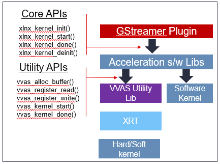

################################################
Acceleration Software Library Development Guide
################################################

One of the objectives of VVAS is to provide a framework for the advanced developers that enables them to develop their own kernel and integrate it into GStreamer-based applications. Kernel developers may not be experts in software development and there is always a learning curve to understand the frameworks like Xilinx Run Time (XRT), GStreamer etc. This framework abstracts the complexities of the XRT and GStreamer framework and provides simple and easy to understand APIs to hook their kernels developed on Xilinx FPGA into complex applications. Developers need to implement these interfaces and make them available in the form of a library, called as acceleration software library.
 
This section covers the details about developing an acceleration software library to control the kernel from the GStreamer application. The acceleration software library manages the kernel state machine as well as provide hooks to control the kernel from the GStreamer plug-ins or an application. 

There are different types of acceleration kernels supported by VVAS and details about these are covered below.

*****************
Types of Kernels
*****************

There are three types of acceleration kernels based on the implementation.

.. figure:: ../images/image15.png
   :align: center

Hard Kernel
============

A hard kernel is made up of HLS and RTL kernels.

Softkernel
===========

These are special kernels where actual hardware is controlled by a software running on the application processor of the device connected to the server over PCIe interface. The software that is controlling the actual hardware on the device is called as softkernel. This softkernel is receiving the commands/control information from the application running on the server. These softkernel are used only in PCIe based platforms, like Data Center.  These kernels are not for Embedded platforms.

.. figure:: ../images/softkernel.png
   :align: center

Software Kernel
================

Software kernels are software processing modules that execute fully on the host CPU. Exposing software kernel through the acceleration software library interface allows them to integrate into the GStreamer framework without an in-depth knowledge of the GStreamer framework.

Kernel Management Modes
=======================

Kernels can be managed in two different modes. In XRT managed mode, kernel execution (starting/stopping/configuration) is     managed by the underlying Xilinx Run Time (XRT). In this mode, the synchronization between different kernel instances executing simultaneously in different thread/process contexts is managed by XRT. This mode of operation is multi thread/multiprocess safe. XRT ensures that at any point, only one kernel context is given access to the actual kernel hardware resources.

Second mode of operation is user managed mode. In this mode, user is responsible to start, stop and configure kernel using     register read/write APIs. This mode is allowed only if kernel object is created in ``exclusive`` mode. If kernel is opened in ``exclusive`` mode, then only one instance of kernel object can be created/opened.

It is strongly recommended to use kernel in XRT managed mode by opening kernel in ``shared`` mode as this is multi thread/multi-process safe and easy to configure.

***********************************************
Interfaces for Acceleration Software Libraries
***********************************************

VVAS has defined a simplified, easy to use interface so that developer can easily hook their Kernels into GStreamer based applications. The interface has been divided into two parts, core APIs and utility APIs. Core APIs are mandatory APIs, to be implemented by the acceleration software libraries so that these can be controlled from the GStreamer Infrastructure plug-ins as well as applications. Utility APIs are provided to abstract the Xilinx Run Time (XRT) interface from the developer and provide easy to use interface to interact with the kernel.

Core API
========

Each acceleration software library must implement these Core APIs. The GStreamer VVAS infrastructure plug-ins (vvas_xfilter and vvas_xmultisrc) call these core APIs to perform operations on the kernel. The following is a list of core APIs.

xlnx_kernel_init
----------------

This API is called by the VVAS infrastructure plug-in only once at the time of plug-in initialization. Acceleration software library can perform all the one-time initialization in this function.

.. code-block::

        int32_t xlnx_kernel_init (VVASKernel * handle)
        Parameters:
            handle - VVAS kernel handle which has kernel context
        Return:
            0 on success or -1 on failure

xlnx_kernel_start
-----------------

This API is called by infrastructure plug-in for each input frame/buffer it has received for further processing by the kernel.
The acceleration software library can perform per frame operations like updating the state machine, reading/writing the registers of the IP and then instructing the kernel to process the input. Steps to start the kernel depends on the type of the kernel and are covered in detail later in this section.

.. code-block::

        int32_t xlnx_kernel_start (VVASKernel * handle, int start, VVASFrame *
        input[MAX_NUM_OBJECT], VVASFrame * output[MAX_NUM_OBJECT])

        Parameters:
           handle - VVAS kernel handle which has kernel context
            start – flag to indicate start of the kernel. Mainly useful in
        streaming kernel mode
            input[MAX_NUM_OBJECT] – Array of input frames populated in VVASFrame
        handle
            output[MAX_NUM_OBJECT] – Array of output frames populated in VVASFrame
        handle
        Return:
            0 on success or -1 on failure

        Note:
            1. MAX_NUM_OBJECT is 512 and same is assigned in vvas_kernel.h
            2. Input and output of array is NULL terminated to know number of input 
        & output frames received to start function

xlnx_kernel_done
-----------------

To know whether the kernel has finished processing the current frame/buffer, infrastructure plug-in or an application will call this API. The acceleration software library can implement the logic to know the status of kernel in this API. 

In case Kernel is being used in XRT managed mode, then developer must call ``vvas_kernel_done`` utility API to know if kernel has finished processing the current job. This API takes **time-out** svalue for the maximum amount of time this API will wait before returning from this function.

In case Kernel is being used in user managed mode then developer may implement the logic where it can monitor the status of AP_DONE bit of the kernel in polling mode to know the status of the current kernel task.

.. code-block::

        int32_t xlnx_kernel_done (VVASKernel * handle)

        Parameters:
            handle - VVAS kernel handle which has kernel context
        kernel.
        Return:
            0 on success or -1 on failure

xlnx_kernel_deinit
--------------------

This API is called by the infrastructure plug-in when plug-in is de-initializing. Acceleration software library must perform any clean-up, de-initialization tasks such as freeing private handles and internal memory allocation as part of the library initialization process.

.. code-block::

        int32_t xlnx_kernel_deinit (VVASKernel * handle)

        Parameters:
            handle - VVAS kernel handle which has kernel context
        Return:
            0 on success or -1 on failure

Utility APIs
==============

This section covers details about the utility infrastructure required to develop the kernel libraries for a new kernel and to integrate these acceleration software libraries into the GStreamer framework.

The acceleration software libraries are developed using the following utility APIs.

The utility API sources are hosted in the vvas-utils folder of the VVAS sources tree.

.. figure:: ../images/image24.png 
   :width: 400

Memory Management APIs
-----------------------

Hardware Kernel work on physically contiguous memory. In case acceleration software library need physically contiguous memory then the utility APIs mentioned below can be used. 

.. code-block::

        VVASFrame* vvas_alloc_buffer (VVASKernel *handle, uint32_t size,
        VVASMemoryType mem_type, VVASFrameProps *props)

        Parameters:
            handle - VVAS kernel handle which has kernel context
            size - memory size to be allocated
            mem_type - memory can be VVAS_FRAME_MEMORY or VVAS_INTERNAL_MEMORY
            props – required when requesting VVAS_FRAME_MEMORY

        Return:
            VVASFrame handle on success or NULL on failure

In case there is frequent memory allocation/de-allocation is required, then recommendation is to allocate from the memory pool. Developer can allocate the memory from the memory pool managed by GStreamer infrastructure plug-in. To allocate memory from memory pool managed by the GStreamer Infrastructure plug-in, developer must pass "props" parameter value as VVAS_FRAME_MEMORY. If "props" parameter value is set to VVAS_INTERNAL_MEMORY, then the memory is not allocated from a memory pool.
 

The following API is to free the memory that is allocated using the vvas_alloc_buffer() API.

.. code-block::

        void vvas_free_buffer (VVASKernel * handle, VVASFrame *vvas_frame)

        Parameters:
            handle - VVAS kernel handle which has kernel context
            vvas_frame – VVASFrame handle allocated using vvas_alloc_buffer() API

        Return:
            None

Read/Write Register APIs
---------------------------

These APIs can be used only if kernel object is created in ``exclusive`` mode. Moreover, developer must ensure that "is_multiprocess" parameter is set to "false" in VVASKernel object in acceleration software library.

In case developer has decided to go for the option of programing the kernel using register programming, then the only option to start a kernel is to set the "ap_start" bit by writing into the control register.
    
.. code-block::

        void vvas_register_write (VVASKernel *handle, void *src, size_t size,
        size_t offset)
        Parameters:
            handle - VVAS kernel handle which has kernel context
            src – pointer to data to be written at offset in ERT command buffer or
        register at offset from base address of IP
            size – size of the data pointer src
            offset – offset at which data to be written

        Return:
            None

The following API used to read from the registers of an IP/kernel. One can use this API to read the interrupt status register to know the status of task in polling mode.

.. code-block::

        void vvas_register_read (VVASKernel *handle, void *src, size_t size, size_t
        offset)

        Parameters:
            handle - VVAS kernel handle which has kernel context
            src – pointer to data which will be updated after read
            size – size of the data pointer src
            offset – offset from base address of an IP

        Return:
            None

Execution APIs
---------------

These APIs must be used in case kernel is being used in XRT managed mode.
Execution APIs are used to start kernel execution and then wait for the completion of the kernel current task. These APIs are multi-process/multi-thread safe. These APIs are only used when `is_multiprocess` is set to true during kernel initialization. Use the following API to start IP/kernel execution.

vvas_kernel_start
^^^^^^^^^^^^^^^^^^

Use this API to start the kernel. This API internally uses Xilinx Run Time (XRT) APIs to start the kernel.

.. code-block::

        int32_t vvas_kernel_start (VVASKernel * handle, const char *format, ...); 

        Parameters:
            handle - VVAS kernel handle which has kernel context
            format - Variable arguments for the list of arguments that the kernel takes.

        Return:
            0 on success -1 on failure

Follow below format specifiers for kernel arguments for "format" argument

| "i" : Signed int argument.
| "u" : Unsigned int argument.
| "f" : Float argument.
| "F" : Double argument.
| "c" : Char argument.
| "C" : Unsigned char argument.
| "S" : Short argument.
| "U" : Unsigned short argument.
| "l" : Unsigned long long argument.
| "d" : Long long argument.
| "p" : Any pointer argument.
| "b" : Buffer Object argument.
| "s" : If you want to skip the argument.

Ex : For passing 3 arguments of types int, unsigned int and a pointer,
     then the format specifier string would be "iup"

     If you want to skip the middler argument in the above case, then
     the format specifier string would be "isp"

Use the following API to check whether the IP or kernel has finished execution. This function internally loops for MAX_EXEC_WAIT_RETRY_CNT times until a timeout before returning an error.

.. code-block::

        int32_t vvas_kernel_done (VVASKernel * handle, int32_t timeout); 

        Parameters:
            handle  - VVAS kernel handle which has kernel context
            timeout - Timeout in milliseconds

        Return:
            0 on success or -1 on failure

*********************
VVAS Data structures
*********************
;
The following sections list the core structures and enumerations used in VVAS framework.

VVASKernel
==========

The VVASKernel is a structure to hold the kernel context and is created and passed to the core APIs by the GStreamer infrastructure plug-ins (for example: the vvas_xfilter).

.. code-block::

        typedef struct \_vvas_kernel VVASKernel;

        struct \_vvas_kernel {

        void \*xcl_handle; /\* XRT handle provided by GStreamer

        infrastructure plug-in \*/

        uint32_t cu_idx; /\* compute unit index of IP/soft- kernel \*/

        json_t \*kernel_config; /\* kernel specific config from app \*/ void
        \*kernel_priv; /\* to store kernel specific

        structures \*/
        json_t \*kernel_dyn_config; /\* Dynamically changed kernel configuration \*/
        xrt_buffer \*ert_cmd_buf; /\* ERT command buffer used to submit

        execution commands to XRT \*/

        size_t min_offset; size_t max_offset;

        VVASBufAllocCBFunc alloc_func; /\* callback function to allocate

        memory from GstBufferPool by GStreamer infrastructure plug-in \*/

        VVASBufFreeCBFunc free_func; /\* callback function to free memory

        allocated by alloc_func \*/ void \*cb_user_data; /\* handle to be
        passed along with

        alloc_func & free_func callback \*/

        vvaspads \*padinfo; #ifdef XLNX_PCIe_PLATFORM

        uint32_t is_softkernel; /\* true when acceleration s/w library is for

        #endif

        soft-kernel in PCIe platforms only

        \*/

        uint8_t is_multiprocess; /\* if true, ERT command buffer will

        be used to start kernel. else, direct register programming will be
        used \*/
        
        uint8_t  \*name; /\* TBD \*/
        
        uint16_t in_mem_bank; /\* Memory bank to which input port of kernel is attached to \*/
        uint16_t out_mem_bank; /\* Memory bank to which output port of kernel is attached to

        };

VVASVideoFormat
================

The VVASVideoFormat represents the video color formats supported by the VVAS framework. The GStreamer infrastructure plug-ins supports the mapping of the following formats and corresponding GStreamer color formats.

.. code-block::

        typedef enum {
        VVAS_VMFT_UNKNOWN = 0,
        VVAS_VFMT_RGBX8,
        VVAS_VFMT_YUVX8,
        VVAS_VFMT_YUYV8, // YUYV
        VVAS_VFMT_ABGR8,
        VVAS_VFMT_RGBX10,
        VVAS_VFMT_YUVX10,
        VVAS_VFMT_Y_UV8,
        VVAS_VFMT_Y_UV8_420, // NV12 
        VVAS_VFMT_RGB8,
        VVAS_VFMT_YUVA8,
        VVAS_VFMT_YUV8,
        VVAS_VFMT_Y_UV10,
        VVAS_VFMT_Y_UV10_420,
        VVAS_VFMT_Y8,
        VVAS_VFMT_Y10,
        VVAS_VFMT_ARGB8,
        VVAS_VFMT_BGRX8,
        VVAS_VFMT_UYVY8,
        VVAS_VFMT_BGR8, // BGR 
        VVAS_VFMT_RGBX12,
        VVAS_VFMT_RGB16,
        VVAS_VFMT_I420
        }  VVASVideoFormat;

VVASFrame
==========

The VVASFrame stores information related to a video frame. The GStreamer infrastructure plug-ins allocate the VVASFrame handle for input and output video frames and sends them to the VVAS kernel processing APIs. Also, the VVASFrame can be allocated by kernel libraries for internal memory requirements (i.e., memory for filter coefficients).

.. code-block::

        typedef struct _vvas_frame_props VVASFrameProps;
        typedef struct _vvas_frame VVASFrame;

        // frame properties hold information about video frame
        struct _vvas_frame_props {
        uint32_t width;
        uint32_t height;
        uint32_t stride;
        VVASVideoFormat fmt;
        };
        struct _vvas_frame {
        uint32_t bo[VIDEO_MAX_PLANES]; // ignore: currently not used 
        void \*vaddr[VIDEO_MAX_PLANES]; // virtual/user space address of 
                                       //video frame memory
        uint64_t paddr[VIDEO_MAX_PLANES]; // physical address of video frame
        uint32_t size[VIDEO_MAX_PLANES];
        void \*meta_data;
        VVASFrameProps props; /* properties of video frame \*/
        /\* application's private data \*/
        void \*app_priv; /* assigned to GstBuffer by GStreamer infrastructure plugin \*/
        VVASMemoryType mem_type;
        /\*number of planes in props.fmt \*/
        uint32_t n_planes; // number of planes based on color format
        };

Other VVAS Declarations
========================

.. code-block::

        #define MAX_NUM_OBJECT 512 /* max number of video frames/objects
        handled by VVAS \*/
        #define MAX_EXEC_WAIT_RETRY_CNT 10 /* retry count on xclExecWait failure \*/
        #define VIDEO_MAX_PLANES 4
        #define DEFAULT_MEM_BANK 0

        typedef enum {
        VVAS_UNKNOWN_MEMORY,
        VVAS_FRAME_MEMORY, /* use for input and output buffers \*/
        VVAS_INTERNAL_MEMORY, /* use for internal memory of IP \*/
        } VVASMemoryType;

        typedef struct buffer {
        unsigned int bo; /* XRT Buffer object \*/
        void* user_ptr; /* userspace/virtual pointer \*/
        uint64_t phy_addr; /* physical address \*/
        unsigned int size; /* size of XRT memory \*/
        } xrt_buffer;

VVAS acceleration software libraries APIs are broadly categorized into two API types, `Core API <#_bookmark17>`__ and `Utility API <#utility-api>`__.

***********************************************
Acceleration Software Library for Hard Kernels
***********************************************

This section covers the steps to develop an acceleration software library for hard kernels.

.. note:: It is assumed that hard kernel work only on physical address. Hence Infrastructure plugins will only provide physical address for the input/output buffers. If for any reason one wants to access the input/output buffers in s/w accel lib, then need to map the buffer and get the virtual address.

Virtual address is populated by infrastructure plugins only in case of s/w accel lib for "software only" kernels.
 
Memory Allocation
==================

A hard kernel works on the physically contiguous memory. Use the ``vvas_alloc_buffer`` API to allocate physically contiguous memory on the device (FPGA).

Starting Kernel
===============

APIs to start a kernel depends on the mode in which kernel object is created.

XRT Managed Kernel
-------------------

 ``vvas_kernel_start`` must be used to start the kernel execution. It takes all kernel parameters required to be programmed as function arguments.

User Managed Mode
--------------------

Use the ``vvas_register_write`` API to set the AP_START bit in kernel control register.

Checking Kernel Task Status
===========================

Once kernel is started, next step is to check if the task is completed or not. Depending on the mode in which kernel object is created, different mechanism to be used.
 
XRT Managed Kernel
-------------------

In this mode, developer needs to call ``vvas_kernel_done`` API. This API will return when kernel finished processing current task. Developer can provide the "time-out" interval value indicating how long this API has to wait before it can return in case kernel has not finished processing.

User Managed Mode
--------------------

In this mode, there is no callback or interrupt notification mechanism available that can be used to notify the task completion. The acceleration software library must continuously poll the kernel status register using ``vvas_register_read``.

******************************************************
Acceleration Software Library for the Software Kernel
******************************************************

Software kernels are software modules that run on the application processor. The acceleration software library for these processing modules do not interact with the XRT interface. The interface APIs that abstract the XRT interface are not needed. You must implement the core API in the acceleration software library for use in the GStreamer application through VVAS infrastructure plug-ins.

********************************************************************
Capability Negotiation Support in the Acceleration Software Library
********************************************************************

Kernel capability negotiation is an important functionality that should be accepted between the upstream element and infrastructure plug-ins to achieve an optimal solution. Because the infrastructure plug-ins are generic, the acceleration software library is responsible to populate the required kernel capability during xlnx_kernel_init(), which is negotiated between the infrastructure plug-ins and the upstream element. The infrastructure plug-in suggests a format on its sink pad and arranges the recommendation in priority order as per the kernel capability in the result from the CAPS query that is performed on the sink pad. Only the vvas_xfilter plug-in is currently supporting the kernel specific capability negotiation.

The following section explains the data structures exchange between acceleration software libraries and the infrastructure plug-ins for capability negotiation.

.. code-block::
   
        typedef struct caps
        {
        uint8_t range_height; /* true/false if height is specified in range */
        uint32_t lower_height; /* lower range of height supported,
        range_height=false then this value specified the fixed height supported
        */
        uint32_t upper_height; /* upper range of height supported */
        uint8_t range_width; /* true/false if width is specified in range */
        uint32_t lower_width; /* lower range of width supported,
        range_width=false then this value specified the fixed width supported */
        uint32_t upper_width; /* upper range of width supported */
        uint8_t num_fmt; /* number of format support by kernel */
        VVASVideoFormat *fmt; /* list of formats */
        } kernelcaps;

        typedef struct kernelpad
        {
        uint8_t nu_caps; /* number of different caps supported */
        kernelcaps **kcaps; /* lsit of caps */
        } kernelpads;

Below mentioned user friendly APIs are provided for kernel to set the above mentioned capabilities.

API to create new caps with input parameters

.. code-block::

        vvas_caps_new() - Create new caps with input parameters
        range_height
             - true  : if kernel support range of height
             - false : if kernel support fixed height
        lower_height : lower value of height supported by kernel
                       if range_height is false, this holds the fixed value
        upper_height : higher value of hight supported by kernel
                       if range_height is false, this should be 0
        range_width : same as above
        lower_width :
        upper_width :
       
                    : variable range of format supported terminated by 0
                      make sure to add 0 at end otherwise it
                      code will take format till it get 0

        kernelcaps * vvas_caps_new (uint8_t range_height,
                                    uint32_t lower_height,
                                    uint32_t upper_height, 
                                    uint8_t range_width, 
                                    uint32_t lower_width,
                                    uint32_t upper_width, ...)

API to  add new caps to sink pad. Only one pad is supported in this release.

.. code-block::

   bool vvas_caps_add_to_sink (VVASKernel * handle, kernelcaps * kcaps, int sinkpad_num)

API to add new caps to src pad. Only one pad is supported as on today.

.. code-block::

   bool vvas_caps_add_to_src (VVASKernel * handle, kernelcaps * kcaps, int sinkpad_num)

********************************************************************
Example (Development of acceleration sw library)
********************************************************************

This section shows how to develop an acceleration sw library using VVAS APIs which controls ``vvas_xsample`` kernel.

Following is a sample structure used in the example to validate ``vvas_xsample`` kernel.

.. code-block::

 struct  __attribute__((aligned(4))) vvas_sample_struct
 {
  char c_value;
  unsigned char uc_value;
  short s_value;
  unsigned short us_value;
  int i_value;
  unsigned int ui_value;
  float f_value;
  double d_value;
  long long ll_value;
  unsigned long long ul_value;
 };
 typedef struct vvas_sample_struct VvasSampleStruct;

At the first step we have to expose the CORE APIs, so that these can be controlled from the GStreamer Infrastructure plug-ins as well as applications. Following APIs are mandatory APIs.

.. code-block::

  
  /*********  CORE APIs ************/

  int32_t xlnx_kernel_init (VVASKernel * handle);

  uint32_t xlnx_kernel_start (VVASKernel * handle, int start,
      VVASFrame * input[MAX_NUM_OBJECT], VVASFrame * output[MAX_NUM_OBJECT]);

  int32_t xlnx_kernel_done (VVASKernel * handle);

  uint32_t xlnx_kernel_deinit (VVASKernel * handle);

We have to perform all the one-time initialization in ``xlnx_kernel_init`` API.
Following is the private structure to maintain/store all the initializations. It is upto the user to implement their own storage classes to maintain one-time initializations.

.. code-block::

 /*
  * Structure to store all initializations
  */

 typedef struct _kern_priv
 {
   int log_level;                /* Debug Level of logs */
   char c_value;                 /* variable to store char value */
   unsigned char uc_value;       /* varaiable to store unsigned char value */
   short s_value;                /* varable to store short value */
   unsigned short us_value;      /* varable to store unsigned short value */
   int i_value;                  /* varable to store int value */
   unsigned int ui_value;        /* varable to store unsigned int value */
   float f_value;                /* varable to store float value */
   double d_value;               /* variable to store double value */
   long long ll_value;           /* variable to store long long value */
   unsigned long long ul_value;  /* variable to store unsigned long long value */
   char overlay_image_path[MAX_LENGTH];  /* Path of the input overlay image */
   char input_overlay_image[MAX_OVERLAY_SIZE];   /* Buffer to store input overlay image */
   int overlay_image_height;     /* Height of the overlay image */
   int overlay_image_width;      /* Width of the overlay image */
   int overlay_image_xpos;       /* x-position, where to overlay image on input buffer */
   int overlay_image_ypos;       /* y-position, where to overlay image on input buffer */
   char input_string[MAX_LENGTH];        /* Input string to test sample kernel */
   void *xrt_input_string;       /* Pointer to hold the address of input string's xrt::bo */
   void *xrt_input_overlay_buffer;       /* Pointer to hold the address of the input overlay buffer's xrt::bo */
   void *xrt_output_string;      /* Pointer to hold the address of output string's xrt::bo */
   void *xrt_output_structure;   /* Pointer to hold the address of the output structure's xrt::bo */
 } vvasSampleKernelPriv;

Initialize all the required variables of the vvasSampleKernelPriv structure in ``xlnx_kernel_init`` API.

.. code-block::

  int32_t xlnx_kernel_init (VVASKernel * handle)
  {
    /*
     *  kernel configuration from application
     */
    json_t *jconfig = handle->kernel_config;
    json_t *val;
    vvasSampleKernelPriv *kpriv =
        (vvasSampleKernelPriv *) calloc (1, sizeof (vvasSampleKernelPriv));
    if (!kpriv)
    {
      LOG_MESSAGE (LOG_LEVEL_ERROR, kpriv->log_level,
          "ERROR: SAMPLE_KERNEL: failed to allocate kernelprivate memory");
      return -1;
    }

    /*
     *  Initaializing the kernel parameters
     *  Below values are hard coded for better understanding
     */
    kpriv->c_value = '\0';      /* Initialize the char value */
    kpriv->uc_value = '\0';     /* Initialize the unsigned char value */
    kpriv->s_value = -100;      /* Initialize the short value */
    kpriv->us_value = 0;        /* Initialize the unsigned short value */
    kpriv->i_value = -10000;    /* Initialize the int value */
    kpriv->ui_value = 0;        /* Initialize the unsigned int value */
    kpriv->f_value = 0.2;       /* Initialize the float value */
    kpriv->d_value = 1000000.1; /* Initialize the double value */
    kpriv->ll_value = 10000000; /* Initialize the long long value */
    kpriv->ul_value = 10000000; /* Initialize the unsigned long long value */

    /*
     *  Initaializing the kernel parameters
     *  from the configuration file passed to infrastructure plugin.
     */

    /* Set the debug level for logging purpose */
    val = json_object_get (jconfig, "debug_level");
    if (!val || !json_is_integer (val)) {
      kpriv->log_level = LOG_LEVEL_WARNING;
      LOG_MESSAGE (LOG_LEVEL_WARNING, kpriv->log_level, "debug_level %d",
          kpriv->log_level);
    } else {
      kpriv->log_level = json_integer_value (val);
      LOG_MESSAGE (LOG_LEVEL_INFO, kpriv->log_level, "debug_level %d",
          kpriv->log_level);
    }

    /* Get and set the input string that should be passed
     * to sample kernel
     */
    val = json_object_get (jconfig, "input_string");
    if (!val || !json_is_string (val)) {
      LOG_MESSAGE (LOG_LEVEL_WARNING, kpriv->log_level,
          "Input String not provided taking default");
      strcpy (kpriv->input_string, "HELLO SAMPLE");
    } else {
      strcpy (kpriv->input_string, (char *) json_string_value (val));
      LOG_MESSAGE (LOG_LEVEL_INFO, kpriv->log_level,
          "Input String is : %s", kpriv->input_string);
    }

    /* Get and set the height of the overlay image */
    val = json_object_get (jconfig, "overlay_image_height");
    if (!val || !json_is_integer (val)) {
      LOG_MESSAGE (LOG_LEVEL_ERROR, kpriv->log_level,
          "Overlay image height not provided");
      return -1;
    } else {
      kpriv->overlay_image_height = json_integer_value (val);
      LOG_MESSAGE (LOG_LEVEL_INFO, kpriv->log_level,
          "Overlay image height : %d", kpriv->overlay_image_height);
    }

    /* Get and set the width of the overlay image */
    val = json_object_get (jconfig, "overlay_image_width");
    if (!val || !json_is_integer (val)) {
      LOG_MESSAGE (LOG_LEVEL_ERROR, kpriv->log_level,
          "Overlay image width not provided");
      return -1;
    } else {
      kpriv->overlay_image_width = json_integer_value (val);
      LOG_MESSAGE (LOG_LEVEL_INFO, kpriv->log_level,
          "Overlay image width : %d", kpriv->overlay_image_width);
    }

    /* Get and set the path/location of the overlay image */
    val = json_object_get (jconfig, "overlay_image_path");
    if (!val || !json_is_string (val)) {
      LOG_MESSAGE (LOG_LEVEL_ERROR, kpriv->log_level,
          "Overlay image path not provided");
      return -1;
    } else {
      strcpy (kpriv->overlay_image_path, (char *) json_string_value (val));
      LOG_MESSAGE (LOG_LEVEL_INFO, kpriv->log_level,
          "Overlay image path : %s", kpriv->overlay_image_path);
    }

    /* Get and set the x position of the overlay image
     * to draw on input buffer
     */
    val = json_object_get (jconfig, "overlay_image_xpos");
    if (!val || !json_is_integer (val)) {
      kpriv->overlay_image_xpos = DEFAULT_X_POS;
      LOG_MESSAGE (LOG_LEVEL_WARNING, kpriv->log_level,
          "Overlay xpos is not set" " taking default : %d",
          kpriv->overlay_image_xpos);
    } else {
      kpriv->overlay_image_xpos = json_integer_value (val);
      LOG_MESSAGE (LOG_LEVEL_INFO, kpriv->log_level,
          "Overlay xpos is  : %d", kpriv->overlay_image_xpos);
    }

    /* Get and set the y position of the overlay image
     * to draw on input buffer
     */
    val = json_object_get (jconfig, "overlay_image_ypos");
    if (!val || !json_is_integer (val)) {
      kpriv->overlay_image_ypos = DEFAULT_Y_POS;
      LOG_MESSAGE (LOG_LEVEL_WARNING, kpriv->log_level,
          "Overlay xpos is not set" " taking default : %d",
          kpriv->overlay_image_ypos);
    } else {
      kpriv->overlay_image_ypos = json_integer_value (val);
      LOG_MESSAGE (LOG_LEVEL_INFO, kpriv->log_level,
          "Overlay ypos is  : %d", kpriv->overlay_image_ypos);
    }

    /* Open, read and store the overlay image */
    ifstream input_file (kpriv->overlay_image_path);
    if (!input_file.is_open ()) {
      LOG_MESSAGE (LOG_LEVEL_ERROR, kpriv->log_level,
          "Could not open overlay image  : %s", kpriv->overlay_image_path);

      return EXIT_FAILURE;
    }
    input_file.read (kpriv->input_overlay_image,
        (int) (kpriv->overlay_image_height * kpriv->overlay_image_width *
            NV12_BYTE_SIZE));
    input_file.close ();

    LOG_MESSAGE (LOG_LEVEL_INFO, kpriv->log_level,
        "Completed reading %s ", kpriv->overlay_image_path);

    /* Populate the kernel private in the kernel handle */
    handle->kernel_priv = (void *) kpriv;

    /* Enable multiprocess as we are using ``vvas_kernel_start`` method */
    handle->is_multiprocess = 1;

    return 0;
  }

After completing all the initializations in ``xlnx_kernel_init`` API , it is the time to execute the kernel in ``xlnx_kernel_start`` API. ``xlnx_kernel_start`` is called by infrastructure plug-in for each input frame/buffer it has received for further processing by the kernel.

As the ``vvas_xsample`` is a hard kernel, all the arguments passed to it deals with physical addresses.

.. code-block::

  uint32_t
      xlnx_kernel_start (VVASKernel * handle, int start,
      VVASFrame * input[MAX_NUM_OBJECT], VVASFrame * output[MAX_NUM_OBJECT]) {

    int ret;
    vvasSampleKernelPriv *kpriv = (vvasSampleKernelPriv *) handle->kernel_priv;
    LOG_MESSAGE (LOG_LEVEL_INFO, kpriv->log_level, "Kernel Start");
    /* Get the physical address of the input buffer */
    uint64_t input_buffer = (input[0]->paddr[0]);
    /* Get the physical address of the output buffer */
    uint64_t output_buffer = (output[0]->paddr[0]);
    /* Get the height of the input buffer */
    short width = input[0]->props.width;
    /* Get the width of the input buffer */
    short height = input[0]->props.height;

    /* Fill the arguments that we are going to pass
     * to the vvas_xsample kernel with the initialized values
     *  in xlnx_kernel_init
     */
    char c_value = kpriv->c_value;      /* Fill the char argument */
    unsigned char uc_value = kpriv->uc_value;   /* Fill the unsigned char argument */
    short s_value = kpriv->s_value;     /* Fill the short argument */
    unsigned short us_value = kpriv->us_value;  /* Fill the unsigned short argument */
    int i_value = kpriv->i_value;       /* Fill the int argument */
    unsigned int ui_value = kpriv->ui_value;    /* Fill the unsigned int argument */
    float f_value = kpriv->f_value;     /* Fill the float argument */
    double d_value = kpriv->d_value;    /* Fill the double argument */
    long long ll_value = kpriv->ll_value;       /* Fill the long long argument */
    unsigned long long ul_value = kpriv->ul_value;      /* Fill the unsigned long long argument */

    /* Get the device and kernel handle to create xrt::bo s
     * which are passed to vvas_xsample kernel
     */
    xrt::device * device = (xrt::device *) handle->dev_handle;
    xrt::kernel * kernel = (xrt::kernel *) handle->kern_handle;

    /* In this example, the xrt::kernel::group_id() member function is used to pass the memory bank index.
     * This member function accept kernel argument-index and automatically
     * detect corresponding memory bank index by inspecting XCLBIN.
     */

    /* Passing 13 to group_id indicates to create the bo on memory bank
     * index attached to 13th argument of the kernel function
     * which is a input_overlay_buffer argument in this example.
     */

    auto input_overlay_buffer = new xrt::bo (*device,
        (int) (kpriv->overlay_image_height * kpriv->overlay_image_width *
            NV12_BYTE_SIZE),
        XRT_BO_FLAGS_NONE, kernel->group_id (13));

    /* Passing 18 to group_id indicates to create the bo on memory bank
     * index attached to 18th argument of the kernel function
     * which is a input_string argument in this example.
     */

    auto input_string = new
        xrt::bo (*device, strlen (kpriv->input_string) + 1, XRT_BO_FLAGS_NONE,
        kernel->group_id (18));

    /* Passing 19 to group_id indicates to create the bo on memory bank
     * index attached to 19th argument of the kernel function
     * which is a output_string argument in this example.
     */

    auto output_string = new
        xrt::bo (*device, strlen (kpriv->input_string) + 1, XRT_BO_FLAGS_NONE,
        kernel->group_id (19));

    /* Passing 13 to group_id indicates to create the bo on memory bank
     * index attached to 13th argument of the kernel function
     * which is a output_structure in this example.
     */

    auto xrt_output_structure = new
        xrt::bo (*device, sizeof (VvasSampleStruct), XRT_BO_FLAGS_NONE,
        kernel->group_id (21));

    /* Hold the references to validate the kernel after its functionality is done */
    kpriv->xrt_input_string = (void *) input_string;
    kpriv->xrt_input_overlay_buffer = (void *) input_overlay_buffer;
    kpriv->xrt_output_string = (void *) output_string;
    kpriv->xrt_output_structure = (void *) xrt_output_structure;

    /* Reset the buffer objects */
    memset (input_overlay_buffer->map (), 0,
        (int) (kpriv->overlay_image_height * kpriv->overlay_image_width *
            NV12_BYTE_SIZE));
    memset (xrt_output_structure->map (), 0, sizeof (VvasSampleStruct));
    memset (input_string->map (), 0, strlen (kpriv->input_string) + 1);
    memset (output_string->map (), 0, strlen (kpriv->input_string) + 1);

    /* Fill the buffer objects with Input Data */
    memcpy (input_overlay_buffer->map (), kpriv->input_overlay_image,
        (int) kpriv->overlay_image_height * kpriv->overlay_image_width *
        NV12_BYTE_SIZE);
    memcpy (input_string->map (), kpriv->input_string,
        strlen (kpriv->input_string) + 1);

    /* Check whether x-position , y-position of overlay
     * image exceeds the boundaries of input buffer
     */
    if (kpriv->overlay_image_xpos + kpriv->overlay_image_width > width) {
      kpriv->overlay_image_xpos = DEFAULT_X_POS;
      LOG_MESSAGE (LOG_LEVEL_WARNING, kpriv->log_level,
          "Overlay xpos is making the image to overlay out of bounds so"
          " taking default : %d", kpriv->overlay_image_xpos);
    }

    if (kpriv->overlay_image_ypos + kpriv->overlay_image_height > width) {
      kpriv->overlay_image_ypos = DEFAULT_Y_POS;
      LOG_MESSAGE (LOG_LEVEL_WARNING, kpriv->log_level,
          "Overlay ypos is making the image to overlay out of bounds so"
          " taking default : %d", kpriv->overlay_image_ypos);
    }

    /* Use the format specifier for kernel arguments as explained in the Execution APIs section
     *   "i" : Signed int argument.
     *   "u" : Unsigned int argument.
     *   "f" : Float argument.
     *   "F" : Double argument.
     *   "c" : Char argument.
     *   "C" : Unsigned char argument.
     *   "S" : Short argument.
     *   "U" : Unsigned short argument.
     *   "l" : Unsigned long long argument.
     *   "d" : Long long argument.
     *   "p" : Any pointer argument.
     *   "b" : Buffer Object argument.
     *   "s" : If you want to skip the argument.
     *
     *   For all the arguments passing to vvas_xsample kernel, the format specifier string looks
     *   like "iufFcCSUldpSSpSSSSppSbp"
     */

    /* Execute the kernel using vvas_kernel_start API.
     * This API internally uses Xilinx Run Time (XRT) APIs to start the kernel.
     */

    ret =
        vvas_kernel_start (handle, "iufFcCSUldpSSpSSSSppSbp", i_value, ui_value,
        f_value, d_value, c_value, uc_value, s_value, us_value, ul_value,
        ll_value, input_buffer, height, width, input_overlay_buffer->address (),
        kpriv->overlay_image_height, kpriv->overlay_image_width,
        kpriv->overlay_image_xpos, kpriv->overlay_image_ypos,
        input_string->address (), output_string->address (),
        strlen (kpriv->input_string), xrt_output_structure, output_buffer);

    LOG_MESSAGE (LOG_LEVEL_INFO, kpriv->log_level,
        "SAMPLE KERNEL : Kernel Started");

    if (ret < 0) {
      LOG_MESSAGE (LOG_LEVEL_ERROR, kpriv->log_level,
          "SAMPLE KERNEL : failed to issue execute command");
      return ret;
    }
    return 0;
  }

To know whether the kernel has finished processing the current frame/buffer, infrastructure plug-in or an application will call ``xlnx_kernel_done``. We must call ``vvas_kernel_done`` utility API to know if kernel has finished processing the current job in ``xlnx_kernel_done``. When it returns true we can validate the functionality of the kernel.

.. code-block::

  int32_t xlnx_kernel_done (VVASKernel * handle)
  {
    int ret;
    vvasSampleKernelPriv *kpriv = (vvasSampleKernelPriv *) handle->kernel_priv;

    /* Use the vvas_kernel_done API to check whether the IP or kernel has finished execution.
     * This function internally loops for MAX_EXEC_WAIT_RETRY_CNT times
     * until a timeout before returning an error.
     */
    ret = vvas_kernel_done (handle, VVAS_SAMPLE_KERNEL_TIMEOUT);
    if (ret < 0) {
      LOG_MESSAGE (LOG_LEVEL_ERROR, kpriv->log_level,
          "ROTATE: failed to receive response from kernel");
      return ret;
    }
    LOG_MESSAGE (LOG_LEVEL_INFO, kpriv->log_level,
        "SAMPLE KERNEL : Kernel Done");

    /*
     * Validating all the parameters from the kernel
     */
    xrt::bo * xrt_output_string = (xrt::bo *) kpriv->xrt_output_string;
    xrt::bo * xrt_output_structure = (xrt::bo *) kpriv->xrt_output_structure;

    /* One of the functionality of the vvas_xsample hard kernel is to
     * increment the arguments (from 1 to 10) values by 1 and
     *  store them in xrt_output_structure
     */

    /* Get the virtual address of the xrt_output_structure bo for validating all the data types */
    VvasSampleStruct *output_structure =
        (VvasSampleStruct *) xrt_output_structure->map ();
    if (output_structure->i_value == (++kpriv->i_value)) {
      LOG_MESSAGE (LOG_LEVEL_DEBUG, kpriv->log_level, "int TEST PASSED");
    } else {
      LOG_MESSAGE (LOG_LEVEL_DEBUG, kpriv->log_level, "int TEST FAILED");
    }
    if (output_structure->ui_value == (++kpriv->ui_value)) {
      LOG_MESSAGE (LOG_LEVEL_DEBUG, kpriv->log_level,
          "unsigned int TEST PASSED");
    } else {
      LOG_MESSAGE (LOG_LEVEL_DEBUG, kpriv->log_level,
          "unsigned int TEST FAILED");
    }
    if (output_structure->f_value == (++kpriv->f_value)) {
      LOG_MESSAGE (LOG_LEVEL_DEBUG, kpriv->log_level, "float TEST PASSED");
    } else {
      LOG_MESSAGE (LOG_LEVEL_DEBUG, kpriv->log_level, "float TEST FAILED");
    }
    if (output_structure->d_value == (++kpriv->d_value)) {
      LOG_MESSAGE (LOG_LEVEL_DEBUG, kpriv->log_level, "double TEST PASSED");
    } else {
      LOG_MESSAGE (LOG_LEVEL_DEBUG, kpriv->log_level, "double TEST FAILED");
    }
    if (output_structure->c_value == (++kpriv->c_value)) {
      LOG_MESSAGE (LOG_LEVEL_DEBUG, kpriv->log_level, "char TEST PASSED");
    } else {
      LOG_MESSAGE (LOG_LEVEL_DEBUG, kpriv->log_level, "char TEST FAILED");
    }
    if (output_structure->uc_value == (++kpriv->uc_value)) {
      LOG_MESSAGE (LOG_LEVEL_DEBUG, kpriv->log_level,
          "unsigned char TEST PASSED");
    } else {
      LOG_MESSAGE (LOG_LEVEL_DEBUG, kpriv->log_level,
          "unsigned char TEST FAILED");
    }
    if (output_structure->s_value == (++kpriv->s_value)) {
      LOG_MESSAGE (LOG_LEVEL_DEBUG, kpriv->log_level, "short TEST PASSED");
    } else {
      LOG_MESSAGE (LOG_LEVEL_DEBUG, kpriv->log_level, "short TEST FAILED");
    }
    if (output_structure->us_value == (++kpriv->us_value)) {
      LOG_MESSAGE (LOG_LEVEL_DEBUG, kpriv->log_level,
          "unsigned short TEST PASSED");
    } else {
      LOG_MESSAGE (LOG_LEVEL_DEBUG, kpriv->log_level,
          "unsigned short TEST FAILED");
    }
    if (output_structure->ul_value == (++kpriv->ul_value)) {
      LOG_MESSAGE (LOG_LEVEL_DEBUG, kpriv->log_level,
          "unsigned long long TEST PASSED");
    } else {
      LOG_MESSAGE (LOG_LEVEL_DEBUG, kpriv->log_level,
          "unsigned long long TEST FAILED");
    }
    if (output_structure->ll_value == (++kpriv->ll_value)) {
      LOG_MESSAGE (LOG_LEVEL_DEBUG, kpriv->log_level, "long long TEST PASSED");
    } else {
      LOG_MESSAGE (LOG_LEVEL_DEBUG, kpriv->log_level, "long long TEST FAILED");
    }
    LOG_MESSAGE (LOG_LEVEL_DEBUG, kpriv->log_level, "output string %s\n",
        (char *) xrt_output_string->map ());
    if (strcmp (kpriv->input_string, (char *) xrt_output_string->map ())) {
      LOG_MESSAGE (LOG_LEVEL_DEBUG, kpriv->log_level, " void TEST FAILED");
    } else {
      LOG_MESSAGE (LOG_LEVEL_DEBUG, kpriv->log_level, "void TEST PASSED");
    }

    /* delete the xrt bos which are allocated in xlnx_kernel_start */

    delete (xrt::bo *) kpriv->xrt_input_string;
    kpriv->xrt_input_string = NULL;

    delete (xrt::bo *) kpriv->xrt_input_overlay_buffer;
    kpriv->xrt_input_overlay_buffer = NULL;

    delete xrt_output_string;
    kpriv->xrt_output_string = NULL;

    delete xrt_output_structure;
    kpriv->xrt_output_structure = NULL;

    return 0;
  }

We must perform any clean-up, de-initialization tasks such as freeing private handles and internal memory allocation in ``xlnx_kernel_deinit`` API.

.. code-block::

  uint32_t xlnx_kernel_deinit (VVASKernel * handle)
  {
    vvasSampleKernelPriv *kpriv = (vvasSampleKernelPriv *) handle->kernel_priv;

    /* Free private handle which was created during initialization */
    if (kpriv)
      free (kpriv);
    handle->kernel_priv = NULL;

    return 0;
  }

.. note::  The overlay image on the input buffer need to be visually verified.
