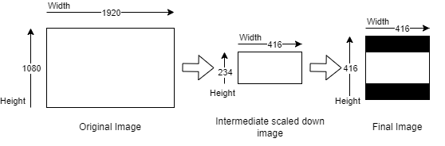

.. _vvas_xinfer:

vvas_xinfer
============

``vvas_xinfer`` is a GStreamer plug-in to performs inferencing on video frames/images and gives output as ``GstInferenceMeta`` object which is tree like structure of inference results. This metadata structure is attached to input GstBuffer. This plug-in can also perform hardware accelerated preprocessing operations like resize/crop/normalization etc. on incoming video frames/images before performing inferencing. ``vvas_xinfer`` plug-in is based on ``Vitis-AI`` library for inferencing. Hardware accelerated pre-processing using ``vvas_xinfer`` is optional and requires ``image_processing`` kernel in the design. User may also use software based pre-processing which is internally using ``Vitis-AI`` library for pre-processing. 

If hardware accelerated preprocessing is enabled and ``vvas_xinfer`` plug-in is not receiving physically contiguous memory, then data will be an overhead of copying data into a physically contiguous memory before sending to preprocessing engine. 

Another useful feature of this plug-in is to consolidte the inferencing results of different stages of cascadded inferencing usecases. This plug-in can update/apend the new meta data information generated at each stage in to the metadata of the previous stages.

For implementation details, refer to `vvas_xinfer source code <https://github.com/Xilinx/VVAS/tree/master/vvas-gst-plugins/sys/infer>`_

.. figure:: ../../images/vvas_xinfer_blockdiagram.png
   :align: center
   :scale: 80

.. note::

        In case of multithreaded applications, ML pipeline should be created by ensuring that the vvas_xinfer instances are created in a sequence and not concurrently by multiple threads.

Input and Output
--------------------

* ML hardware engine supports images in BGR/RGB formats only (depending on model). Though this plug-in can accepts buffers with GRAY8, NV12, BGR, RGB, YUY2, r210, v308, GRAY10_LE32, ABGR, ARGB color formats on input GstPad & output GstPad, actual formats supported may vary depending on the hardware design, and the color formats enabled in the hardware design.

  - In case there is ``image_processing`` kernel in the design, then user may choose to use hardware accelerated pre-processing and/or color space conversion. Make sure ``image_processing`` kernel supports the required color format.
  - In case ``image_processing`` kernel in not there in the design then the input image to ``vvas_xinfer`` plug-in must be in BGR/RGB format (depending on the model requirements) otherwise the results are unexpected.

* Attaches ``GstInferenceMeta`` metadata to output GstBuffer. For details about meta data, refer to :ref:`vvas_inference_metadata`

Control Parameters
--------------------

.. list-table:: Control Parameters
   :widths: 20 10 10 10 50
   :header-rows: 1

   * - Property Name
     - Type
     - Range
     - Default
     - Description
   * - infer-config
     - String
     - N/A
     - Null
     - Complete path, including file name, of the inference configuration JSON file
   * - preprocess-config
     - String
     - N/A
     - Null
     - Complete path, including file name, of the pre-processing kernels config JSON file
   * - attach-empty-metadata
     - Boolean
     - True/False
     - True
     - Flag to decide attaching empty metadata strucutre when there is no inference results available for the current image
   * - batch-timeout
     - Unsigned Integer
     - 0 - UINT_MAX
     - 0 (No timeout)
     - time (in milliseconds) to wait when batch is not full, before pushing batch of frames for inference

infer-config json members
-------------------------

+---------------------+--------------------+------------------------------------------------------------------------------------------------------------------------------------------------------+
| Json key            | Item               | Item description                                                                                                                                     |
+=====================+====================+======================================================================================================================================================+
|                     | Description        | Inference level in cascaded inference use case. e.g. Object detection ML (level-1) followed by object classification (level-2) on detected objects   |
|                     +--------------------+------------------------------------------------------------------------------------------------------------------------------------------------------+
|                     | Value type         | Integer                                                                                                                                              |
| inference-level     +--------------------+------------------------------------------------------------------------------------------------------------------------------------------------------+
|                     | Mandatory/Optional | Optional                                                                                                                                             |
|                     +--------------------+------------------------------------------------------------------------------------------------------------------------------------------------------+
|                     | Default value      | 1                                                                                                                                                    |
+---------------------+--------------------+------------------------------------------------------------------------------------------------------------------------------------------------------+
|                     | Description        | Parameter to enable/disable low-latency mode in vvas_xinfer and it is useful only when inference-level > 1.                                          |
|                     |                    | If enabled, then vvas_xinfer plug-in will not wait for batch-size frames to be accumulated to reduce latency.                                        |
|                     |                    | If disabled, inference engine can work at maximum throughput.                                                                                        |
|                     +--------------------+------------------------------------------------------------------------------------------------------------------------------------------------------+
| low-latency         | Value type         | Boolean                                                                                                                                              |
|                     +--------------------+------------------------------------------------------------------------------------------------------------------------------------------------------+
|                     | Mandatory/Optional | Optional                                                                                                                                             |
|                     +--------------------+------------------------------------------------------------------------------------------------------------------------------------------------------+
|                     | Default value      | false                                                                                                                                                |
+---------------------+--------------------+------------------------------------------------------------------------------------------------------------------------------------------------------+
|                     | Description        | Maximum number of input frames those can be queued inside the plug-in.                                                                               |
|                     |                    | When low-latency is disabled, vvas_xinfer plug-in will wait for inference-max-queue buffers until batch-size is accumulated                          |
|                     +--------------------+------------------------------------------------------------------------------------------------------------------------------------------------------+
| inference-max-queue | Value type         | Integer                                                                                                                                              |
|                     +--------------------+------------------------------------------------------------------------------------------------------------------------------------------------------+
|                     | Mandatory/Optional | Optional                                                                                                                                             |
|                     +--------------------+------------------------------------------------------------------------------------------------------------------------------------------------------+
|                     | Default value      | batch-size                                                                                                                                           |
+---------------------+--------------------+------------------------------------------------------------------------------------------------------------------------------------------------------+
|                     | Description        | Attaches output of preprocessing library to GstInferenceMeta to avoid redoing of the preprocessing if required.                                      |
|                     +--------------------+------------------------------------------------------------------------------------------------------------------------------------------------------+
|                     | Value type         | Boolean                                                                                                                                              |
| attach-ppe-outbuf   +--------------------+------------------------------------------------------------------------------------------------------------------------------------------------------+
|                     | Mandatory/Optional | Optional                                                                                                                                             |
|                     +--------------------+------------------------------------------------------------------------------------------------------------------------------------------------------+
|                     | Default value      | False                                                                                                                                                |
+---------------------+--------------------+------------------------------------------------------------------------------------------------------------------------------------------------------+
|                     | Description        | Kernel object provides information about an VVAS kernel library configuration and kernel library name                                                |
|                     +--------------------+------------------------------------------------------------------------------------------------------------------------------------------------------+
|                     | Value type         | JSON Object                                                                                                                                          |
|                     +--------------------+------------------------------------------------------------------------------------------------------------------------------------------------------+
| kernel              | Mandatory/Optional | Mandatory                                                                                                                                            |
|                     +--------------------+------------------------------------------------------------------------------------------------------------------------------------------------------+
|                     | Default value      | None                                                                                                                                                 |
|                     +--------------------+------------------------------------------------------------------------------------------------------------------------------------------------------+
|                     | Object Members     | members of kernel JSON object are mentioned below                                                                                                    |
+---------------------+--------------------+------------------------------------------------------------------------------------------------------------------------------------------------------+

infer-config::kernel json members
---------------------------------

+--------------+--------------------+---------------------------------------------------------------------------------------------------------------------+
| JSON key     | Item               |  Description                                                                                                        |
+==============+====================+=====================================================================================================================+
|              | Description        | Inference kernel specific configuration                                                                             |
|              +--------------------+---------------------------------------------------------------------------------------------------------------------+
|              | Value type         | JSON object                                                                                                         |
|              +--------------------+---------------------------------------------------------------------------------------------------------------------+
| config       | Mandatory/Optional | Mandatory                                                                                                           |
|              +--------------------+---------------------------------------------------------------------------------------------------------------------+
|              | Default value      | None                                                                                                                |
|              +--------------------+---------------------------------------------------------------------------------------------------------------------+
|              | Object members     | Contains members specific to inference library. See vvas_xdpuinfer library for more information                     |
+--------------+--------------------+---------------------------------------------------------------------------------------------------------------------+

infer-config::config json members
---------------------------------

+---------------------+---------+-----------------------------------------+--------------+--------------------------------------------------------------------------------------------------------------------------------------------------------------------------------------------------------------------------------------------------------------------------------------------------------------------------------------------------------------------------------------------------------------+
| Parameter           | Type    | Expected Values                         | Default      | Description                                                                                                                                                                                                                                                                                                                                                                                                  |
+=====================+=========+=========================================+==============+==============================================================================================================================================================================================================================================================================================================================================================================================================+
| model-name          | string  | resnet50                                | N/A          | Name string of the machine learning model to be executed. The name string should be same as the name of the directory available in model -path parameter file. If the name of the model ELF file is resnet50.elf, then the model-name is resnet50 in the JSON file. The ELF file present in the specified path model-path of the JSON file.                                                                  |
+---------------------+---------+-----------------------------------------+--------------+--------------------------------------------------------------------------------------------------------------------------------------------------------------------------------------------------------------------------------------------------------------------------------------------------------------------------------------------------------------------------------------------------------------+
| model-class         | string  | YOLOV3                                  | N/A          | Class of some model corresponding to model. Some examples are shown below:                                                                                                                                                                                                                                                                                                                                   |
|                     |         |                                         |              |                                                                                                                                                                                                                                                                                                                                                                                                              |
|                     |         | FACEDETECT                              |              | * **YOLOV3**: yolov3_adas_pruned_0_9, yolov3_voc, yolov3_voc_tf                                                                                                                                                                                                                                                                                                                                              |
|                     |         |                                         |              |                                                                                                                                                                                                                                                                                                                                                                                                              |
|                     |         | CLASSIFICATION                          |              | * **FACEDETECT**: densebox_320_320, densebox_640_360                                                                                                                                                                                                                                                                                                                                                         |
|                     |         |                                         |              |                                                                                                                                                                                                                                                                                                                                                                                                              |
|                     |         | SSD                                     |              | * **CLASSIFICATION**: resnet18, resnet50, resnet_v1_50_tf                                                                                                                                                                                                                                                                                                                                                    |
|                     |         |                                         |              |                                                                                                                                                                                                                                                                                                                                                                                                              |
|                     |         | REFINEDET                               |              |                                                                                                                                                                                                                                                                                                                                                                                                              |
|                     |         |                                         |              |                                                                                                                                                                                                                                                                                                                                                                                                              |
|                     |         | TFSSD                                   |              |                                                                                                                                                                                                                                                                                                                                                                                                              |
|                     |         |                                         |              |                                                                                                                                                                                                                                                                                                                                                                                                              |
|                     |         | YOLOV2                                  |              |                                                                                                                                                                                                                                                                                                                                                                                                              |
|                     |         |                                         |              |                                                                                                                                                                                                                                                                                                                                                                                                              |
|                     |         | VEHICLECLASSIFICATION                   |              |                                                                                                                                                                                                                                                                                                                                                                                                              |
|                     |         |                                         |              |                                                                                                                                                                                                                                                                                                                                                                                                              |
|                     |         | REID                                    |              |                                                                                                                                                                                                                                                                                                                                                                                                              |
|                     |         |                                         |              |                                                                                                                                                                                                                                                                                                                                                                                                              |
|                     |         | SEGMENTATION                            |              |                                                                                                                                                                                                                                                                                                                                                                                                              |
|                     |         |                                         |              |                                                                                                                                                                                                                                                                                                                                                                                                              |
|                     |         | PLATEDETECT                             |              |                                                                                                                                                                                                                                                                                                                                                                                                              |
|                     |         |                                         |              |                                                                                                                                                                                                                                                                                                                                                                                                              |
|                     |         | PLATENUM                                |              |                                                                                                                                                                                                                                                                                                                                                                                                              |
|                     |         |                                         |              |                                                                                                                                                                                                                                                                                                                                                                                                              |
|                     |         | POSEDETECT                              |              |                                                                                                                                                                                                                                                                                                                                                                                                              |
|                     |         |                                         |              |                                                                                                                                                                                                                                                                                                                                                                                                              |
|                     |         | BCC                                     |              |                                                                                                                                                                                                                                                                                                                                                                                                              |
|                     |         |                                         |              |                                                                                                                                                                                                                                                                                                                                                                                                              |
|                     |         | EFFICIENTDETD2                          |              |                                                                                                                                                                                                                                                                                                                                                                                                              |
|                     |         |                                         |              |                                                                                                                                                                                                                                                                                                                                                                                                              |
|                     |         | FACEFEATURE                             |              |                                                                                                                                                                                                                                                                                                                                                                                                              |
|                     |         |                                         |              |                                                                                                                                                                                                                                                                                                                                                                                                              |
|                     |         | FACELANDMARK                            |              |                                                                                                                                                                                                                                                                                                                                                                                                              |
|                     |         |                                         |              |                                                                                                                                                                                                                                                                                                                                                                                                              |
|                     |         | ROADLINE                                |              |                                                                                                                                                                                                                                                                                                                                                                                                              |
|                     |         |                                         |              |                                                                                                                                                                                                                                                                                                                                                                                                              |
|                     |         | ULTRAFAST                               |              |                                                                                                                                                                                                                                                                                                                                                                                                              |
|                     |         |                                         |              |                                                                                                                                                                                                                                                                                                                                                                                                              |
|                     |         | RAWTENSOR                               |              |                                                                                                                                                                                                                                                                                                                                                                                                              |
+---------------------+---------+-----------------------------------------+--------------+--------------------------------------------------------------------------------------------------------------------------------------------------------------------------------------------------------------------------------------------------------------------------------------------------------------------------------------------------------------------------------------------------------------+
| model-format        | string  | RGB/BGR                                 | N/A          | Image color format required by model.                                                                                                                                                                                                                                                                                                                                                                        |
+---------------------+---------+-----------------------------------------+--------------+--------------------------------------------------------------------------------------------------------------------------------------------------------------------------------------------------------------------------------------------------------------------------------------------------------------------------------------------------------------------------------------------------------------+
| model-path          | string  | ``/usr/share/vitis_ai_library/models/`` | N/A          | Path of the folder where the model to be executed is stored.                                                                                                                                                                                                                                                                                                                                                 |
+---------------------+---------+-----------------------------------------+--------------+--------------------------------------------------------------------------------------------------------------------------------------------------------------------------------------------------------------------------------------------------------------------------------------------------------------------------------------------------------------------------------------------------------------+
| vitis-ai-preprocess | Boolean | True/False                              | True         | If vitis-ai-preprocess = true: Normalize with mean/scale through the Vitis AI Library If vitis-ai-preprocess = false: Normalize with mean/scale is performed before calling the vvas_xdpuinfer API's. The Vitis AI library does not perform these operations.                                                                                                                                                |
+---------------------+---------+-----------------------------------------+--------------+--------------------------------------------------------------------------------------------------------------------------------------------------------------------------------------------------------------------------------------------------------------------------------------------------------------------------------------------------------------------------------------------------------------+
| batch-size          | Integer | 0 to UINT_MAX                           | N/A          | Number of frames to be processed in a single batch. If not set or is greater than the batch-size supported by model, it is adjusted to the maximum batch-size supported by the model.                                                                                                                                                                                                                        |
+---------------------+---------+-----------------------------------------+--------------+--------------------------------------------------------------------------------------------------------------------------------------------------------------------------------------------------------------------------------------------------------------------------------------------------------------------------------------------------------------------------------------------------------------+
| float-feature       | Boolean | True/False                              | False        | This is used for FACEFEATURE class. If float-feature = true: Features are provided as float numbers. If float-feature = false: Features are provided as integers.                                                                                                                                                                                                                                            |
+---------------------+---------+-----------------------------------------+--------------+--------------------------------------------------------------------------------------------------------------------------------------------------------------------------------------------------------------------------------------------------------------------------------------------------------------------------------------------------------------------------------------------------------------+
| max-objects         | Integer | 0 to UINT_MAX                           | UINT_MAX     | Maximum number of objects to be detected.                                                                                                                                                                                                                                                                                                                                                                    |
+---------------------+---------+-----------------------------------------+--------------+--------------------------------------------------------------------------------------------------------------------------------------------------------------------------------------------------------------------------------------------------------------------------------------------------------------------------------------------------------------------------------------------------------------+
| segoutfactor        | Integer | 0 to UINT_MAX                           | 1            | Multiplication factor for Y8 output to look bright.                                                                                                                                                                                                                                                                                                                                                          |
+---------------------+---------+-----------------------------------------+--------------+--------------------------------------------------------------------------------------------------------------------------------------------------------------------------------------------------------------------------------------------------------------------------------------------------------------------------------------------------------------------------------------------------------------+
| seg-out-format      | string  | BGR/GRAY8                               | N/A          | Output color format of segmentation.                                                                                                                                                                                                                                                                                                                                                                         |
+---------------------+---------+-----------------------------------------+--------------+--------------------------------------------------------------------------------------------------------------------------------------------------------------------------------------------------------------------------------------------------------------------------------------------------------------------------------------------------------------------------------------------------------------+
| filter-labels       | Array   |                                         | N/A          | Array of comma separated strings to filter objects with certain labels only.                                                                                                                                                                                                                                                                                                                                 |
+---------------------+---------+-----------------------------------------+--------------+--------------------------------------------------------------------------------------------------------------------------------------------------------------------------------------------------------------------------------------------------------------------------------------------------------------------------------------------------------------------------------------------------------------+
| performance-test    | Boolean | True/False                              | False        | Enable performance test and corresponding flops per second (f/s) display logs. Calculates and displays the f/s of the standalone DPU after every second.                                                                                                                                                                                                                                                     |
+---------------------+---------+-----------------------------------------+--------------+--------------------------------------------------------------------------------------------------------------------------------------------------------------------------------------------------------------------------------------------------------------------------------------------------------------------------------------------------------------------------------------------------------------+
| postprocess-lib-path| string  | /usr/lib/libvvascore_postprocessor.so   | N/A          | Library to post-process tensors. Absolute path of the library has to be given                                                                                                                                                                                                                                                                                                                                |
|                     |         |                                         |              | Embedded: /usr/lib/libvvascore_postprocessor.so                                                                                                                                                                                                                                                                                                                                                              |
|                     |         |                                         |              | PCIe: /opt/xilinx/vvas/lib/libvvascore_postprocessor.so                                                                                                                                                                                                                                                                                                                                                      |
+---------------------+---------+-----------------------------------------+--------------+--------------------------------------------------------------------------------------------------------------------------------------------------------------------------------------------------------------------------------------------------------------------------------------------------------------------------------------------------------------------------------------------------------------+
| postprocess-function| string  | vvas_postprocess_rawtensor              | N/A          | Name of the custom function implemented in postprocess-lib-path for post-procesing.                                                                                                                                                                                                                                                                                                                          |
|                     |         | implemented.                            |              |                                                                                                                                                                                                                                                                                                                                                                                                              |
+---------------------+---------+-----------------------------------------+--------------+--------------------------------------------------------------------------------------------------------------------------------------------------------------------------------------------------------------------------------------------------------------------------------------------------------------------------------------------------------------------------------------------------------------+
| debug-level         | Integer | 0 to 3                                  | 1            | Used to enable log levels.                                                                                                                                                                                                                                                                                                                                                                                   |
|                     |         |                                         |              |                                                                                                                                                                                                                                                                                                                                                                                                              |
|                     |         |                                         |              | There are four log levels for a message sent by the kernel library code, starting from level 0 and decreasing in severity till level 3 the lowest log-level identifier. When a log level is set, it acts as a filter, where only messages with a log-level lower than it, (therefore messages with an higher severity) are displayed.                                                                        |
|                     |         |                                         |              |                                                                                                                                                                                                                                                                                                                                                                                                              |
|                     |         |                                         |              | 0: This is the highest level in order of severity: it is used for messages about critical errors, both hardware and software related.                                                                                                                                                                                                                                                                        |
|                     |         |                                         |              |                                                                                                                                                                                                                                                                                                                                                                                                              |
|                     |         |                                         |              | 1: This level is used in situations where you attention is immediately required.                                                                                                                                                                                                                                                                                                                             |
|                     |         |                                         |              |                                                                                                                                                                                                                                                                                                                                                                                                              |
|                     |         |                                         |              | 2: This is the log level used for information messages about the action performed by the kernel and output of model.                                                                                                                                                                                                                                                                                         |
|                     |         |                                         |              |                                                                                                                                                                                                                                                                                                                                                                                                              |
|                     |         |                                         |              | 3: This level is used for debugging.                                                                                                                                                                                                                                                                                                                                                                         |
+---------------------+---------+-----------------------------------------+--------------+--------------------------------------------------------------------------------------------------------------------------------------------------------------------------------------------------------------------------------------------------------------------------------------------------------------------------------------------------------------------------------------------------------------+

.. note::
        In case of class type RAWTENSOR, it is mandatory to provide the post processing function name in the json file.

preprocess-config json members
------------------------------

Table 4 preprocess-config json members

+-------------------+--------------------+-------------------------------------------------------------------------------------------------------+
| Json key          | Item               | Item description                                                                                      |
+===================+====================+=======================================================================================================+
|                   | Description        | Location of xclbin which contains scaler IP to program FPGA device based on device-index property     |
|                   +--------------------+-------------------------------------------------------------------------------------------------------+
|                   | Value type         | String                                                                                                |
| xclbin-location   +--------------------+-------------------------------------------------------------------------------------------------------+
|                   | Mandatory/Optional | Mandatory                                                                                             |
|                   +--------------------+-------------------------------------------------------------------------------------------------------+
|                   | Default value      | NULL                                                                                                  |
+-------------------+--------------------+-------------------------------------------------------------------------------------------------------+
|                   | Description        | Device index on which scaler IP is present                                                            |
|                   +--------------------+-------------------------------------------------------------------------------------------------------+
|                   | Value type         | Integer                                                                                               |
|                   +--------------------+-------------------------------------------------------------------------------------------------------+
| device-index      | Mandatory/Optional | Mandatory in PCIe platforms                                                                           |
|                   |                    | In embedded platforms, device-index is not an applicable option as it is always zero                  |
|                   +--------------------+-------------------------------------------------------------------------------------------------------+
|                   | Default value      | -1 in PCIe platforms                                                                                  |
|                   |                    | 0 in Embedded platforms                                                                               |
+-------------------+--------------------+-------------------------------------------------------------------------------------------------------+
|                   | Description        | Use software/hardware pre-processing.                                                                 |
|                   +--------------------+-------------------------------------------------------------------------------------------------------+
|                   | Value type         | Boolean                                                                                               |
|                   +--------------------+-------------------------------------------------------------------------------------------------------+
| software-ppe      | Mandatory/Optional | Optional                                                                                              |
|                   +--------------------+-------------------------------------------------------------------------------------------------------+
|                   | Default value      | FALSE                                                                                                 |
+-------------------+--------------------+-------------------------------------------------------------------------------------------------------+
|                   | Description        | Kernel object provides information about an VVAS library configuration.                               |
|                   +--------------------+-------------------------------------------------------------------------------------------------------+
|                   | Value type         | JSON Object                                                                                           |
|                   +--------------------+-------------------------------------------------------------------------------------------------------+
| kernel            | Mandatory/Optional | Mandatory                                                                                             |
|                   +--------------------+-------------------------------------------------------------------------------------------------------+
|                   | Default value      | None                                                                                                  |
|                   +--------------------+-------------------------------------------------------------------------------------------------------+
|                   | Object Members     | members of kernel JSON object are mentioned below                                                     |
+-------------------+--------------------+-------------------------------------------------------------------------------------------------------+

preprocess-config::kernel json members
---------------------------------------

Table 5: preprocess-config::kernel json members

+--------------+--------------------+----------------------------------------------------------------------------+
| JSON key     | Item               | Description                                                                |
+==============+====================+============================================================================+
|              | Description        | Name of the preprocessing kernel. Syntax : "<kernel_name>:<instance_name>" |
|              +--------------------+----------------------------------------------------------------------------+
|              | Value type         | String                                                                     |
| kernel-name  +--------------------+----------------------------------------------------------------------------+
|              | Mandatory/Optional | Mandatory                                                                  |
|              +--------------------+----------------------------------------------------------------------------+
|              | Default value      | NULL                                                                       |
+--------------+--------------------+----------------------------------------------------------------------------+
|              | Description        | preprocess kernel specific configuration                                   |
|              +--------------------+----------------------------------------------------------------------------+
|              | Value type         | JSON object                                                                |
|              +--------------------+----------------------------------------------------------------------------+
| config       | Mandatory/Optional | Mandatory                                                                  |
|              +--------------------+----------------------------------------------------------------------------+
|              | Default value      | None                                                                       |
|              +--------------------+----------------------------------------------------------------------------+
|              | Object members     | Contains members specific to preprocess library                            |
+--------------+--------------------+----------------------------------------------------------------------------+

preprocess-config::config json members
---------------------------------------

+---------------------+---------+-----------------------------------------+--------------+---------------------------------------------------------------------------------------------------------------------------+
| Parameter           | Type    | Expected Values                         | Default      | Description                                                                                                               |
+=====================+=========+=========================================+==============+===========================================================================================================================+
| ppc                 | Integer | 2/4                                     | PCIe : 4     | Pixel per clock supported by a multi- scaler kernel                                                                       |
|                     |         |                                         | Embedded : 2 |                                                                                                                           |
+---------------------+---------+-----------------------------------------+--------------+---------------------------------------------------------------------------------------------------------------------------+
| scaler-type         | string  | letterbox/envelope_cropped/NA           | default      | Type of scaling to be used for resize operation. Some models require resize to be done with aspect-ratio preserved.       |
|                     |         |                                         | resize       | If not set, default res-sizing will be done.                                                                              |
|                     |         |                                         |              | letterbox: letterbox cropping                                                                                             |
|                     |         |                                         |              | envelope_cropped: envelope cropping                                                                                       |
+---------------------+---------+-----------------------------------------+--------------+---------------------------------------------------------------------------------------------------------------------------+
| scaler-horz-align   | string  | left/right/center                       | left         | Used when "scaler-type" = letterbox.                                                                                      |
|                     |         |                                         |              | left: Image will be at the left i.e, padding will be added at the right end of the image.                                 |
|                     |         |                                         |              | right: Image will be at the left i.e, padding will be added at the right end of the image.                                |
|                     |         |                                         |              | center: Image will be at the center i.e, padding will be added at both right and left ends of the image.                  |
+---------------------+---------+-----------------------------------------+--------------+---------------------------------------------------------------------------------------------------------------------------+
| scaler-vert-align   | string  | top/bottom/center                       | top          | Used when "scaler-type" = letterbox.                                                                                      |
|                     |         |                                         |              | top: Image will be at the top i.e, padding will be added at the bottom end of the image.                                  |
|                     |         |                                         |              | bottom: Image will be at the bottom i.e, padding will be added at the top end of the image.                               |
|                     |         |                                         |              | center: Image will be at the center i.e, padding will be added at both top and botoom ends of the image.                  |
+---------------------+---------+-----------------------------------------+--------------+---------------------------------------------------------------------------------------------------------------------------+
| scaler-pad-value    | Integer | 0 - UINT_MAX                            | 0            | pixel value of the padded region in letterbox cropping.                                                                   |
+---------------------+---------+-----------------------------------------+--------------+---------------------------------------------------------------------------------------------------------------------------+
| in-mem-bank         | Integer | 0 - 65535                               | 0            | VVAS input memory bank to allocate memory.                                                                                |
+---------------------+---------+-----------------------------------------+--------------+---------------------------------------------------------------------------------------------------------------------------+
| out-mem-bank        | Integer | 0 - 65535                               | 0            | VVAS output memory bank to allocate memory.                                                                               |
+---------------------+---------+-----------------------------------------+--------------+---------------------------------------------------------------------------------------------------------------------------+
| debug-level         | Integer | 0 to 3                                  | 1            | Used to enable log levels.                                                                                                |
|                     |         |                                         |              |                                                                                                                           |
|                     |         |                                         |              | There are four log levels for a message sent by the kernel library code, starting from level 0 and decreasing in severity |
|                     |         |                                         |              | till level 3 the lowest log-level identifier. When a log level is set, it acts as a filter, where only messages with a    |
|                     |         |                                         |              | log-level lower than it, (therefore messages with an higher severity) are displayed.                                      |
|                     |         |                                         |              |                                                                                                                           |
|                     |         |                                         |              | 0: This is the highest level in order of severity: it is used for messages about critical errors.                         |
|                     |         |                                         |              |                                                                                                                           |
|                     |         |                                         |              | 1: This level is used in situations where you attention is immediately required.                                          |
|                     |         |                                         |              |                                                                                                                           |
|                     |         |                                         |              | 2: This is the log level used for information messages about the action performed by the kernel and output of model.      |
|                     |         |                                         |              |                                                                                                                           |
|                     |         |                                         |              | 3: This level is used for debugging.                                                                                      |
+---------------------+---------+-----------------------------------------+--------------+---------------------------------------------------------------------------------------------------------------------------+

Scaler Types
--------------------

Letterbox
--------------------

Letterbox scaling is a method of preserving the aspect ratio of an image when resizing it to fit a specific resolution. The algorithm works by first determining the target aspect ratio, and then scaling the image down so that it fits within that aspect ratio while maintaining its original aspect ratio. The resulting image will have "letterbox" bars on the top and bottom (or left and right) of the image to fill the remaining space. This is done to ensure that the entire image is visible, and no important parts of the image are cut off.

Example: Below input image of 1920x1080 is first being scaled down to a resolution of 416x234 using a technique that preserves the aspect ratio of the original image. After that, a letterbox method is applied to the scaled image by adding black bars horizontally to the image, which will result in the final resolution of 416x416 pixels.

Envelope Cropped
--------------------

Envelope cropped scaling is a technique used in digital image processing to resize an image to fit within a specific resolution while preserving its aspect ratio. 
The algorithm for implementing envelope cropped scaling consists of several steps:

  * Determining the target aspect ratio by comparing the aspect ratio of the original image to the aspect ratio of the target resolution.
  * Scaling the image down by a factor that preserves the original aspect ratio while ensuring that the smallest side of the image fits within the target resolution.
  * Cropping the image by removing equal parts from both sides of the image, maintaining the central part of the image.

  By scaling the image so that the smallest side fits within the target resolution, it ensures that the input image is resized in a way that preserves its aspect ratio while fitting the target resolution. However, this method can result in important parts of the image being cut off, so it's important to carefully consider the potential impact on the performance of the model.

Example
--------

Below input image of 1920x1080 is being scaled down to a resolution of 455x256 using the smallest side factor of 256 pixels. This new resolution preserves the aspect ratio of the original image. After that, a center crop of 224x224 pixels is taken from the scaled image to obtain the final resolution of 224x224 pixels.

.. figure:: ../../images/infer_example_envelop_crop.png
   :align: center
   :scale: 80

.. note::
        * scaler-type is not needed for all models. Few models have requirements that image be resized using specific techniques for better inference. Use scaler-type only when needed. Otherwise leave it unset.
        * bcc uses letterbox scaler-type for re-sizing.
        * efficientnetd2 models use envelope_cropped scaler-type for re-sizing.

.. note::
        * Color format conversion is not supported by vitis-ai-preprocess. It is user's responsibility to feed the frame in the format required by the model if "vitis-ai-preprocess" = true.
        * If "vitis-ai-preprocess" = false and preprocess-config is not provided, then pre-processing operations like, Normalization, scaling must be performed on the frame before feeding to vvas_xinfer, otherwise results may not be as expected.

        * If preprocess-config json is provided and "vitis-ai-preprocess" = true in infer-config json, then pre-processing is done by VVAS using hardware acceleration for better performance.

.. note::
        Set "device-index" = -1 and "kernel-name" = image_processing_sw:{image_processing_sw_1} when using software-ppe from VVAS.

.. note::
        * If tensors are needed instead of post-processed results, user can set "model-class" = "RAWTENSOR" in the infer-config json file.
        * Users can implement their own post-processing to process the tensors. ``vvascore_postprocessor`` library is implemented to demonstrate how to implement post-processing library. This is only an example library for reference and is not optimized.
        * The ``vvascore_postprocessor`` library only supports yolov3_voc, yolov3_voc_tf, plate_num, densebox_320_320, resnet_v1_50_tf models.

Example Pipelines and Jsons
----------------------------

Single stage inference example
^^^^^^^^^^^^^^^^^^^^^^^^^^^^^^^

An example simple inference (YOLOv3) pipeline which takes NV12 YUV file (test.nv12) as input is described below:

The below pipeline performs ML using a yolov3_voc_tf model. A 1920x1080 NV12 frame is fed to the vvas_xinfer plugin. The vvas_xinfer feeds this frame to the pre-processor which re-sizes the frame and convert color format as the model requires an RGB input. Along with this mean value subtraction and normalization operations are also performed on the frame. Now this re-sized and pre-processed frame is fed to inference library which gives the inference predictions. These inference predictions are then upscaled to the original resolution (1920x1080) and attached to the output buffer.

.. code-block::
  
  gst-launch-1.0 filesrc location=<test.nv12> ! videoparse width=1920 height=1080 format=nv12 ! \
  vvas_xinfer preprocess-config=yolov_preproc.json infer-config=yolov3_voc_tf.json ! fakesink -v

.. code-block::

  {
      "inference-level":1,
      "inference-max-queue":30,
      "attach-ppe-outbuf": false,
      "low-latency":false,
      "kernel" : {
         "config": {
            "batch-size":13,
            "model-name" : "yolov3_voc_tf",
            "model-class" : "YOLOV3",
            "model-format" : "RGB",
            "model-path" : "/usr/share/vitis_ai_library/models/",
            "vitis-ai-preprocess" : false,
            "performance-test" : false,
            "debug-level" : 0
         }
      }
   }

.. code-block::

   {
      "xclbin-location":"/run/media/mmcblk0p1/dpu.xclbin",
      "software-ppe": false,
      "device-index": 0,
      "kernel" : {
         "kernel-name": "image_processing:{image_processing_1}",
         "config": {
            "ppc": 4,
            "debug-level" : 0
         }
      }
   }

2-level inference example
^^^^^^^^^^^^^^^^^^^^^^^^^^^

An example cascade inference (YOLOv3+Resnet18) pipeline which takes NV12 YUV file (test.nv12) as input is described below:

Here the objects detected in level-1 are cropped using ``vvas_xabrscaler`` and fed to ``vascore_dpuinfer`` for further inference.
Refer to jsons in above example for level-1. jsons files for level-2 are provided below.

.. code-block::

  gst-launch-1.0 filesrc location=<test.nv12> ! videoparse width=1920 height=1080 format=nv12 ! \
  vvas_xinfer preprocess-config=yolo_preproc.json infer-config=yolov3_voc_tf.json ! queue ! \
  vvas_xinfer preprocess-config=resnet_preproc.json infer-config=resnet18.json ! fakesink -v

.. code-block::

  {
      "inference-level":2,
      "inference-max-queue":30,
      "attach-ppe-outbuf": false,
      "low-latency":false,
      "kernel" : {
         "config": {
            "batch-size":13,
            "model-name" : "resnet50",
            "model-class" : "CLASSIFICATION",
            "model-format" : "RGB",
            "model-path" : "/usr/share/vitis_ai_library/models/",
            "vitis-ai-preprocess" : false,
            "performance-test" : false,
            "debug-level" : 0
         }
      }
   }

.. code-block::

   {
      "xclbin-location":"/run/media/mmcblk0p1/dpu.xclbin",
      "software-ppe": false,
      "device-index": 0,
      "kernel" : {
         "kernel-name": "image_processing:{image_processing_1}",
         "config": {
            "ppc": 4,
            "debug-level" : 0
         }
      }
   }

.. _raw-tensor-example-label:

Rawtensor example
^^^^^^^^^^^^^^^^^^

An example inference pipeline to get tensors is described below:

The below pipeline performs inference using yolov3_voc_tf model. In the infer-json ``model-class: RAWTENSOR`` indicates that tensors are required by the user instead of post-processed inference results.

.. code-block::

  gst-launch-1.0 filesrc location=<test.nv12> ! videoparse width=1920 height=1080 format=nv12 ! \
  vvas_xinfer preprocess-config=yolov_preproc.json infer-config=yolov3_voc_tf.json ! fakesink -v

.. code-block::

  {
      "inference-level":1,
      "inference-max-queue":30,
      "attach-ppe-outbuf": false,
      "low-latency":false,
      "kernel" : {
         "config": {
            "batch-size":13,
            "model-name" : "yolov3_voc_tf",
            "model-class" : "RAWTENSOR",
            "model-format" : "RGB",
            "model-path" : "/usr/share/vitis_ai_library/models/",
            "vitis-ai-preprocess" : false,
            "performance-test" : false,
            "debug-level" : 0
         }
      }
   }

.. code-block::

   {
      "xclbin-location":"/run/media/mmcblk0p1/dpu.xclbin",
      "software-ppe": false,
      "device-index": 0,
      "kernel" : {
         "kernel-name": "image_processing:{image_processing_1}",
         "config": {
            "ppc": 4,
            "debug-level" : 0
         }
      }
   }

Using the same pipeline described above, if post-processing has to be performed on the tensors, ``postprocess-lib-path`` and ``postprocess-function`` are added in the infer-config json. Note that the post-processing library used here is only a refernce library and does not support all models.

.. code-block::

  {
      "inference-level":1,
      "inference-max-queue":30,
      "attach-ppe-outbuf": false,
      "low-latency":false,
      "kernel" : {
         "config": {
            "batch-size":13,
            "model-name" : "yolov3_voc_tf",
            "model-class" : "RAWTENSOR",
            "postprocess-lib-path" : "/opt/xilinx/vvas/lib/libvvascore_postprocessor.so",
            "postprocess-function" : "vvas_postprocess_tensor",
            "model-format" : "RGB",
            "model-path" : "/usr/share/vitis_ai_library/models/",
            "vitis-ai-preprocess" : false,
            "performance-test" : false,
            "debug-level" : 0
         }
      }
   }
