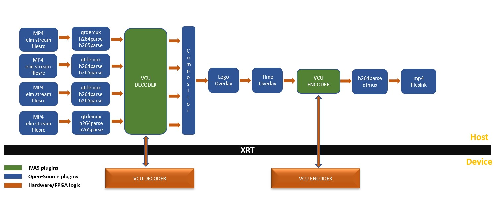
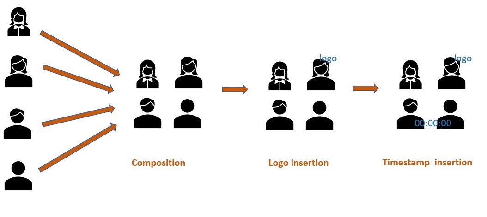

## Copyright and license statement
Copyright 2020-2022 Xilinx Inc.

Licensed under the Apache License, Version 2.0 (the "License"); you may not use this file except in compliance with the License. You may obtain a copy of the License at
[http://www.apache.org/licenses/LICENSE-2.0](http://www.apache.org/licenses/LICENSE-2.0).

Unless required by applicable law or agreed to in writing, software distributed under the License is distributed on an "AS IS" BASIS, WITHOUT WARRANTIES OR CONDITIONS OF ANY KIND, either express or implied. See the License for the specific language governing permissions and limitations under the License.

# VVAS compositor application
Compositor application is a command line utility which implements the gstreamer transcoding pipeline along with composition of four separate input video frames into single frame adding timestamp and optional logo layer. Below is the block diagram for it :

Below is the data flow diagram of frames between transcoding :


## Building the application
```
make
```

## Usage


## Example runs
1. Composition along with logo on top right of video
```
./vvas_xcompositor -f ./video1.mp4 -f ./video2.mp4 -f ./video3.h264 -f ./video4.h265 -l ./logo.png
```

2. Composition with logo on top left of video
```
./vvas_xcompositor -f ./video1.mp4 -f ./video2.mp4 -f ./video3.h264 -f ./video4.h265 -l ./logo.png -h 0 -v 0
```

3. Composition with logo on center of video
```
./vvas_xcompositor -f ./video1.mp4 -f ./video2.mp4 -f ./video3.h264 -f ./video4.h265 -l ./logo.png -h 0.5 -v 0.5
```

4. Composition without logo layer
```
./vvas_xcompositor -f ./video1.mp4 -f ./video2.mp4 -f ./video3.h264 -f ./video4.h265
```

5. Composition on device with index 2
```
./vvas_xcompositor -f ./video1.mp4 -f ./video2.mp4 -f ./video3.h264 -f ./video4.h265 -i 2
```

6. Composition on decoder soft kernel start index at 8
```
./vvas_xcompositor -f ./video1.mp4 -f ./video2.mp4 -f ./video3.h264 -f ./video4.h265 -d 8
```


